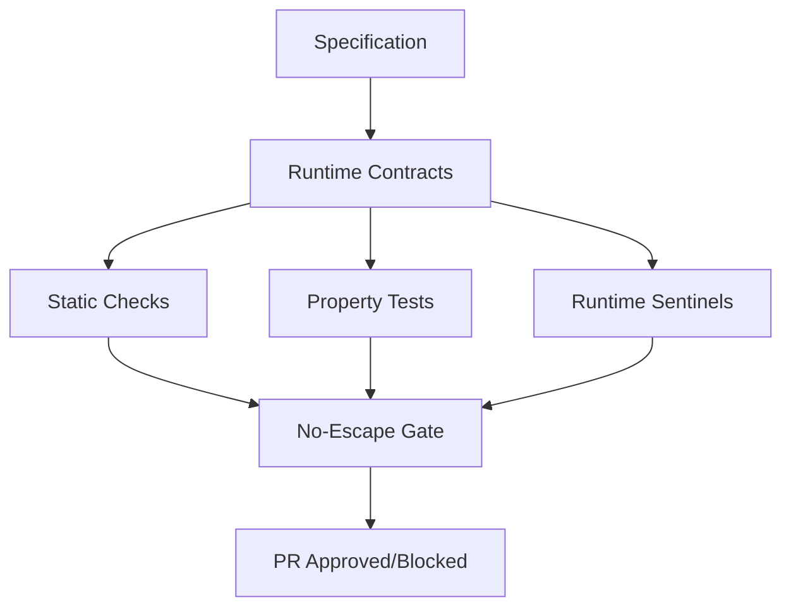

# SpecFact CLI

> **Spec→Contract→Sentinel** - Command-line tool for contract-driven development with automated quality gates

[](LICENSE.md)
[](https://www.python.org/)
[](https://github.com/nold-ai/specfact-cli)

---

## 🎯 Overview

**SpecFact CLI** is a zero-dependency command-line tool that enables **contract-driven development** through automated quality gates, runtime contract validation, and state machine workflows. It helps developers transition from "vibe coding" to spec-first development with **temporal contracts** and **no-escape enforcement**.

### Key Features

- **🔄 Import** - Convert GitHub Spec-Kit projects to contract-driven format
- **🔍 Analyze** - Reverse-engineer plans from brownfield codebases
- **📋 Plan** - Manage greenfield development (idea → features → stories)
- **⚖️ Compare** - Detect deviations between manual and auto-derived plans
- **🛡️ Enforce** - Stage contract validation (shadow → warn → block modes)
- **✅ Repro** - One-command evidence validation for CI/CD

---

## 🚀 Quick Start

### Installation

```bash
# Install via uvx (recommended - zero install)
uvx specfact --help

# Install via pip
pip install specfact-cli

# Run via container
docker run ghcr.io/nold-ai/specfact-cli:latest --help
```

### First Run (< 60 seconds)

```bash
# Initialize a new contract-driven project
specfact plan init --interactive

# Or convert an existing Spec-Kit project
specfact import from-spec-kit --repo ./my-speckit-project --dry-run
```

---

## 📚 Command Reference

### 1. Import from Spec-Kit

Convert GitHub Spec-Kit projects to contract-driven format:

```bash
# Preview import
specfact import from-spec-kit --repo ./my-project --dry-run

# Execute import
specfact import from-spec-kit \
  --repo ./my-project \
  --out-branch feat/specfact-migration \
  --write \
  --report migration-report.md
```

**What it does:**

- Parses `spec/components.yaml` and extracts FSM
- Converts schemas to Pydantic models with contracts
- Generates `contracts/protocols/workflow.protocol.yaml`
- Creates `contracts/plans/plan.bundle.yaml`
- Adds Semgrep async anti-pattern rules
- Generates GitHub Action workflow for PR validation

### 2. Analyze Brownfield Code

Reverse-engineer specifications from existing code:

```bash
# Analyze entire repository
specfact analyze code2spec \
  --repo ./my-project \
  --out reports/brownfield-plan.yaml \
  --shadow-only

# Analyze with confidence threshold
specfact analyze code2spec \
  --repo ./my-project \
  --confidence 0.7 \
  --report reports/analysis.md
```

**What it does:**

- Builds module dependency graph
- Mines commit history for feature boundaries
- Extracts acceptance criteria from tests
- Infers API surfaces from type hints
- Detects async anti-patterns with Semgrep
- Generates plan bundle with confidence scores

### 3. Plan Management

Manage greenfield development plans:

```bash
# Initialize new plan
specfact plan init --interactive

# Add feature
specfact plan add-feature \
  --key FEATURE-001 \
  --title "Spec-Kit Import" \
  --outcomes "Zero manual conversion" \
  --acceptance "Given Spec-Kit repo, When import, Then bundle created"

# Add story
specfact plan add-story \
  --feature FEATURE-001 \
  --key STORY-001 \
  --title "Parse components.yaml" \
  --acceptance "Schema validation passes"

# Compare plans
specfact plan compare \
  --manual contracts/plans/plan.bundle.yaml \
  --auto reports/brownfield-plan.yaml \
  --format markdown \
  --out reports/deviation.md
```

### 4. Contract Enforcement

Configure quality gates:

```bash
# Set enforcement mode
specfact enforce stage --preset balanced

# Enforcement modes:
#   minimal  - Log violations, never block
#   balanced - Block HIGH severity, warn MEDIUM
#   strict   - Block all MEDIUM+ violations
```

### 5. Reproducibility

Run full validation suite:

```bash
# Standard validation
specfact repro

# Verbose with time budget
specfact repro --verbose --budget 120
```

**Runs:**

- Lint checks (ruff, semgrep async rules)
- Type checking (mypy/basedpyright)
- Contract exploration (CrossHair)
- Property-based tests (Hypothesis)
- Smoke tests (event loop lag, orphaned tasks)
- Plan validation (schema compliance)

---

## 🎓 Use Cases

### GitHub Spec-Kit Migration

**Problem**: You have a Spec-Kit project but need team collaboration, production deployment, and quality assurance.

**Solution**:

```bash
# 1. Preview migration
specfact import from-spec-kit --repo ./spec-kit-project --dry-run

# 2. Execute migration
specfact import from-spec-kit \
  --repo ./spec-kit-project \
  --write \
  --out-branch feat/specfact-migration

# 3. Review generated contracts
git diff feat/specfact-migration

# 4. Enable enforcement
specfact enforce stage --preset balanced
```

### Brownfield Code Hardening

**Problem**: Existing codebase with no specs, need to add quality gates incrementally.

**Solution**:

```bash
# 1. Analyze code
specfact analyze code2spec \
  --repo . \
  --shadow-only \
  --report analysis.md

# 2. Review auto-generated plan
cat analysis.md

# 3. Compare with manual plan (if exists)
specfact plan compare \
  --manual docs/plan.yaml \
  --auto analysis.yaml \
  --format markdown

# 4. Fix high-severity deviations
specfact plan enforce-deviations analysis.json --policy balanced
```

### Greenfield Spec-First Development

**Problem**: Starting a new project, want contract-driven development from day 1.

**Solution**:

```bash
# 1. Create plan interactively
specfact plan init --interactive

# 2. Add features and stories
specfact plan add-feature --key FEATURE-001 --title "User Auth"
specfact plan add-story --feature FEATURE-001 --key STORY-001 --title "Login"

# 3. Enable strict enforcement
specfact enforce stage --preset strict

# 4. Validate continuously
specfact repro
```

---

## 🏗️ Architecture

### Contract Layers



### Data Models

**Plan Bundle** (`contracts/plans/plan.bundle.yaml`):

```yaml
version: "1.0"
idea:
  title: "SpecFact CLI Tool"
  narrative: "Enable contract-driven development"
product:
  themes:
    - "Developer Experience"
  releases:
    - name: "v0.1"
      objectives: ["Import", "Analyze", "Enforce"]
features:
  - key: FEATURE-001
    title: "Spec-Kit Import"
    outcomes:
      - "Zero manual conversion"
    stories:
      - key: STORY-001
        title: "Parse components.yaml"
        acceptance:
          - "Schema validation passes"
```

**Protocol** (`contracts/protocols/workflow.protocol.yaml`):

```yaml
states:
  - INIT
  - PLAN
  - REQUIREMENTS
  - ARCHITECTURE
  - CODE
  - REVIEW
  - DEPLOY
start: INIT
transitions:
  - from_state: INIT
    on_event: start_planning
    to_state: PLAN
  - from_state: PLAN
    on_event: approve_plan
    to_state: REQUIREMENTS
    guard: plan_quality_gate_passes
```

---

## 🎯 Competitive Differentiation

### vs GitHub Spec-Kit

| Feature | Spec-Kit | SpecFact CLI |
|---------|----------|--------------|
| Living Specs | ✅ Manual | ✅ Automated |
| Contract Enforcement | ❌ | ✅ Runtime + Static |
| Team Collaboration | ❌ | ✅ Multi-user workflows |
| Production Deployment | ❌ | ✅ CI/CD integration |
| Brownfield Support | ❌ | ✅ Reverse engineering |
| State Machine Validation | ❌ | ✅ FSM fuzzing |

### vs Replit Agent 3, Lovable, Blitzy

| Feature | Others | SpecFact CLI |
|---------|--------|--------------|
| Temporal Contracts | ❌ Text only | ✅ FSM + Runtime |
| No-Escape Gates | ❌ | ✅ Budget-based |
| Proof-Carrying | ❌ | ✅ Evidence required |
| Offline-First | ❌ SaaS required | ✅ Local CLI |
| OSS | ❌ Closed | ✅ Open source |

---

## 🧪 Testing and Validation

### Contract-First Approach

SpecFact CLI uses **contracts as specifications**:

```python
from icontract import require, ensure
from beartype import beartype

@require(lambda plan: plan.version == "1.0")
@ensure(lambda result: len(result.features) > 0)
@beartype
def validate_plan(plan: PlanBundle) -> ValidationResult:
    """Validate plan bundle against contracts."""
    # Contracts are checked at runtime
    return ValidationResult(valid=True)
```

### Property-Based Testing

```python
from hypothesis import given
from hypothesis.strategies import text

@given(text())
def test_plan_key_format(feature_key: str):
    """All feature keys must match FEATURE-\d+ format."""
    if feature_key.startswith("FEATURE-"):
        assert feature_key[8:].isdigit()
```

### Running Tests

```bash
# Contract validation
hatch run contract-test-contracts

# Contract exploration (CrossHair)
hatch run contract-test-exploration

# Scenario tests
hatch run contract-test-scenarios

# Full test suite
hatch run contract-test-full
```

---

## 📦 Installation Options

### Via uvx (Recommended)

```bash
# Zero-install, always latest
uvx specfact plan init --interactive
```

### Via pip

```bash
# System-wide
pip install specfact-cli

# User install
pip install --user specfact-cli

# Virtual environment
python -m venv .venv
source .venv/bin/activate  # or `.venv\Scripts\activate` on Windows
pip install specfact-cli
```

### Via Container

```bash
# Docker
docker run --rm -v $(pwd):/workspace ghcr.io/nold-ai/specfact-cli:latest plan init

# Podman
podman run --rm -v $(pwd):/workspace ghcr.io/nold-ai/specfact-cli:latest plan init
```

### Via GitHub Action

```yaml
# .github/workflows/specfact-gate.yml
name: SpecFact Quality Gate
on: [pull_request]
jobs:
  validate:
    runs-on: ubuntu-latest
    steps:
      - uses: actions/checkout@v4
      - name: Run SpecFact
        uses: nold-ai/specfact-action@v1
        with:
          preset: balanced
```

---

## 🤝 Contributing

We welcome contributions! See [CONTRIBUTING.md](CONTRIBUTING.md) for guidelines.

### Development Setup

```bash
# Clone repository
git clone https://github.com/nold-ai/specfact-cli.git
cd specfact-cli

# Install dependencies
pip install -e ".[dev]"

# Run tests
hatch run contract-test-full

# Format code
hatch run format

# Run linters
hatch run lint
```

### Code Quality Standards

- **Type hints**: 100% coverage with basedpyright
- **Contracts**: All public APIs have `@icontract` decorators
- **Tests**: Contract validation + scenario tests
- **Documentation**: Google-style docstrings

---

## 📄 License

SpecFact CLI is licensed under the **Sustainable Use License** - a fair-code license that allows free use for internal business purposes while protecting against commercial exploitation.

### ✅ Allowed

- Use internally for your business automation
- Modify for your own use
- Provide consulting services around SpecFact CLI
- Contribute code (subject to CLA)
- Academic and non-commercial use

### ❌ Not Allowed

- Sell SpecFact CLI as a SaaS
- White-label and resell
- Create competing platforms

For commercial use beyond the Sustainable Use License, contact us for an **Enterprise License**.

**See**: [LICENSE.md](LICENSE.md) | [USAGE-FAQ.md](USAGE-FAQ.md)

---

## 📞 Support

- **Issues**: [GitHub Issues](https://github.com/nold-ai/specfact-cli/issues)
- **Discussions**: [GitHub Discussions](https://github.com/nold-ai/specfact-cli/discussions)
- **Email**: [hello@noldai.com](mailto:hello@noldai.com)
- **Documentation**: [README.md](https://github.com/nold-ai/specfact-cli#readme)

---

## 🗺️ Roadmap

### v0.1 (Current)

- ✅ Plan management (init, add-feature, add-story, compare)
- ✅ Import from Spec-Kit
- ✅ Brownfield analysis (code2spec)
- ✅ Contract enforcement (shadow/warn/block modes)
- ✅ Reproducibility validation (repro)

### v0.2 (Q1 2025)

- ⏳ VS Code extension
- ⏳ GitHub Action marketplace listing
- ⏳ Auto-fix suggestions for deviations
- ⏳ Plugin API for custom rules

### v0.3 (Q2 2025)

- ⏳ Multi-language support (TypeScript, Go, Rust)
- ⏳ IDE integrations (JetBrains, Neovim)
- ⏳ Real-time collaboration features

### Future: SpecFact Platform

SpecFact CLI will eventually become part of the **SpecFact Platform** - a comprehensive contract-driven development platform with team collaboration, hosted validation, and enterprise features.

---

> **Built with ❤️ by NOLD AI**

Copyright © 2025 Nold AI (Owner: Dominikus Nold)
