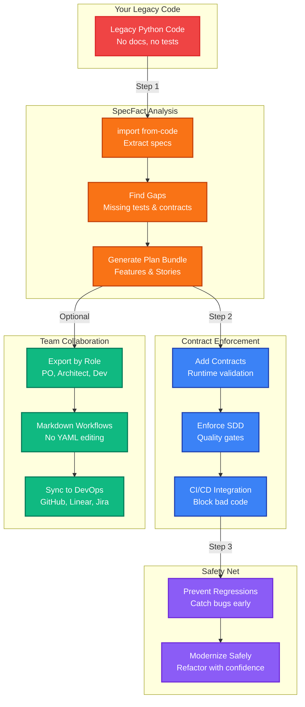
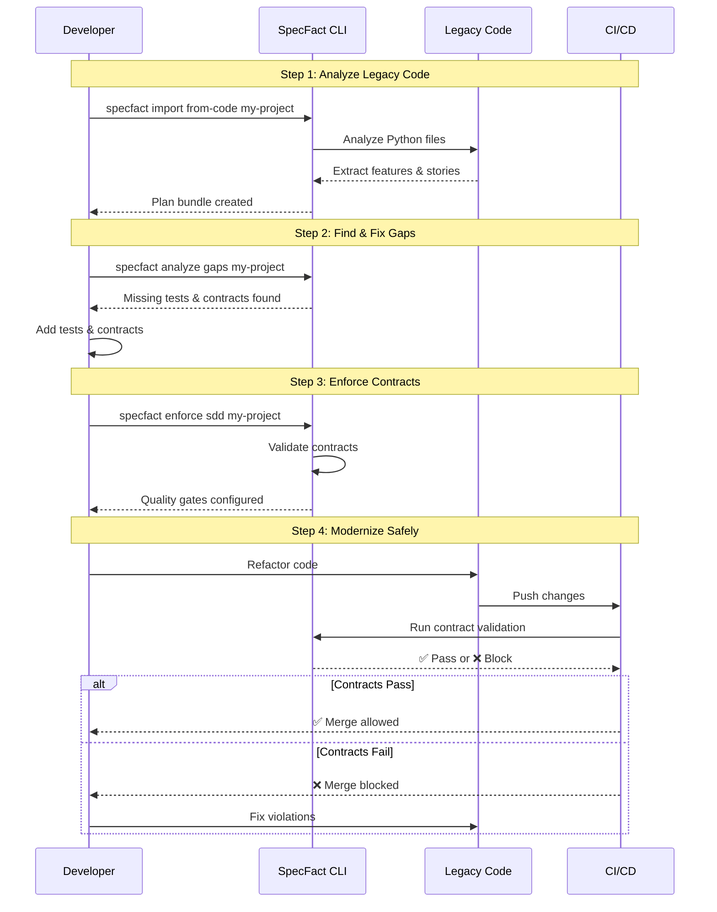

# SpecFact CLI

> **Brownfield-first legacy code modernization with runtime contract enforcement.**  
> Analyze existing Python code → Extract specs → Find gaps → Enforce contracts → Prevent regressions

**No API keys required. Works offline. Zero vendor lock-in.**

[](https://pypi.org/project/specfact-cli/)
[](https://pypi.org/project/specfact-cli/)
[](LICENSE.md)
[](https://github.com/nold-ai/specfact-cli)

<div align="center">

**[🌐 Website](https://noldai.com)** • **[📚 Documentation](https://nold-ai.github.io/specfact-cli)** • **[💬 Support](mailto:hello@noldai.com)**

</div>

---

## What is SpecFact?

**SpecFact CLI analyzes your existing Python code** to automatically extract specifications, find missing tests and contracts, and enforce them to prevent bugs during modernization.

**Perfect for:** Teams modernizing legacy Python systems who can't afford production bugs during migration.

### Why SpecFact?

AI coding assistants are powerful but unpredictable when requirements live in chat history. SpecFact adds a **brownfield-first analysis workflow** that understands existing code, extracts specs automatically, and enforces them as runtime contracts, giving you deterministic, reviewable outputs.

**Key outcomes:**

* **Understand legacy code** in minutes, not weeks (automatic spec extraction)
* **Find gaps** in tests, contracts, and documentation automatically
* **Prevent regressions** with runtime contract enforcement during modernization
* **Works with the tools you already use**: VS Code, Cursor, GitHub Actions, pre-commit hooks
* **No API keys required** - Works completely offline

## How SpecFact Compares (at a glance)

**New to spec-driven development?** Here's how SpecFact compares to other tools:

| Tool | Best For | SpecFact's Focus |
|------|----------|------------------|
| **GitHub Spec-Kit** | Greenfield specs, multi-language, interactive authoring | **Brownfield analysis**, runtime enforcement, formal verification |
| **OpenSpec** | Specification anchoring, change tracking, cross-repo workflows | **Code analysis**, contract enforcement, DevOps integration |
| **Traditional Testing** | Manual test writing, code review | **Automated gap detection**, contract-first validation, CI/CD gates |

**Key Differentiators:**

* ✅ **Brownfield-first** - Reverse engineers existing code (primary use case)
* ✅ **Runtime enforcement** - Contracts prevent regressions automatically
* ✅ **Formal verification** - CrossHair symbolic execution (not just LLM suggestions)
* ✅ **Team collaboration** - Role-based workflows for agile/scrum teams
* ✅ **Works offline** - No API keys, no cloud, zero vendor lock-in

**Compared to spec-kit & OpenSpec**: Those shine for brand-new features (0→1) and change tracking. SpecFact also excels when modernizing existing behavior (1→n), especially when you need runtime safety nets.

👉 **[See detailed comparison guide](docs/guides/speckit-comparison.md)** - Understand when to use SpecFact, Spec-Kit, OpenSpec, or all together

### The Problem It Solves

* ❌ **Legacy code** with no documentation or outdated specs
* ❌ **Missing tests** and contracts that should exist
* ❌ **Regressions** introduced during refactoring/modernization
* ❌ **No safety net** to catch bugs before production

### The Solution

SpecFact CLI:

1. **Analyzes** your existing code → Extracts specs automatically
2. **Finds gaps** → Missing tests, contracts, documentation
3. **Enforces contracts** → Prevents regressions with runtime validation
4. **Integrates** → Works with VS Code, Cursor, GitHub Actions, pre-commit hooks

**Works offline. No account required. Zero vendor lock-in.**

### How It Works

SpecFact follows a simple workflow that analyzes existing code and enforces contracts to prevent regressions:

```
┌────────────────────┐
│ Analyze Legacy     │
│ Code               │
└────────┬───────────┘
         │ extract specs automatically
         ▼
┌────────────────────┐
│ Find Gaps          │
│ (tests, contracts) │◀──── feedback loop ──────┐
└────────┬───────────┘                          │
         │ add contracts                        │
         ▼                                      │
┌────────────────────┐                          │
│ Enforce Contracts  │──────────────────────────┘
│ (runtime validation)│
└────────┬───────────┘
         │ modernize safely
         ▼
┌────────────────────┐
│ Prevent Regressions│
│ (safety net)       │
└────────────────────┘

1. Analyze your existing code to extract specs automatically
2. Find gaps in tests, contracts, and documentation
3. Add contracts to critical paths for runtime enforcement
4. Modernize safely knowing contracts will catch regressions
```


```mermaid
graph TB
    subgraph "Your Legacy Code"
        LC[Legacy Python Code<br/>No docs, no tests]
    end
    
    subgraph "SpecFact Analysis"
        A1[import from-code<br/>Extract specs]
        A2[Find Gaps<br/>Missing tests & contracts]
        A3[Generate Plan Bundle<br/>Features & Stories]
    end
    
    subgraph "Contract Enforcement"
        E1[Add Contracts<br/>Runtime validation]
        E2[Enforce SDD<br/>Quality gates]
        E3[CI/CD Integration<br/>Block bad code]
    end
    
    subgraph "Team Collaboration"
        T1[Export by Role<br/>PO, Architect, Dev]
        T2[Markdown Workflows<br/>No YAML editing]
        T3[Sync to DevOps<br/>GitHub, Linear, Jira]
    end
    
    subgraph "Safety Net"
        S1[Prevent Regressions<br/>Catch bugs early]
        S2[Modernize Safely<br/>Refactor with confidence]
    end
    
    LC -->|Step 1| A1
    A1 --> A2
    A2 --> A3
    A3 -->|Step 2| E1
    E1 --> E2
    E2 --> E3
    E3 -->|Step 3| S1
    S1 --> S2
    
    A3 -->|Optional| T1
    T1 --> T2
    T2 --> T3
    
    style LC fill:#ef4444,stroke:#dc2626,stroke-width:2px,color:#fff
    style A1 fill:#f97316,stroke:#c2410c,stroke-width:2px,color:#fff
    style A2 fill:#f97316,stroke:#c2410c,stroke-width:2px,color:#fff
    style A3 fill:#f97316,stroke:#c2410c,stroke-width:2px,color:#fff
    style E1 fill:#3b82f6,stroke:#1e40af,stroke-width:2px,color:#fff
    style E2 fill:#3b82f6,stroke:#1e40af,stroke-width:2px,color:#fff
    style E3 fill:#3b82f6,stroke:#1e40af,stroke-width:2px,color:#fff
    style T1 fill:#10b981,stroke:#047857,stroke-width:2px,color:#fff
    style T2 fill:#10b981,stroke:#047857,stroke-width:2px,color:#fff
    style T3 fill:#10b981,stroke:#047857,stroke-width:2px,color:#fff
    style S1 fill:#8b5cf6,stroke:#6d28d9,stroke-width:2px,color:#fff
    style S2 fill:#8b5cf6,stroke:#6d28d9,stroke-width:2px,color:#fff
```

### Typical Workflow


```mermaid
sequenceDiagram
    participant Dev as Developer
    participant SF as SpecFact CLI
    participant Code as Legacy Code
    participant CI as CI/CD
    
    Note over Dev,CI: Step 1: Analyze Legacy Code
    Dev->>SF: specfact import from-code my-project
    SF->>Code: Analyze Python files
    Code-->>SF: Extract features & stories
    SF-->>Dev: Plan bundle created
    
    Note over Dev,CI: Step 2: Find & Fix Gaps
    Dev->>SF: specfact analyze gaps my-project
    SF-->>Dev: Missing tests & contracts found
    Dev->>Dev: Add tests & contracts
    
    Note over Dev,CI: Step 3: Enforce Contracts
    Dev->>SF: specfact enforce sdd my-project
    SF->>SF: Validate contracts
    SF-->>Dev: Quality gates configured
    
    Note over Dev,CI: Step 4: Modernize Safely
    Dev->>Code: Refactor code
    Code->>CI: Push changes
    CI->>SF: Run contract validation
    SF-->>CI: ✅ Pass or ❌ Block
    
    alt Contracts Pass
        CI-->>Dev: ✅ Merge allowed
    else Contracts Fail
        CI-->>Dev: ❌ Merge blocked
        Dev->>Code: Fix violations
    end
```

---

## 🚀 Quick Start

### Install (10 seconds)

```bash
# Zero-install (recommended - no setup needed)
uvx specfact-cli@latest

# Or install globally
pip install -U specfact-cli
```

### Your First Command (< 60 seconds)

**Analyze your existing code:**

```bash
# Analyze legacy codebase (most common use case)
specfact import from-code my-project --repo .

# Or start a new project
specfact plan init my-project --interactive
```

**That's it!** SpecFact will:

* Extract features and stories from your code
* Find missing tests and contracts
* Generate a plan bundle you can enforce

👉 **[Getting Started Guide](docs/getting-started/README.md)** - Complete walkthrough with examples

---

## Key Features

### 🔍 Code Analysis

* **Reverse engineer** legacy code into documented specs
* **Find gaps** in tests, contracts, and documentation
* **Works with** any Python project (no special setup required)

### 🛡️ Contract Enforcement

* **Prevent regressions** with runtime contract validation
* **CI/CD integration** - Block bad code from merging
* **Works offline** - No cloud required

### 👥 Team Collaboration

* **Role-based workflows** - Product Owners, Architects, Developers work in parallel
* **Markdown-based** - No YAML editing required
* **Agile/scrum ready** - DoR checklists, story points, dependencies

### 🔌 Integrations

* **VS Code, Cursor** - Catch bugs before you commit
* **GitHub Actions** - Automated quality gates
* **AI IDEs** - Generate prompts for fixing gaps
* **DevOps tools** - Sync with GitHub Issues, Linear, Jira

---

## Common Use Cases

### 1. Modernizing Legacy Code ⭐ **Most Common**

**Problem:** Existing codebase with no specs or outdated documentation

```bash
# Step 1: Analyze your code
specfact import from-code my-project --repo .

# Step 2: Review what was found
specfact plan review my-project

# Step 3: Enforce contracts to prevent regressions
specfact enforce sdd my-project
```

👉 **[Brownfield Modernization Guide](docs/guides/brownfield-engineer.md)** - Complete walkthrough

### 2. Working with a Team

**Problem:** Need team collaboration with role-based workflows

```bash
# Product Owner: Export backlog
specfact project export --bundle my-project --persona product-owner

# Architect: Export technical design
specfact project export --bundle my-project --persona architect

# Developer: Export implementation tasks
specfact project export --bundle my-project --persona developer
```

👉 **[Agile/Scrum Workflows Guide](docs/guides/agile-scrum-workflows.md)** - Team collaboration guide

### 3. Using AI IDEs (Cursor, Copilot, Claude)

**Problem:** Want AI to fix gaps, but need validation

```bash
# Step 1: Find gaps
specfact analyze gaps --bundle my-project

# Step 2: Generate AI prompt
specfact generate fix-prompt GAP-001 --bundle my-project

# Step 3: Copy to AI IDE → AI fixes → Validate
specfact enforce sdd --bundle my-project
```

👉 **[AI IDE Integration](docs/guides/ide-integration.md)** - Setup guide

---

## See It In Action

We ran SpecFact CLI **on itself** to prove it works:

* ⚡ Analyzed 32 legacy Python files → Found **32 features** and **81 stories** in **3 seconds**
* 🚫 Set enforcement → **Blocked 2 HIGH violations** automatically
* 📊 Compared plans → Found **24 deviations** in **5 seconds**

**Total time**: < 10 seconds | **Result**: Found real bugs and inconsistencies

👉 **[Read the complete example](docs/examples/dogfooding-specfact-cli.md)** - See actual commands and outputs

---

## Documentation

### 🎯 Find Your Path

**New to SpecFact?**

1. **[Getting Started](docs/getting-started/README.md)** - Install and first commands
2. **[Tutorial: Using SpecFact with OpenSpec or Spec-Kit](docs/getting-started/tutorial-openspec-speckit.md)** ⭐ **NEW** - Complete beginner-friendly tutorial
3. **[Modernizing Legacy Code?](docs/guides/brownfield-engineer.md)** ⭐ - Complete guide
4. **[Use Cases](docs/guides/use-cases.md)** - Common scenarios
5. **[Command Reference](docs/reference/commands.md)** - All commands

**Working with a Team?**

* **[Agile/Scrum Workflows](docs/guides/agile-scrum-workflows.md)** ⭐ - Persona-based collaboration
* **[Project Commands](docs/reference/commands.md#project---project-bundle-management)** - Export/import workflows

**Want Integrations?**

* **[IDE Integration](docs/guides/ide-integration.md)** - VS Code, Cursor setup
* **[Integration Showcases](docs/examples/integration-showcases/)** - Real bugs fixed
* **[GitHub Actions](docs/guides/use-cases.md#use-case-4-cicd-integration)** - CI/CD setup

**Advanced Topics**

* **[Architecture](docs/reference/architecture.md)** - How it works
* **[Schema Versioning](docs/reference/schema-versioning.md)** - Bundle schemas
* **[Testing Guide](docs/technical/testing.md)** - Development setup

👉 **[Full Documentation Index](docs/README.md)** - Browse all documentation

---

## Version 0.22.0

**Latest release** introduces bridge adapter architecture refactoring and OpenSpec integration.

**What's New:**

* ✅ **Bridge Adapter Architecture** - Plugin-based adapter registry pattern for extensible tool integration
* ✅ **OpenSpec Adapter** - Read-only sync from OpenSpec to SpecFact (v0.22.0+)
* ✅ **SpecKitAdapter** - Refactored Spec-Kit integration using adapter pattern
* ✅ **Command Updates** - Constitution commands moved to `specfact sdd constitution`
* ✅ **Breaking Changes** - Removed `specfact bridge` command group, `implement`, and `generate tasks` commands

👉 **[Changelog](CHANGELOG.md)** - Complete release history

---

## Why SpecFact?

### Works with Your Existing Tools

* ✅ **No new platform** - Pure CLI, works offline
* ✅ **No account required** - Fully local, zero vendor lock-in
* ✅ **Integrates everywhere** - VS Code, Cursor, GitHub Actions, pre-commit hooks

### Built for Real Teams

* ✅ **Role-based workflows** - Product Owners, Architects, Developers work in parallel
* ✅ **Markdown-based** - No YAML editing, human-readable conflicts
* ✅ **Agile/scrum ready** - DoR checklists, story points, sprint planning

### Proven Results

* ✅ **Catches real bugs** - See [Integration Showcases](docs/examples/integration-showcases/)
* ✅ **Prevents regressions** - Runtime contract enforcement
* ✅ **Works on legacy code** - Analyzed itself successfully

---

## Contributing

We welcome contributions! See [CONTRIBUTING.md](CONTRIBUTING.md) for guidelines.

```bash
git clone https://github.com/nold-ai/specfact-cli.git
cd specfact-cli
pip install -e ".[dev]"
hatch run contract-test-full
```

---

## License

**Apache License 2.0** - Open source and enterprise-friendly

* ✅ Free to use for any purpose (commercial or non-commercial)
* ✅ Modify and distribute as needed
* ✅ Enterprise-friendly with explicit patent grant

[Full license](LICENSE.md)

---

## Support

* 💬 **Questions?** [GitHub Discussions](https://github.com/nold-ai/specfact-cli/discussions)
* 🐛 **Found a bug?** [GitHub Issues](https://github.com/nold-ai/specfact-cli/issues)
* 📧 **Need help?** [hello@noldai.com](mailto:hello@noldai.com)
* 🌐 **Learn more:** [noldai.com](https://noldai.com)

---

<div align="center">

**Built with ❤️ by [NOLD AI](https://noldai.com)**

Copyright © 2025-2026 Nold AI (Owner: Dominikus Nold)

**Trademarks**: NOLD AI (NOLDAI) is a registered trademark (wordmark) at the European Union Intellectual Property Office (EUIPO). All other trademarks mentioned in this project are the property of their respective owners. See [TRADEMARKS.md](TRADEMARKS.md) for more information.

</div>
