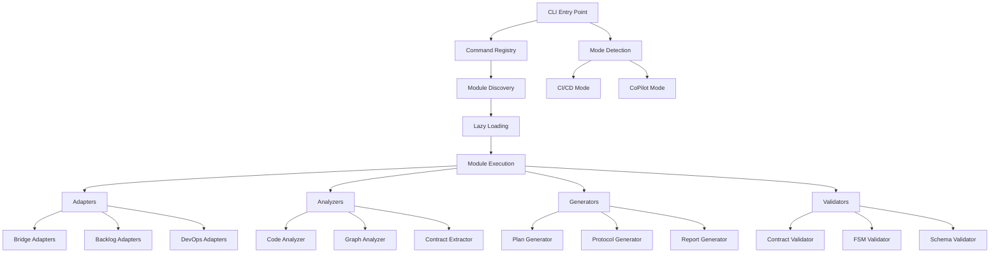
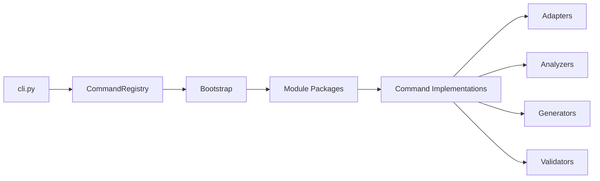
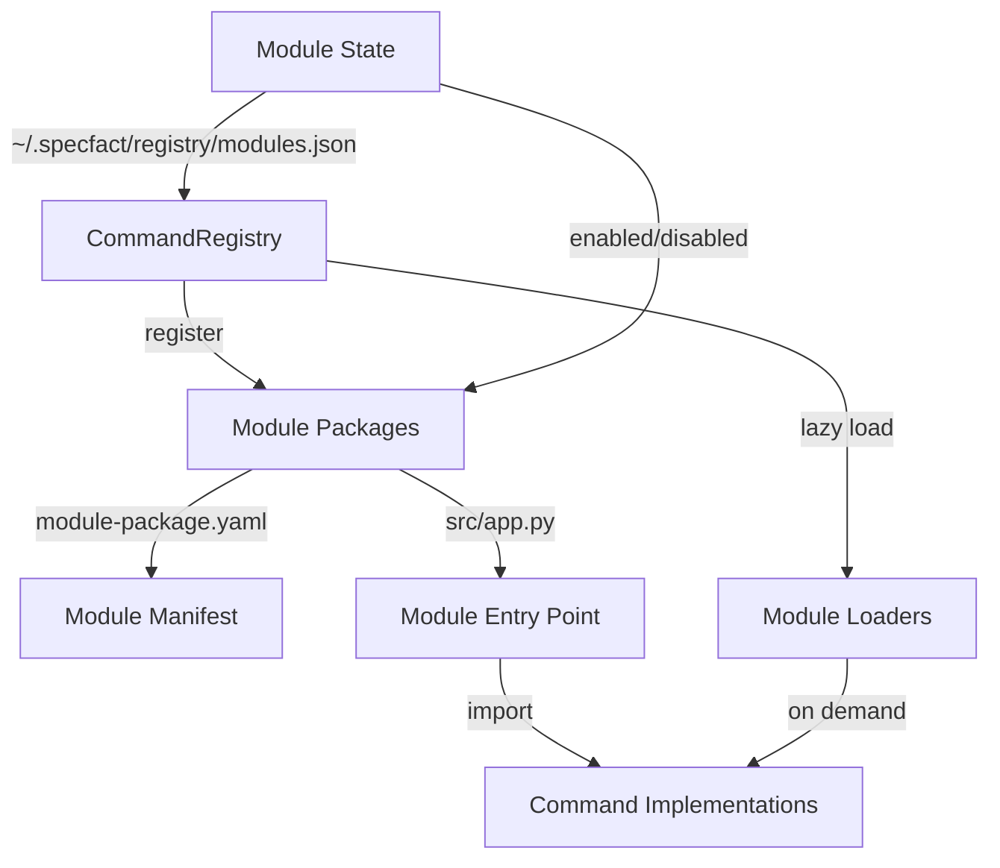
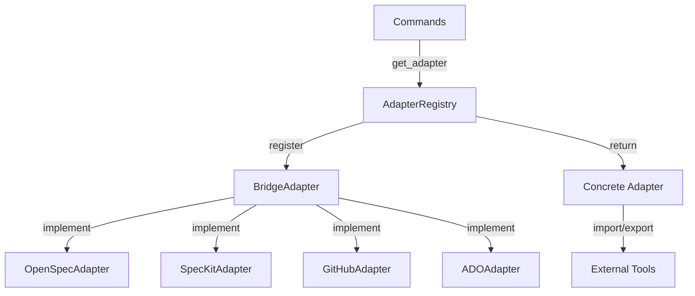
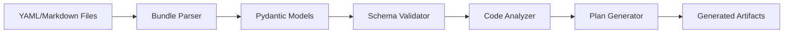
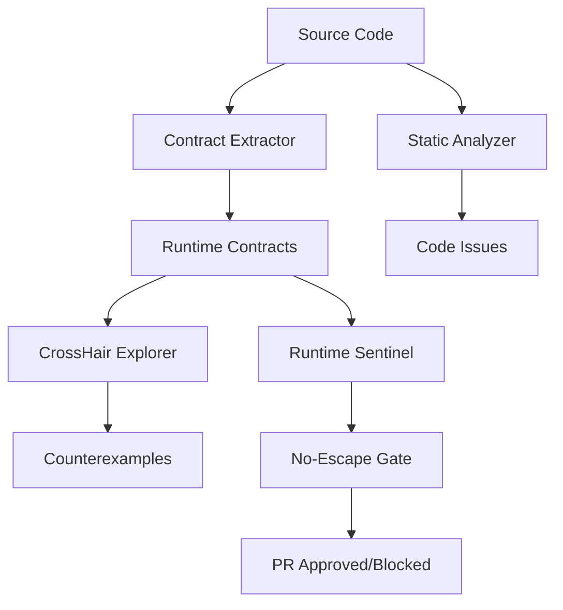
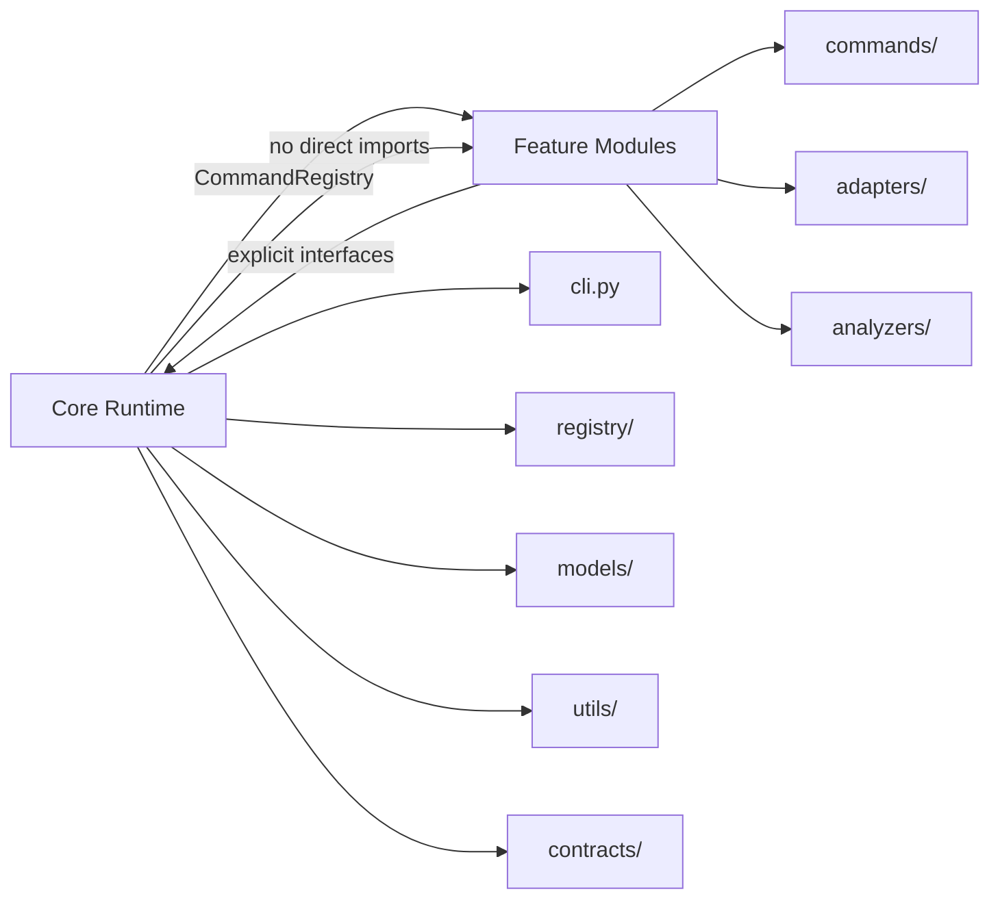
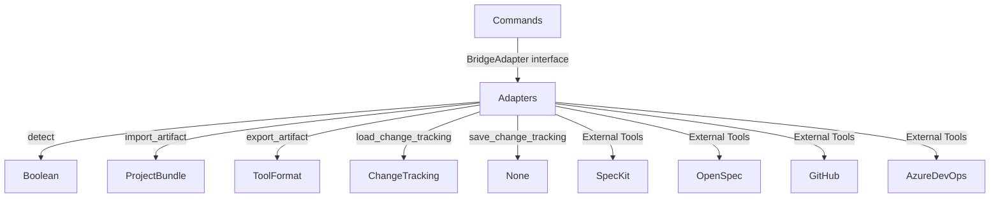
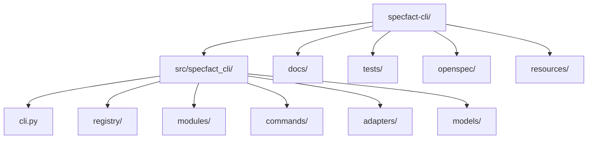
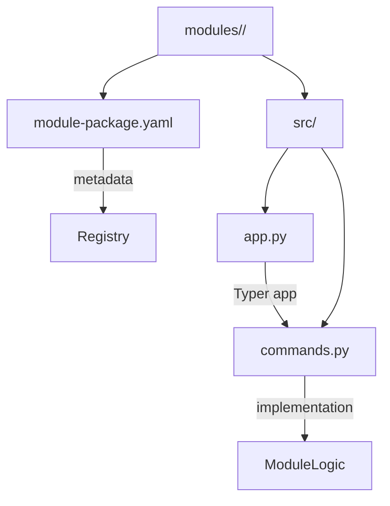

# SpecFact CLI Component Graph

## High-Level System Architecture

## Core Component Relationships

### Main CLI Flow

### Module System Architecture

### Adapter System Architecture

## Data Flow Architecture

### Plan Bundle Processing Flow

### Contract Validation Flow

## Interface Boundaries

### Core-Module Isolation

### Adapter Interface Boundary

## Physical Architecture

### File System Layout

### Module Package Structure

## Key Interfaces and Contracts

### CommandRegistry Interface

- `register_command(name: str, loader: Callable, metadata: CommandMetadata)`
- `get_typer_app(name: str) -> typer.Typer`
- `list_commands() -> list[CommandMetadata]`

### BridgeAdapter Interface

- `detect(repo_path: Path) -> bool`
- `import_artifact(artifact_key: str, artifact_path: Path, project_bundle: Any) -> None`
- `export_artifact(artifact_key: str, artifact_data: Any) -> Path | dict`
- `load_change_tracking(bundle_dir: Path) -> ChangeTracking | None`
- `save_change_tracking(bundle_dir: Path, change_tracking: ChangeTracking) -> None`

### Module Package Contract

- `name: str` - Module identifier
- `version: str` - Semantic version
- `commands: list[str]` - Command names provided
- `pip_dependencies: list[str]` - Optional Python dependencies
- `module_dependencies: list[str]` - Module dependencies

## Architecture Decision Records

### ADR-001: Modular Command Registry

**Status**: Implemented in v0.27
**Decision**: Replace hard-wired command imports with lazy-loaded module registry
**Rationale**: Faster startup, independent module delivery, better test isolation

### ADR-002: Contract-First Development

**Status**: Core principle since v0.1
**Decision**: All public APIs must have @icontract and @beartype decorators
**Rationale**: Runtime validation, better error messages, contract exploration

### ADR-003: Dual-Mode Operation

**Status**: Implemented in v0.21
**Decision**: Support both CI/CD (fast, automated) and CoPilot (interactive) modes
**Rationale**: Serve different user needs without compromising either experience

### ADR-004: Bridge Adapter Pattern

**Status**: Implemented in v0.21.1
**Decision**: Use plugin-based adapter registry for tool integrations
**Rationale**: Extensible architecture, no hard-coded adapter checks in core
