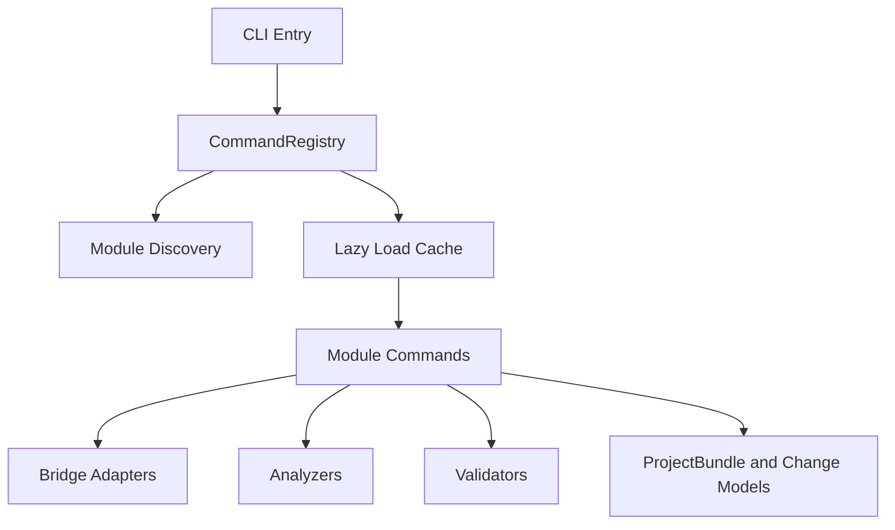
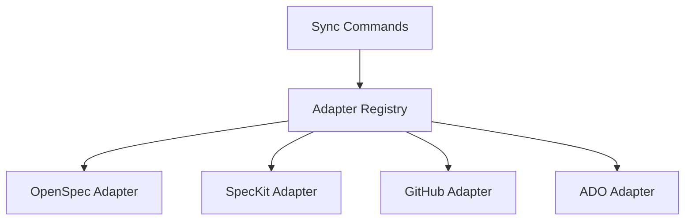

# SpecFact CLI Component Graph

## High-level components

```mermaid
graph TD
    CLI[CLI Entry] --> Registry[CommandRegistry]
    Registry --> Discovery[Module Discovery]
    Registry --> Cache[Lazy Load Cache]
    Cache --> Commands[Module Commands]

    Commands --> Adapters[Bridge Adapters]
    Commands --> Analysis[Analyzers]
    Commands --> Validation[Validators]
    Commands --> Models[ProjectBundle and Change Models]
```

## Adapter view

```mermaid
graph TD
    Sync[Sync Commands] --> AdapterRegistry[Adapter Registry]
    AdapterRegistry --> OpenSpec[OpenSpec Adapter]
    AdapterRegistry --> SpecKit[SpecKit Adapter]
    AdapterRegistry --> GitHub[GitHub Adapter]
    AdapterRegistry --> ADO[ADO Adapter]
```

Note: The graph uses concrete adapter implementations only.
