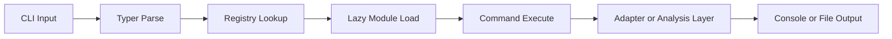
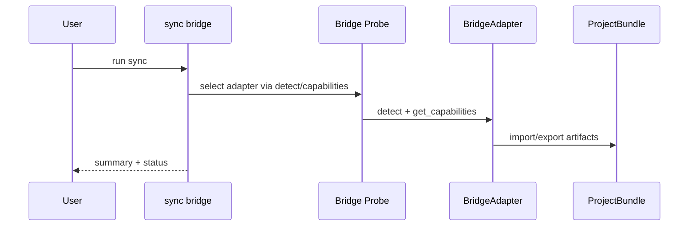

# SpecFact CLI Data Flow Architecture

## Command execution flow

## Bridge sync flow

## Error flow

- Validate inputs with contracts.
- Convert operational failures into actionable command errors.
- Log adapter and lifecycle non-fatal issues with bridge logger.
