# SpecFact CLI Data Flow Architecture

## High-Level Data Flow

### Main CLI Data Pipeline

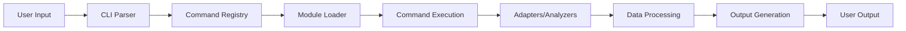

### Data Flow Components

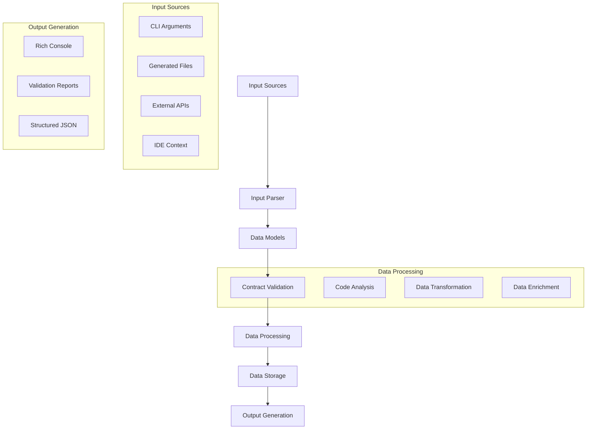

## Command Execution Data Flow

### Typical Command Flow

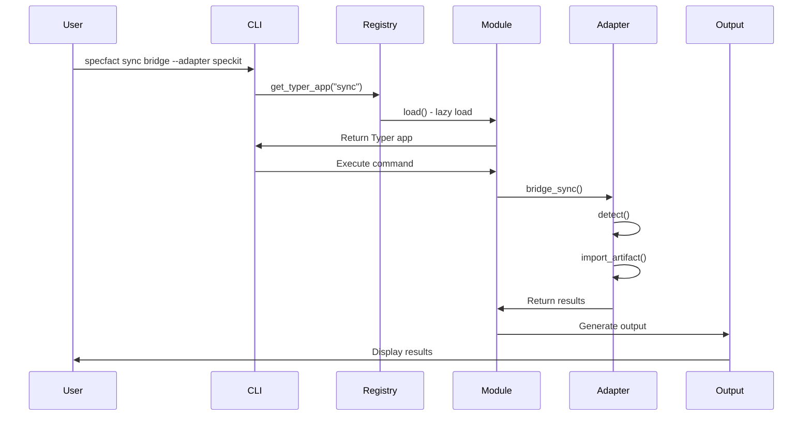

### Data Transformation Pipeline

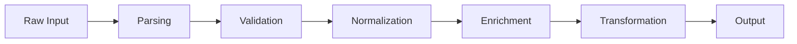

## Module Data Flow

### Module Loading Data Flow

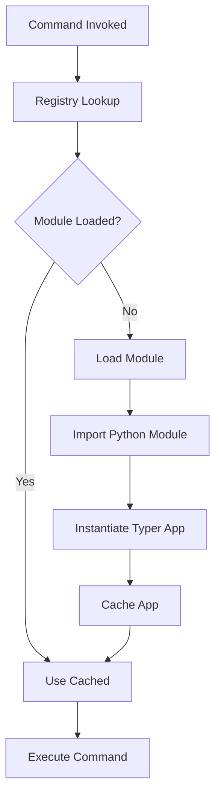

### Module Dependency Data Flow

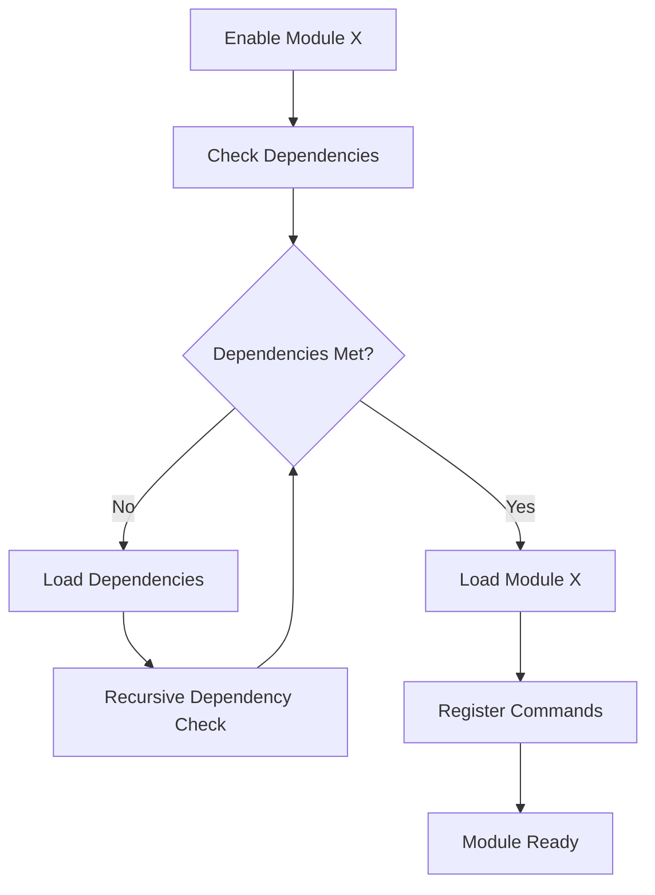

## Adapter Data Flow

### Bridge Adapter Data Flow

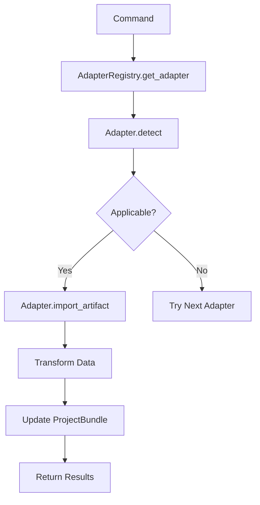

### Bidirectional Sync Data Flow

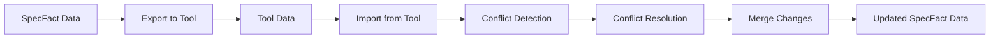

## Analysis Data Flow

### Code Analysis Pipeline

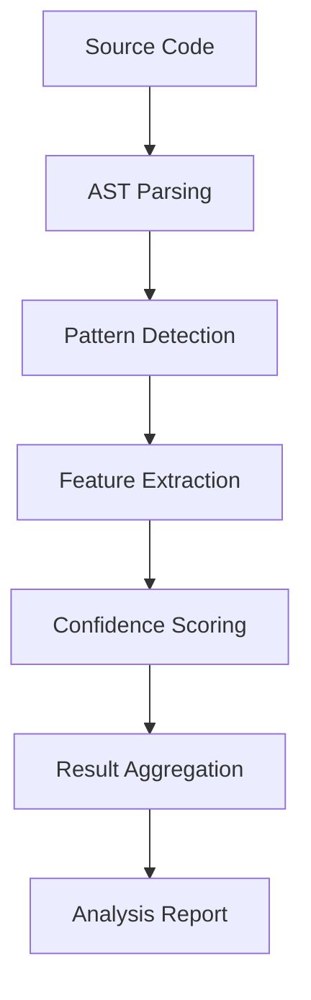

### Hybrid Analysis Flow

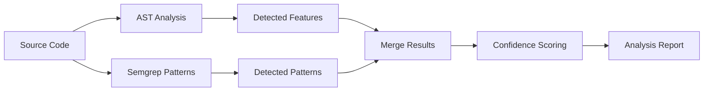

## Validation Data Flow

### Contract Validation Flow

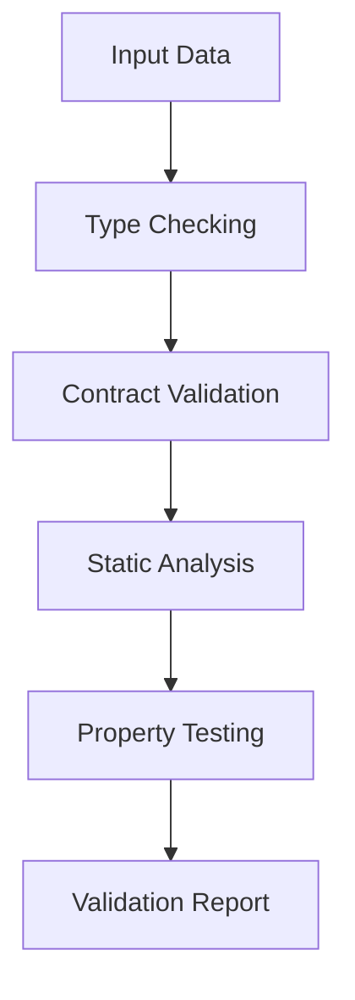

### Multi-Layer Validation

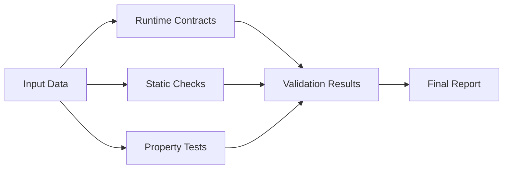

## State Management Data Flow

### Module State Flow

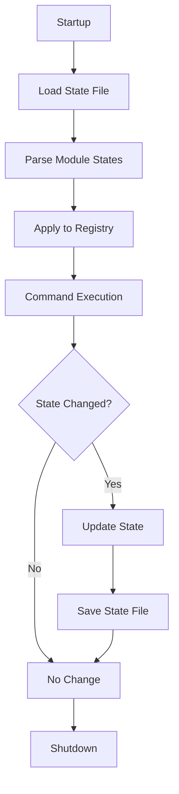

### Bridge Configuration Flow

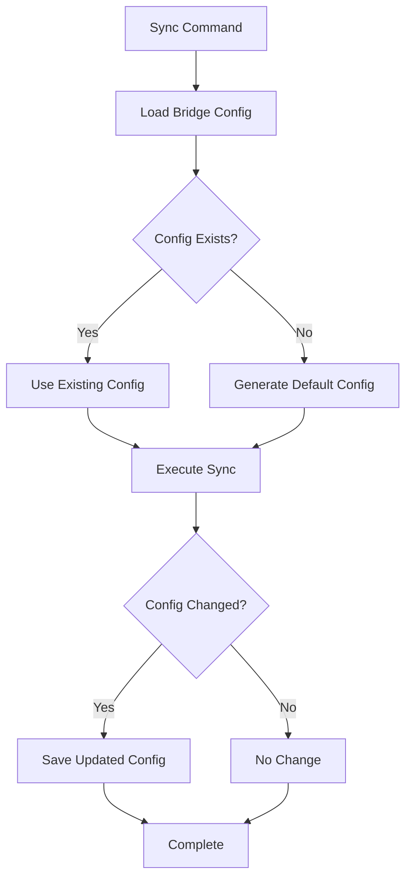

## Error Handling Data Flow

### Error Propagation Flow

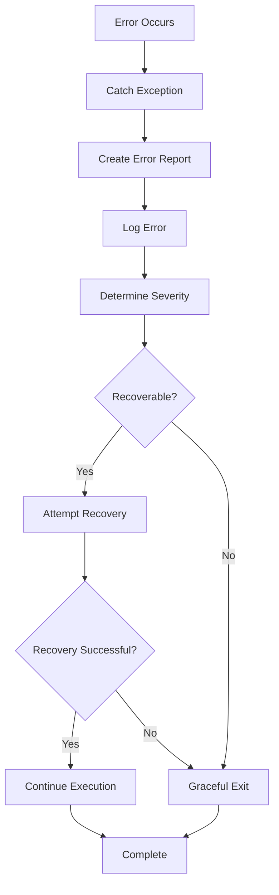

### Module Loading Error Flow

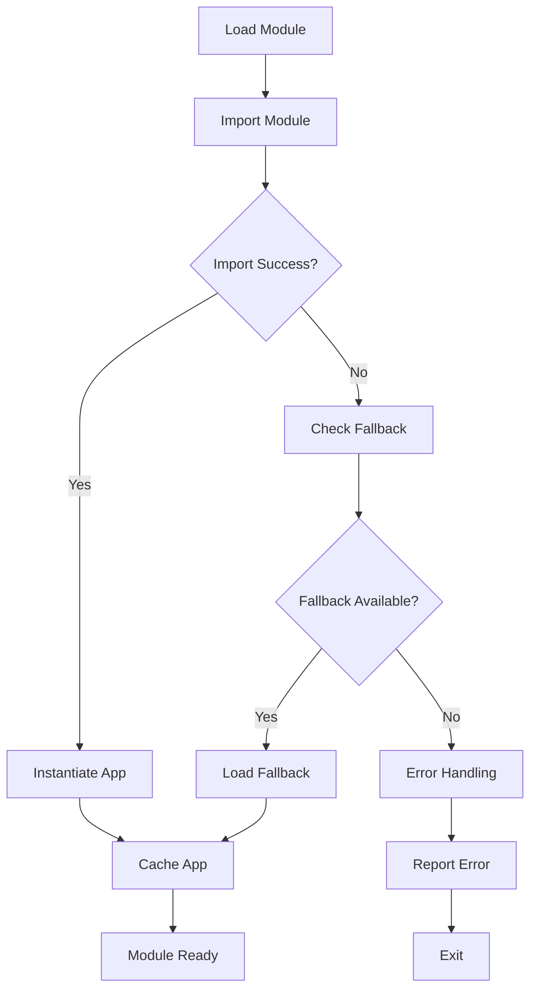

## Performance Data Flow

### Lazy Loading Performance

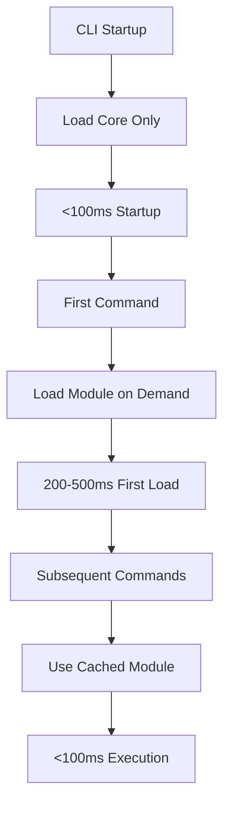

### Memory Management Flow

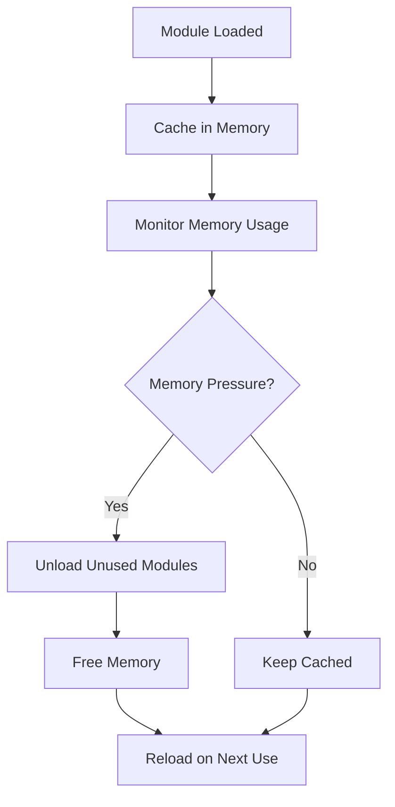

## Data Model Flow

### PlanBundle Lifecycle

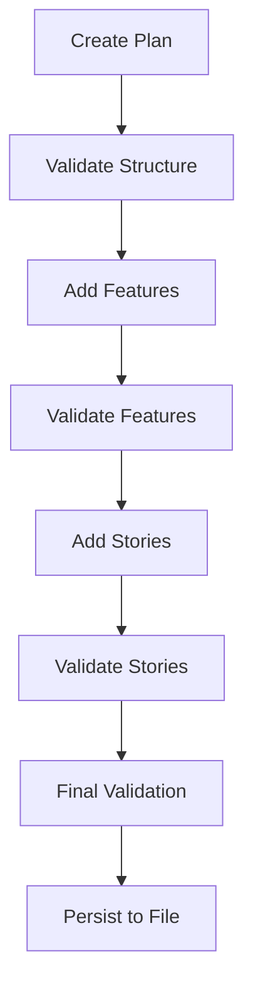

### ProjectBundle Flow

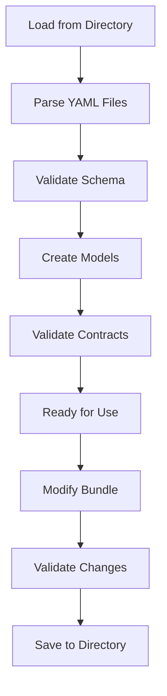

## Event-Driven Data Flow

### Event Processing Pipeline

```mermaid
graph TD
    A[Event Emitted] --> B[Event Queue]
    B --> C[Event Dispatcher]
    C --> D[Event Handlers]
    D --> E[Process Event]
    E --> F[Generate Response]
    F --> G[Emit New Events]
    G --> B
```

### Command Event Flow

```mermaid
sequenceDiagram
    participant User
    participant CLI
    participant EventBus
    participant Handlers
    participant Output
    
    User->>CLI: Execute command
    CLI->>EventBus: emit(command_started)
    EventBus->>Handlers: dispatch to handlers
    Handlers->>CLI: Process command
    CLI->>EventBus: emit(command_processing)
    CLI->>Output: Generate output
    Output->>User: Display results
    CLI->>EventBus: emit(command_completed)
```

## Data Transformation Patterns

### Data Normalization Flow

```mermaid
graph TD
    A[Raw Data] --> B[Normalize Structure]
    B --> C[Standardize Formats]
    C --> D[Validate Schema]
    D --> E[Normalized Data]
```

### Data Enrichment Flow

```mermaid
graph TD
    A[Base Data] --> B[Add Metadata]
    B --> C[Add Context]
    C --> D[Add Relationships]
    D --> E[Enriched Data]
```

## API Data Flow

### REST API Integration Flow

```mermaid
graph TD
    A[External API] --> B[API Client]
    B --> C[Request Data]
    C --> D[Parse Response]
    D --> E[Transform to Models]
    E --> F[Validate Data]
    F --> G[Use in Processing]
```

### GraphQL Data Flow

```mermaid
graph TD
    A[GraphQL Endpoint] --> B[Query Execution]
    B --> C[Response Parsing]
    C --> D[Data Extraction]
    D --> E[Type Conversion]
    E --> F[Model Creation]
```

## File System Data Flow

### File Operations Flow

```mermaid
graph TD
    A[File Request] --> B[Check Permissions]
    B --> C[Open File]
    C --> D[Read/Write Data]
    D --> E[Handle Errors]
    E --> F[Close File]
    F --> G[Return Results]
```

### YAML Processing Flow

```mermaid
graph TD
    A[YAML File] --> B[Parse YAML]
    B --> C[Validate Schema]
    C --> D[Create Models]
    D --> E[Validate Contracts]
    E --> F[Use Data]
    F --> G[Modify Data]
    G --> H[Serialize to YAML]
    H --> I[Write File]
```

## Data Flow Diagrams by Component

### Command Registry Data Flow

```mermaid
graph TD
    A[CLI] --> B[CommandRegistry.register_command]
    B --> C[Store Metadata]
    C --> D[Create Loader]
    D --> E[Registry Ready]
    E --> F[CLI.get_typer_app]
    F --> G[Loader.load]
    G --> H[Return Typer App]
```

### Adapter Registry Data Flow

```mermaid
graph TD
    A[Adapter] --> B[AdapterRegistry.register_adapter]
    B --> C[Store Adapter Class]
    C --> D[Registry Ready]
    D --> E[Command.get_adapter]
    E --> F[Instantiate Adapter]
    F --> G[Return Adapter Instance]
```

### Module State Data Flow

```mermaid
graph TD
    A[Module State File] --> B[Load JSON]
    B --> C[Parse States]
    C --> D[Create State Objects]
    D --> E[Apply to Registry]
    E --> F[Module State Ready]
    F --> G[State Changes]
    G --> H[Serialize to JSON]
    H --> I[Save State File]
```

## Data Flow Anti-Patterns

### Common Anti-Patterns to Avoid

```mermaid
graph TD
    A[Direct Core Imports] --> B[Use CommandRegistry Instead]
    C[Synchronous Loading] --> D[Use Lazy Loading]
    E[Tight Coupling] --> F[Use Interfaces]
    G[Global State] --> H[Use Dependency Injection]
```

### Performance Anti-Patterns

```mermaid
graph TD
    A[Load All Modules] --> B[Load on Demand]
    C[Block Main Thread] --> D[Use Async Operations]
    E[Memory Leaks] --> F[Proper Cleanup]
    G[Redundant Validation] --> H[Cache Results]
```

## Data Flow Optimization Strategies

### Caching Strategies

```mermaid
graph TD
    A[First Request] --> B[Load Data]
    B --> C[Cache Result]
    C --> D[Subsequent Requests]
    D --> E[Use Cached Data]
    E --> F[Fast Response]
```

### Parallel Processing

```mermaid
graph TD
    A[Input Data] --> B[Split into Chunks]
    B --> C[Process Chunk 1]
    B --> D[Process Chunk 2]
    B --> E[Process Chunk N]
    C --> F[Combine Results]
    D --> F
    E --> F
    F --> G[Final Result]
```

### Batch Processing

```mermaid
graph TD
    A[Multiple Requests] --> B[Batch Together]
    B --> C[Single Processing]
    C --> D[Generate Results]
    D --> E[Return All Results]
```

## Data Flow Monitoring

### Monitoring Architecture

```mermaid
graph TD
    A[Data Flow] --> B[Instrumentation]
    B --> C[Metrics Collection]
    C --> D[Performance Monitoring]
    D --> E[Alerting]
    E --> F[Optimization]
```

### Key Metrics to Monitor

- **Module Load Time**: Time to load modules on demand
- **Command Execution Time**: End-to-end command performance
- **Memory Usage**: Peak memory during operations
- **Error Rates**: Frequency of data flow errors
- **Cache Hit Rate**: Effectiveness of caching strategies

## Data Flow Testing

### Data Flow Test Strategy

```mermaid
graph TD
    A[Unit Tests] --> B[Component Tests]
    B --> C[Integration Tests]
    C --> D[End-to-End Tests]
    D --> E[Performance Tests]
```

### Test Coverage Targets

| Test Type | Coverage Target | Focus |
|-----------|----------------|-------|
| Unit tests | 80%+ | Individual components |
| Component tests | 70%+ | Component interactions |
| Integration tests | 60%+ | Cross-component flows |
| E2E tests | Key scenarios | Complete workflows |
| Performance tests | Critical paths | Performance characteristics |

## Data Flow Documentation Standards

### Documentation Requirements

1. **Every data flow** must have:
   - Clear diagram showing components
   - Description of data transformations
   - Performance characteristics
   - Error handling strategy

2. **Every component** must document:
   - Input data format
   - Output data format
   - Data validation rules
   - Performance contracts

3. **Every integration point** must document:
   - Data exchange format
   - Error handling
   - Version compatibility
   - Performance expectations

### Data Flow Documentation Example

```python
class DataAnalyzer:
    """
    Analyzes code repositories and extracts features.
    
    Data Flow:
    1. Input: Repository path and analysis parameters
    2. Process: AST parsing → Pattern detection → Feature extraction
    3. Output: AnalysisResult with detected features
    
    Performance:
    - Typical: 1-5 seconds per 1000 files
    - Memory: 50-100MB peak usage
    - Scalability: Linear with file count
    
    Error Handling:
    - Invalid paths: ValidationError
    - Parse errors: AnalysisError
    - Timeout: AnalysisTimeoutError
    """
    
    def analyze_repository(self, repo_path: Path) -> AnalysisResult:
        """
        Analyze a repository.
        
        Data Flow:
        1. Validate repo_path exists
        2. Scan directory structure
        3. Parse Python files with AST
        4. Detect patterns with Semgrep
        5. Merge results and score confidence
        6. Return AnalysisResult
        
        Args:
            repo_path: Path to repository root
            
        Returns:
            AnalysisResult with features and metrics
            
        Raises:
            ValidationError: If repo_path is invalid
            AnalysisError: If analysis fails
            
        Performance Contract:
            - Time: O(n) where n = number of files
            - Space: O(m) where m = AST size
            - Typical: < 2s for 500 files
        """
        # Implementation
        ...
```

## Future Data Flow Enhancements

### Planned Improvements

1. **Streaming Processing**: Handle large datasets without loading entirely into memory
2. **Distributed Analysis**: Parallel processing across multiple workers
3. **Incremental Updates**: Only process changed files
4. **Smart Caching**: Cache based on file content hashes
5. **Real-time Monitoring**: Live data flow visualization

### Roadmap

```mermaid
gantt
    title Data Flow Enhancements Roadmap
    dateFormat  YYYY-MM
    section Performance
    Streaming Processing: active, perf-001, 2026-03, 2026-05
    Smart Caching: perf-002, 2026-04, 2026-06
    
    section Scalability
    Distributed Analysis: scale-001, 2026-05, 2026-07
    Incremental Updates: scale-002, 2026-06, 2026-08
    
    section Observability
    Real-time Monitoring: obs-001, 2026-07, 2026-09
```
