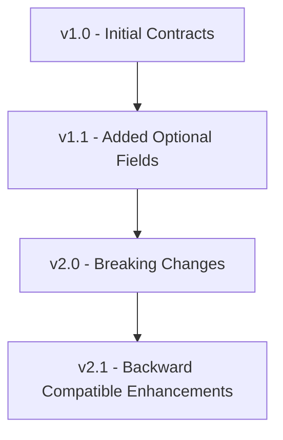
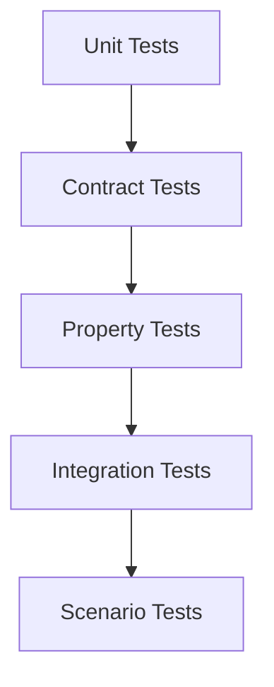

# SpecFact CLI Interface Contracts

## Core Interface Contracts

### CommandRegistry Interface

```python
from collections.abc import Callable
from typing import Protocol
from specfact_cli.registry.metadata import CommandMetadata
import typer

class CommandRegistryInterface(Protocol):
    """Interface for the CommandRegistry."""
    
    def register_command(
        self,
        name: str,
        loader: Callable[[], typer.Typer],
        metadata: CommandMetadata
    ) -> None:
        """
        Register a command with the registry.
        
        Args:
            name: Command name (e.g., "sync", "analyze")
            loader: Callable that returns a Typer app
            metadata: Command metadata including help text
            
        Raises:
            ValueError: If command already registered
            ContractViolation: If metadata is invalid
        """
        ...
    
    def get_typer_app(self, name: str) -> typer.Typer:
        """
        Get Typer app for a command (lazy load).
        
        Args:
            name: Command name to retrieve
            
        Returns:
            Typer app instance
            
        Raises:
            ValueError: If command not registered
            ImportError: If module loading fails
        """
        ...
    
    def list_commands(self) -> list[CommandMetadata]:
        """
        List all registered commands.
        
        Returns:
            List of command metadata
        """
        ...
    
    def get_command_help(self, name: str) -> str:
        """
        Get help text for a command.
        
        Args:
            name: Command name
            
        Returns:
            Help text string
            
        Raises:
            ValueError: If command not found
        """
        ...
```

### BridgeAdapter Interface

```python
from abc import ABC, abstractmethod
from pathlib import Path
from typing import Any
from specfact_cli.models.bridge import BridgeConfig, ToolCapabilities
from specfact_cli.models.change import ChangeTracking, ChangeProposal

class BridgeAdapter(ABC):
    """Base interface for all bridge adapters."""
    
    @abstractmethod
    def detect(self, repo_path: Path, bridge_config: BridgeConfig | None = None) -> bool:
        """
        Detect if this adapter applies to the given repository.
        
        Args:
            repo_path: Path to repository root
            bridge_config: Optional bridge configuration
            
        Returns:
            True if adapter can handle this repository
            
        Contracts:
            @require(lambda repo_path: repo_path.exists())
            @ensure(lambda result: isinstance(result, bool))
        """
        ...
    
    @abstractmethod
    def import_artifact(
        self,
        artifact_key: str,
        artifact_path: Path | dict,
        project_bundle: Any,
        bridge_config: BridgeConfig | None = None
    ) -> None:
        """
        Import artifact from tool format to SpecFact.
        
        Args:
            artifact_key: Type of artifact (e.g., "specification", "plan")
            artifact_path: Path to artifact or artifact data
            project_bundle: Target project bundle to update
            bridge_config: Optional bridge configuration
            
        Raises:
            ValueError: If artifact_key not supported
            ImportError: If import fails
            
        Contracts:
            @require(lambda artifact_key: artifact_key in self.get_capabilities().supported_artifacts)
            @require(lambda project_bundle: hasattr(project_bundle, 'update'))
        """
        ...
    
    @abstractmethod
    def export_artifact(
        self,
        artifact_key: str,
        artifact_data: Any,
        bridge_config: BridgeConfig | None = None
    ) -> Path | dict:
        """
        Export artifact from SpecFact to tool format.
        
        Args:
            artifact_key: Type of artifact to export
            artifact_data: Artifact data to export
            bridge_config: Optional bridge configuration
            
        Returns:
            Path to exported file or dict with export data
            
        Raises:
            ValueError: If artifact_key not supported
            ExportError: If export fails
            
        Contracts:
            @require(lambda artifact_key: artifact_key in self.get_capabilities().supported_artifacts)
            @ensure(lambda result: isinstance(result, (Path, dict)))
        """
        ...
    
    @abstractmethod
    def generate_bridge_config(self, repo_path: Path) -> BridgeConfig:
        """
        Generate bridge configuration for this adapter.
        
        Args:
            repo_path: Path to repository root
            
        Returns:
            BridgeConfig instance
            
        Contracts:
            @require(lambda repo_path: repo_path.exists())
            @ensure(lambda result: isinstance(result, BridgeConfig))
        """
        ...
    
    @abstractmethod
    def get_capabilities(self, repo_path: Path, bridge_config: BridgeConfig | None = None) -> ToolCapabilities:
        """
        Get adapter capabilities.
        
        Args:
            repo_path: Path to repository root
            bridge_config: Optional bridge configuration
            
        Returns:
            ToolCapabilities describing what this adapter supports
            
        Contracts:
            @require(lambda repo_path: repo_path.exists())
            @ensure(lambda result: isinstance(result, ToolCapabilities))
        """
        ...
    
    @abstractmethod
    def load_change_tracking(
        self,
        bundle_dir: Path,
        bridge_config: BridgeConfig | None = None
    ) -> ChangeTracking | None:
        """
        Load change tracking from adapter-specific storage.
        
        Args:
            bundle_dir: Path to bundle directory
            bridge_config: Optional bridge configuration
            
        Returns:
            ChangeTracking instance or None if not available
            
        Contracts:
            @require(lambda bundle_dir: bundle_dir.exists())
            @ensure(lambda result: result is None or isinstance(result, ChangeTracking))
        """
        ...
    
    @abstractmethod
    def save_change_tracking(
        self,
        bundle_dir: Path,
        change_tracking: ChangeTracking,
        bridge_config: BridgeConfig | None = None
    ) -> None:
        """
        Save change tracking to adapter-specific storage.
        
        Args:
            bundle_dir: Path to bundle directory
            change_tracking: ChangeTracking instance to save
            bridge_config: Optional bridge configuration
            
        Contracts:
            @require(lambda bundle_dir: bundle_dir.exists())
            @require(lambda change_tracking: isinstance(change_tracking, ChangeTracking))
        """
        ...
```

### ModulePackage Interface

```python
from pydantic import BaseModel, Field
from typing import List, Optional

class ModuleManifest(BaseModel):
    """Module package manifest definition."""
    
    name: str = Field(..., description="Module identifier")
    version: str = Field(..., description="Semantic version")
    commands: List[str] = Field(..., min_items=1, description="Command names provided by this module")
    
    # Optional fields
    command_help: Optional[dict[str, str]] = Field(
        None,
        description="Optional help text for commands"
    )
    pip_dependencies: Optional[List[str]] = Field(
        None,
        description="Optional Python package dependencies"
    )
    module_dependencies: Optional[List[str]] = Field(
        None,
        description="Optional module dependencies"
    )
    core_compatibility: Optional[str] = Field(
        None,
        description="Required core version range"
    )
    tier: Optional[str] = Field(
        None,
        description="Module tier (community/enterprise)"
    )
    addon_id: Optional[str] = Field(
        None,
        description="Addon identifier for marketplace"
    )
    
    # Contracts
    @classmethod
    def __pydantic_init_subclass__(cls):
        """Add validation contracts."""
        from icontract import require
        
        @require(lambda name: name.isidentifier() and len(name) > 0)
        def validate_name(self):
            return True
            
        @require(lambda version: version.count('.') >= 2)
        def validate_version(self):
            return True
```

## Data Model Contracts

### PlanBundle Contract

```python
from pydantic import BaseModel, Field, validator
from typing import List
from datetime import datetime

class Idea(BaseModel):
    """High-level idea definition."""
    title: str = Field(..., min_length=1, max_length=200)
    narrative: str = Field(..., min_length=10, max_length=5000)

class Story(BaseModel):
    """User story definition."""
    key: str = Field(..., regex=r'^STORY-\d+$')
    title: str = Field(..., min_length=1, max_length=300)
    acceptance: List[str] = Field(..., min_items=1)
    
    @validator('acceptance')
    def validate_acceptance_criteria(cls, v):
        """Ensure acceptance criteria are reasonable."""
        if len(v) > 10:
            raise ValueError("Too many acceptance criteria (max 10)")
        for criterion in v:
            if len(criterion) > 500:
                raise ValueError("Acceptance criterion too long (max 500 chars)")
        return v

class Feature(BaseModel):
    """Feature with stories."""
    key: str = Field(..., regex=r'^FEATURE-\d+$')
    title: str = Field(..., min_length=1, max_length=200)
    outcomes: List[str] = Field(..., min_items=1, max_items=5)
    stories: List[Story] = Field(..., min_items=1)
    
    @validator('outcomes')
    def validate_outcomes(cls, v):
        """Validate feature outcomes."""
        for outcome in v:
            if len(outcome) > 300:
                raise ValueError("Outcome too long (max 300 chars)")
        return v

class PlanBundle(BaseModel):
    """Complete plan bundle."""
    version: str = Field(default="1.0", regex=r'^\d+\.\d+$')
    idea: Idea
    features: List[Feature] = Field(..., min_items=1)
    created_at: datetime = Field(default_factory=datetime.now)
    updated_at: datetime = Field(default_factory=datetime.now)
    
    @validator('features')
    def validate_feature_keys_unique(cls, v):
        """Ensure all feature keys are unique."""
        keys = [feature.key for feature in v]
        if len(keys) != len(set(keys)):
            raise ValueError("Feature keys must be unique")
        return v
```

### ProtocolSpec Contract

```python
from pydantic import BaseModel, Field, validator
from typing import List, Optional

class Transition(BaseModel):
    """State machine transition."""
    from_state: str = Field(..., min_length=1)
    on_event: str = Field(..., min_length=1)
    to_state: str = Field(..., min_length=1)
    guard: Optional[str] = Field(None, max_length=100)
    
    @validator('from_state', 'to_state')
    def validate_state_names(cls, v):
        """Validate state names."""
        if not v.isidentifier():
            raise ValueError("State names must be valid identifiers")
        return v

class ProtocolSpec(BaseModel):
    """FSM protocol specification."""
    states: List[str] = Field(..., min_items=2)
    start: str = Field(..., min_length=1)
    transitions: List[Transition] = Field(..., min_items=1)
    
    @validator('states')
    def validate_states_unique(cls, v):
        """Ensure all states are unique."""
        if len(v) != len(set(v)):
            raise ValueError("State names must be unique")
        return v
    
    @validator('start')
    def validate_start_state(cls, v, values):
        """Ensure start state is in states list."""
        if 'states' in values and v not in values['states']:
            raise ValueError("Start state must be in states list")
        return v
    
    @validator('transitions')
    def validate_transitions(cls, v, values):
        """Validate all transitions reference valid states."""
        if 'states' not in values:
            return v
        
        valid_states = set(values['states'])
        for transition in v:
            if transition.from_state not in valid_states:
                raise ValueError(f"Invalid from_state: {transition.from_state}")
            if transition.to_state not in valid_states:
                raise ValueError(f"Invalid to_state: {transition.to_state}")
        
        return v
```

## Service Contracts

### CodeAnalyzer Contract

```python
from pathlib import Path
from typing import Optional
from specfact_cli.models.analysis import AnalysisResult

class CodeAnalyzerInterface:
    """Contract for code analysis services."""
    
    def analyze_repository(
        self,
        repo_path: Path,
        confidence_threshold: float = 0.7,
        max_depth: Optional[int] = None
    ) -> AnalysisResult:
        """
        Analyze a code repository.
        
        Args:
            repo_path: Path to repository root
            confidence_threshold: Minimum confidence for detected features
            max_depth: Maximum directory depth to analyze
            
        Returns:
            AnalysisResult with detected features and issues
            
        Contracts:
            @require(lambda repo_path: repo_path.exists() and repo_path.is_dir())
            @require(lambda confidence_threshold: 0.0 <= confidence_threshold <= 1.0)
            @ensure(lambda result: isinstance(result, AnalysisResult))
            @ensure(lambda result: result.confidence >= 0.0)
        """
        ...
    
    def detect_patterns(
        self,
        code_content: str,
        pattern_type: str
    ) -> list[dict]:
        """
        Detect specific patterns in code.
        
        Args:
            code_content: Code content to analyze
            pattern_type: Type of pattern to detect (e.g., "api", "model", "crud")
            
        Returns:
            List of detected patterns with locations
            
        Contracts:
            @require(lambda code_content: isinstance(code_content, str) and len(code_content) > 0)
            @require(lambda pattern_type: pattern_type in ["api", "model", "crud", "auth"])
            @ensure(lambda result: isinstance(result, list))
        """
        ...
```

### PlanGenerator Contract

```python
from specfact_cli.models.plan import PlanBundle
from specfact_cli.models.analysis import AnalysisResult

class PlanGeneratorInterface:
    """Contract for plan generation services."""
    
    def generate_plan(
        self,
        analysis_result: AnalysisResult,
        bundle_name: str,
        include_tests: bool = True
    ) -> PlanBundle:
        """
        Generate a plan bundle from analysis results.
        
        Args:
            analysis_result: Code analysis results
            bundle_name: Name for the plan bundle
            include_tests: Whether to include test stories
            
        Returns:
            Generated PlanBundle
            
        Contracts:
            @require(lambda analysis_result: isinstance(analysis_result, AnalysisResult))
            @require(lambda bundle_name: len(bundle_name) > 0)
            @ensure(lambda result: isinstance(result, PlanBundle))
            @ensure(lambda result: len(result.features) > 0)
        """
        ...
    
    def update_plan(
        self,
        existing_plan: PlanBundle,
        new_analysis: AnalysisResult
    ) -> PlanBundle:
        """
        Update an existing plan with new analysis.
        
        Args:
            existing_plan: Current plan bundle
            new_analysis: New analysis results
            
        Returns:
            Updated PlanBundle
            
        Contracts:
            @require(lambda existing_plan: isinstance(existing_plan, PlanBundle))
            @require(lambda new_analysis: isinstance(new_analysis, AnalysisResult))
            @ensure(lambda result: isinstance(result, PlanBundle))
        """
        ...
```

## Validation Contracts

### ContractValidator Contract

```python
from specfact_cli.models.validation import ValidationReport
from specfact_cli.models.plan import PlanBundle

class ContractValidatorInterface:
    """Contract for validation services."""
    
    def validate_plan(
        self,
        plan: PlanBundle,
        strict: bool = False
    ) -> ValidationReport:
        """
        Validate a plan bundle.
        
        Args:
            plan: Plan bundle to validate
            strict: Whether to apply strict validation rules
            
        Returns:
            ValidationReport with results
            
        Contracts:
            @require(lambda plan: isinstance(plan, PlanBundle))
            @ensure(lambda result: isinstance(result, ValidationReport))
            @ensure(lambda result: result.is_valid in [True, False])
        """
        ...
    
    def validate_protocol(
        self,
        protocol_spec: ProtocolSpec
    ) -> ValidationReport:
        """
        Validate a protocol specification.
        
        Args:
            protocol_spec: Protocol specification to validate
            
        Returns:
            ValidationReport with results
            
        Contracts:
            @require(lambda protocol_spec: isinstance(protocol_spec, ProtocolSpec))
            @ensure(lambda result: isinstance(result, ValidationReport))
        """
        ...
```

## Adapter Contracts

### AdapterRegistry Contract

```python
from typing import Type, Optional
from specfact_cli.adapters.base import BridgeAdapter

class AdapterRegistryInterface:
    """Contract for adapter registry."""
    
    def register_adapter(
        self,
        adapter_class: Type[BridgeAdapter],
        adapter_name: str
    ) -> None:
        """
        Register an adapter class.
        
        Args:
            adapter_class: BridgeAdapter subclass
            adapter_name: Name to register adapter under
            
        Contracts:
            @require(lambda adapter_class: issubclass(adapter_class, BridgeAdapter))
            @require(lambda adapter_name: len(adapter_name) > 0)
        """
        ...
    
    def get_adapter(
        self,
        adapter_name: str
    ) -> Optional[BridgeAdapter]:
        """
        Get an adapter instance.
        
        Args:
            adapter_name: Name of adapter to retrieve
            
        Returns:
            BridgeAdapter instance or None
            
        Contracts:
            @require(lambda adapter_name: len(adapter_name) > 0)
            @ensure(lambda result: result is None or isinstance(result, BridgeAdapter))
        """
        ...
    
    def list_adapters(self) -> list[str]:
        """
        List all registered adapter names.
        
        Returns:
            List of adapter names
            
        Contracts:
            @ensure(lambda result: isinstance(result, list))
            @ensure(lambda result: all(isinstance(name, str) for name in result))
        """
        ...
    
    def detect_applicable_adapters(
        self,
        repo_path: Path
    ) -> list[str]:
        """
        Detect which adapters apply to a repository.
        
        Args:
            repo_path: Path to repository
            
        Returns:
            List of applicable adapter names
            
        Contracts:
            @require(lambda repo_path: repo_path.exists())
            @ensure(lambda result: isinstance(result, list))
        """
        ...
```

## Error Handling Contracts

### Error Types

```python
class SpecFactError(Exception):
    """Base exception for all SpecFact errors."""
    pass

class ValidationError(SpecFactError):
    """Validation-related errors."""
    def __init__(self, message: str, details: Optional[dict] = None):
        super().__init__(message)
        self.details = details or {}

class ContractViolationError(SpecFactError):
    """Contract violation errors."""
    def __init__(self, message: str, contract_name: str):
        super().__init__(message)
        self.contract_name = contract_name

class AdapterError(SpecFactError):
    """Adapter-related errors."""
    def __init__(self, message: str, adapter_name: str):
        super().__init__(message)
        self.adapter_name = adapter_name

class ModuleError(SpecFactError):
    """Module-related errors."""
    def __init__(self, message: str, module_name: str):
        super().__init__(message)
        self.module_name = module_name
```

### Error Handling Contract

```python
from typing import Callable, Any
from specfact_cli.models.error import ErrorReport

class ErrorHandlerInterface:
    """Contract for error handling."""
    
    def handle_error(
        self,
        error: Exception,
        context: dict[str, Any]
    ) -> ErrorReport:
        """
        Handle an error and generate a report.
        
        Args:
            error: Exception to handle
            context: Additional context for error handling
            
        Returns:
            ErrorReport with details
            
        Contracts:
            @require(lambda error: isinstance(error, Exception))
            @ensure(lambda result: isinstance(result, ErrorReport))
        """
        ...
    
    def log_error(
        self,
        error_report: ErrorReport,
        level: str = "error"
    ) -> None:
        """
        Log an error report.
        
        Args:
            error_report: Error report to log
            level: Log level (error, warning, info)
            
        Contracts:
            @require(lambda error_report: isinstance(error_report, ErrorReport))
            @require(lambda level: level in ["error", "warning", "info"])
        """
        ...
    
    def create_recovery_suggestion(
        self,
        error_report: ErrorReport
    ) -> Optional[str]:
        """
        Create recovery suggestion for an error.
        
        Args:
            error_report: Error report to analyze
            
        Returns:
            Recovery suggestion or None
            
        Contracts:
            @require(lambda error_report: isinstance(error_report, ErrorReport))
            @ensure(lambda result: result is None or isinstance(result, str))
        """
        ...
```

## Contract Implementation Patterns

### Runtime Contracts with icontract

```python
from icontract import require, ensure, invariant
from beartype import beartype

class PlanService:
    """Example service with runtime contracts."""
    
    def __init__(self, max_features: int = 100):
        self.max_features = max_features
        
        # Class invariant
        invariant(
            lambda self: self.max_features > 0,
            "Max features must be positive"
        )
    
    @require(lambda plan: plan is not None)
    @require(lambda plan: len(plan.features) <= self.max_features)
    @ensure(lambda result: result.is_valid in [True, False])
    @beartype
    def validate_plan(self, plan: PlanBundle) -> ValidationReport:
        """Validate a plan with runtime contracts."""
        # Implementation
        return ValidationReport(is_valid=True)
```

### Property-Based Testing Contracts

```python
from hypothesis import given
from hypothesis.strategies import text, integers
import pytest

class TestPlanValidation:
    """Property-based tests for plan validation."""
    
    @given(
        title=text(min_size=1, max_size=200),
        feature_count=integers(min_value=1, max_value=10)
    )
    def test_plan_creation(self, title: str, feature_count: int):
        """Test that plans can be created with valid parameters."""
        # Create plan with generated parameters
        idea = Idea(title=title, narrative="Test narrative")
        
        features = []
        for i in range(feature_count):
            story = Story(
                key=f"STORY-{i+1:03d}",
                title=f"Story {i+1}",
                acceptance=[f"Criteria {i+1}"]
            )
            feature = Feature(
                key=f"FEATURE-{i+1:03d}",
                title=f"Feature {i+1}",
                outcomes=[f"Outcome {i+1}"],
                stories=[story]
            )
            features.append(feature)
        
        # This should not raise exceptions
        plan = PlanBundle(idea=idea, features=features)
        
        # Verify contracts
        assert len(plan.features) == feature_count
        assert all(f.key.startswith("FEATURE-") for f in plan.features)
```

### CrossHair Contract Exploration

```python
# Example of contract that CrossHair can explore
from icontract import require, ensure

@require(lambda x: x > 0)
@ensure(lambda result: result > 0)
def positive_square(x: int) -> int:
    """Square a positive integer."""
    return x * x

# CrossHair will automatically test this with various inputs
# to find counterexamples that violate the contracts
```

## Contract Evolution and Versioning

### Contract Versioning Strategy



### Contract Compatibility Rules

1. **Backward Compatible Changes**:
   - Adding optional fields
   - Adding new methods (non-abstract)
   - Relaxing constraints
   - Adding new enum values

2. **Breaking Changes** (require major version bump):
   - Removing fields/methods
   - Changing field types
   - Tightening constraints
   - Changing method signatures

3. **Deprecation Policy**:
   - Mark deprecated in current version
   - Maintain for 2 major versions
   - Remove in 3rd major version

### Contract Migration Example

```python
# v1.0 Contract
class PlanBundleV1(BaseModel):
    version: str = "1.0"
    idea: Idea
    features: List[Feature]

# v2.0 Contract (breaking change)
class PlanBundleV2(BaseModel):
    version: str = "2.0"
    idea: Idea
    features: List[Feature]
    change_tracking: Optional[ChangeTracking] = None  # New field
    
    # Migration method
    @classmethod
    def from_v1(cls, v1_plan: PlanBundleV1) -> 'PlanBundleV2':
        """Migrate from v1 to v2."""
        return cls(
            idea=v1_plan.idea,
            features=v1_plan.features,
            change_tracking=None  # Default for migrated plans
        )
```

## Contract Testing Strategy

### Test Pyramid for Contracts



### Contract Test Coverage Targets

| Test Type | Coverage Target | Tools |
|-----------|----------------|-------|
| Runtime contracts | 90%+ | icontract, beartype |
| Property tests | 80%+ | hypothesis |
| Contract exploration | Key contracts | CrossHair |
| Integration tests | 70%+ | pytest |

### Contract Test Example

```python
import pytest
from icontract import ViolationError
from specfact_cli.models.plan import PlanBundle, Idea, Feature, Story

def test_plan_validation_contracts():
    """Test that plan validation contracts work correctly."""
    
    # Test valid plan
    idea = Idea(title="Test", narrative="Test narrative")
    story = Story(key="STORY-001", title="Test story", acceptance=["Criteria"])
    feature = Feature(key="FEATURE-001", title="Test feature", outcomes=["Outcome"], stories=[story])
    plan = PlanBundle(idea=idea, features=[feature])
    
    # This should not raise
    assert plan.version == "1.0"
    
    # Test invalid plan - should raise ViolationError
    with pytest.raises(ViolationError):
        # Empty features list violates contract
        PlanBundle(idea=idea, features=[])
    
    with pytest.raises(ViolationError):
        # Invalid story key format
        invalid_story = Story(key="INVALID-KEY", title="Bad", acceptance=["Criteria"])
        invalid_feature = Feature(key="FEATURE-001", title="Bad", outcomes=["Outcome"], stories=[invalid_story])
        PlanBundle(idea=idea, features=[invalid_feature])
```

## Contract Documentation Standards

### Contract Documentation Requirements

1. **Every public method** must have:
   - `@require` for preconditions
   - `@ensure` for postconditions  
   - `@invariant` for class invariants (when applicable)
   - `@beartype` for type checking

2. **Every contract** must have:
   - Clear description in docstring
   - Examples of valid/invalid inputs
   - Error handling documentation

3. **Every module** must document:
   - Public interface contracts
   - Error types that can be raised
   - Performance contracts (time/space complexity)

### Contract Documentation Example

```python
class PlanService:
    """
    Service for plan management.
    
    Contracts:
    - All methods require valid PlanBundle inputs
    - All methods ensure valid PlanBundle outputs
    - Methods raise ValidationError on contract violations
    """
    
    @require(
        lambda plan: isinstance(plan, PlanBundle),
        "Input must be a valid PlanBundle"
    )
    @require(
        lambda plan: len(plan.features) > 0,
        "Plan must have at least one feature"
    )
    @ensure(
        lambda result: result.is_valid in [True, False],
        "Result must be a valid ValidationReport"
    )
    @beartype
    def validate_plan(self, plan: PlanBundle) -> ValidationReport:
        """
        Validate a plan bundle.
        
        Args:
            plan: PlanBundle to validate
            
        Returns:
            ValidationReport with results
            
        Raises:
            ValidationError: If plan violates validation rules
            
        Examples:
            >>> service = PlanService()
            >>> valid_plan = PlanBundle(idea=idea, features=[feature])
            >>> report = service.validate_plan(valid_plan)
            >>> assert report.is_valid
            
            >>> invalid_plan = PlanBundle(idea=idea, features=[])
            >>> service.validate_plan(invalid_plan)
            Traceback (most recent call last):
                ...
            ValidationError: Plan must have at least one feature
            
        Performance:
            - Time complexity: O(n) where n = number of features
            - Space complexity: O(n)
            - Typical execution: < 100ms for 100 features
        """
        # Implementation
        ...
```