# SpecFact CLI Module System Architecture

## Module Registry Architecture

### Overview

The SpecFact CLI uses a **modular command registry** introduced in v0.27 that enables:

- **Lazy Loading**: Modules are loaded only when their commands are invoked
- **Fast Startup**: No need to import all modules at startup
- **Independent Delivery**: Modules can be developed and delivered independently
- **Explicit Interfaces**: Clear boundaries between core and modules

### Core Components

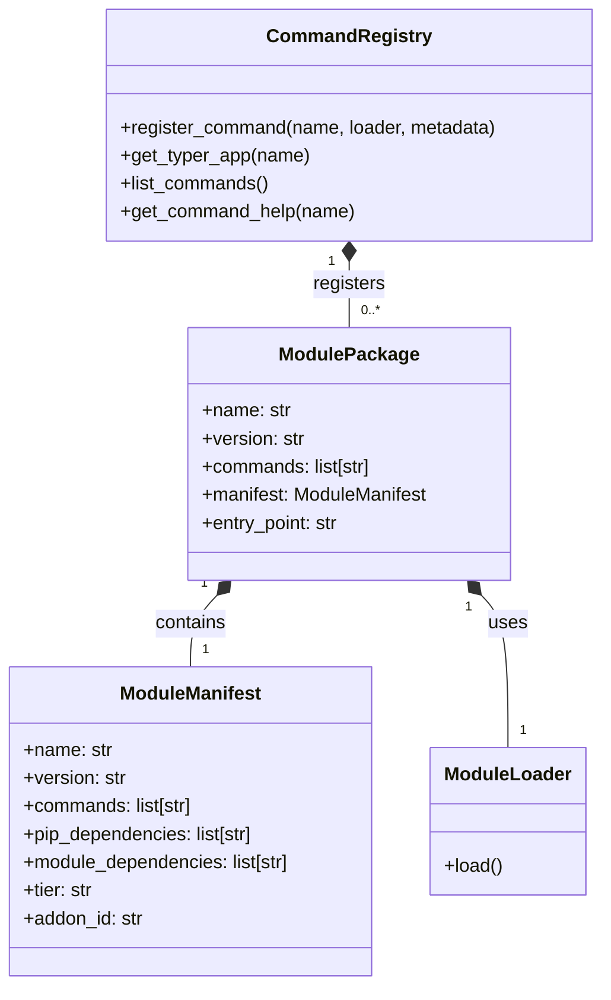

## Module Discovery and Registration

### Discovery Process

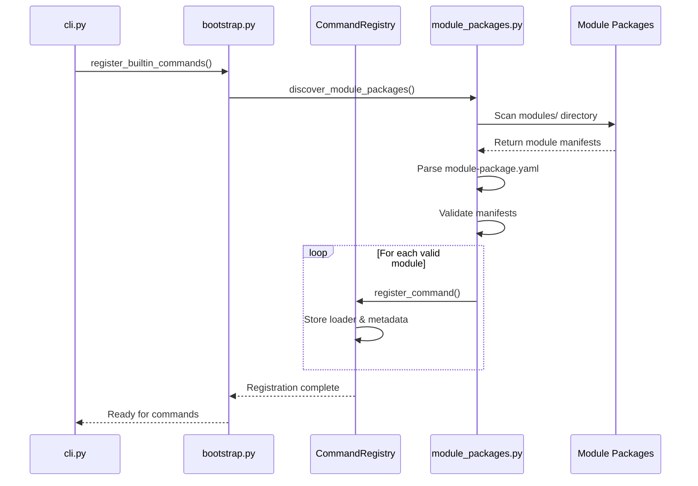

### Registration Flow

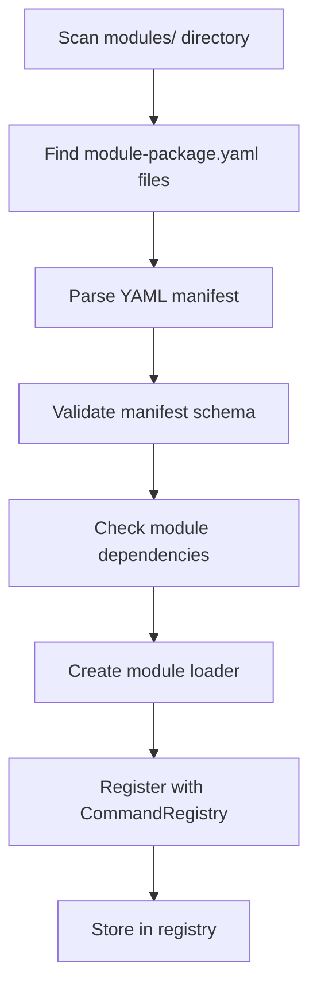

## Lazy Loading Mechanism

### Load-on-Demand Pattern

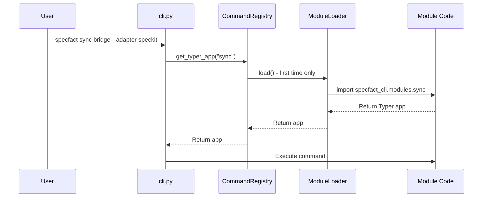

### Loading States

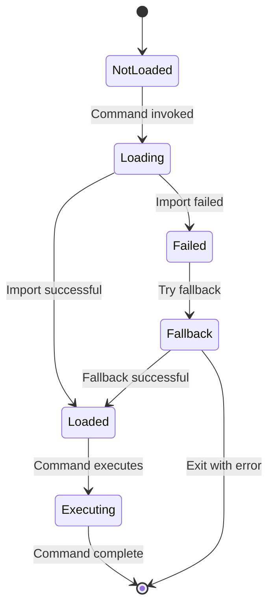

## Module Package Structure

### Standard Module Layout

```bash
modules/<module-name>/
├── module-package.yaml      # Module manifest
├── src/
│   ├── __init__.py         # Python package init
│   ├── app.py              # Typer app entry point
│   └── commands.py         # Command implementations
└── tests/                  # Module-specific tests (optional)
```

### Module Manifest Example

```yaml
# module-package.yaml
name: sync
version: "1.0.0"
commands:
  - sync
  - bridge
command_help:
  sync: "Synchronize SpecFact artifacts with external tools"
  bridge: "Bridge-based bidirectional synchronization"
pip_dependencies:
  - "ruamel.yaml>=0.18.0"
module_dependencies:
  - core
  - registry
core_compatibility: "^0.27.0"
tier: community
addon_id: specfact.sync
```

## Module Entry Point Pattern

### Standard app.py Structure

```python
# modules/<name>/src/app.py
from typer import Typer
from . import commands

# Create Typer app for this module
app = Typer(
    name="sync",
    help="Synchronize SpecFact artifacts with external tools",
    rich_markup_mode="rich",
)

# Import commands (this triggers registration)
from .commands import bridge, repository

# Add command groups
app.add_typer(bridge.app, name="bridge")
app.add_typer(repository.app, name="repository")
```

### Command Implementation Pattern

```python
# modules/<name>/src/commands.py
from typer import Typer
from beartype import beartype
from icontract import require, ensure

app = Typer(name="bridge", help="Bridge-based synchronization")

@app.command()
@require(lambda adapter: adapter in ["speckit", "openspec", "github"])
@beartype
def sync(
    adapter: str,
    bundle: str,
    bidirectional: bool = False,
) -> None:
    """Synchronize using bridge adapter."""
    # Implementation here
```

## Module State Management

### State File Structure

```json
{
  "modules": [
    {
      "id": "sync",
      "version": "1.0.0",
      "enabled": true,
      "dependencies": ["core", "registry"]
    },
    {
      "id": "analyze",
      "version": "1.2.0",
      "enabled": false
    }
  ]
}
```

### State Management Flow

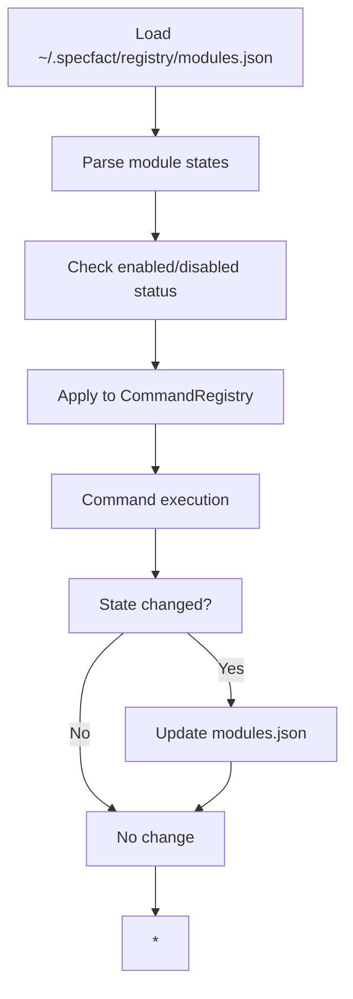

## Module Dependency Management

### Dependency Graph

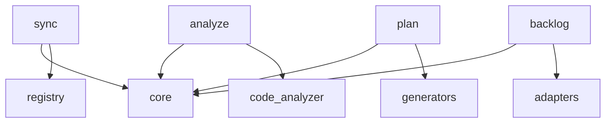

### Dependency Resolution

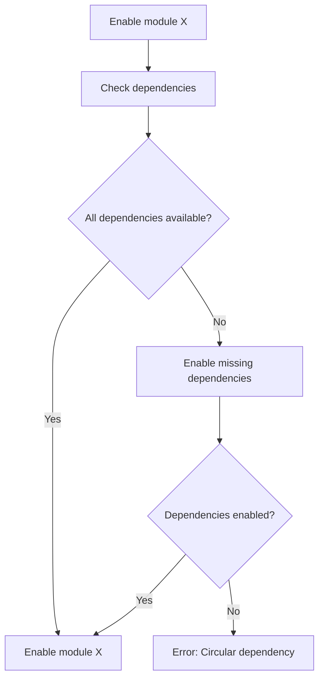

## Core-Module Isolation Principle

### Architecture Boundary

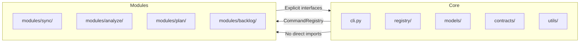

### Isolation Enforcement

1. **No direct imports**: Core never imports from `specfact_cli.modules.*`
2. **Interface-based**: All communication through `CommandRegistry`
3. **Contract validation**: Module interfaces validated at registration
4. **Static checks**: CI tests enforce isolation boundaries

## Module Lifecycle Commands

### Command Reference

```bash
# List available modules
specfact module list

# Enable a module
specfact module enable sync

# Disable a module
specfact module disable analyze

# Install a marketplace module
specfact module install specfact/backlog

# Uninstall a module
specfact module uninstall backlog

# Show module info
specfact module info sync
```

### Lifecycle State Machine

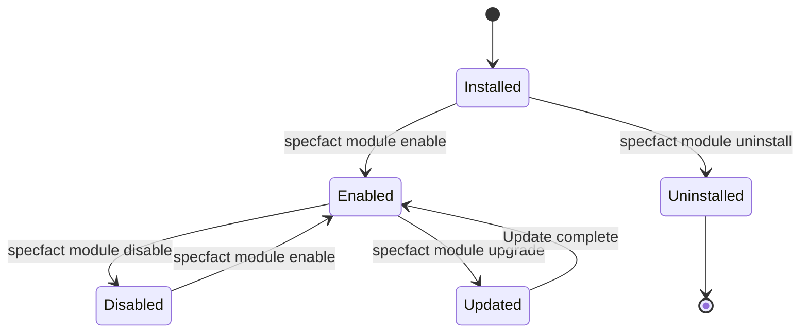

## Module Development Workflow

### Development Process

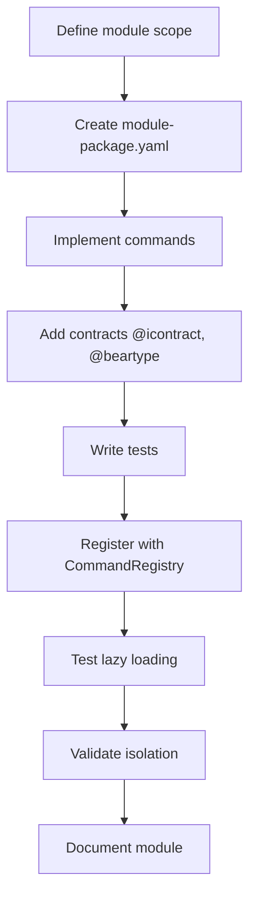

### Testing Strategy

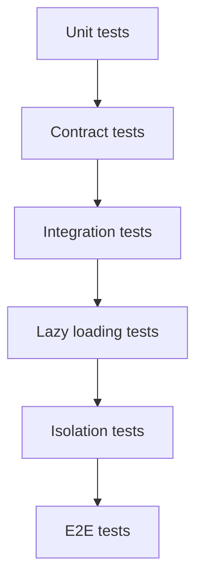

## Performance Characteristics

### Loading Performance

| Scenario | Time | Notes |
|----------|------|-------|
| Startup (no commands) | < 100ms | Only core loaded |
| First command | 200-500ms | Module loaded on demand |
| Subsequent commands | < 100ms | Module already loaded |
| All modules loaded | 1-2s | Rare case |

### Memory Usage

| Component | Memory | Notes |
|-----------|--------|-------|
| Core runtime | 10-20MB | Always loaded |
| Single module | 2-5MB | Loaded on demand |
| All modules | 50-80MB | Worst case |

## Module Security

### Security Boundaries

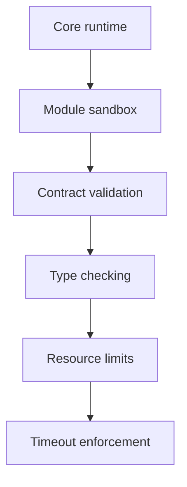

### Security Practices

1. **Contract-first**: All module interfaces have runtime contracts
2. **Type safety**: @beartype for runtime type checking
3. **Isolation**: No direct core imports from modules
4. **Validation**: Module manifests validated at load time
5. **Timeouts**: Command execution timeouts enforced

## Module Versioning and Compatibility

### Versioning Strategy

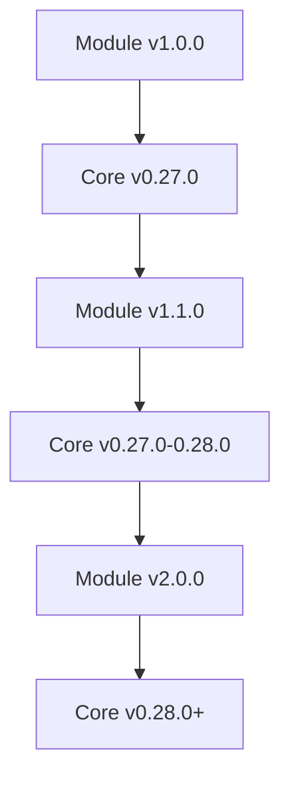

### Compatibility Matrix

| Module Version | Core Compatibility | Notes |
|----------------|-------------------|-------|
| 1.x.x | ^0.27.0 | Initial module system |
| 2.x.x | ^0.28.0 | Enhanced features |
| 3.x.x | ^0.29.0 | Breaking changes |

## Module Registry Implementation Details

### CommandRegistry Class

```python
class CommandRegistry:
    def __init__(self):
        self._commands: dict[str, tuple[Callable, CommandMetadata]] = {}
        self._help_cache: dict[str, str] = {}
    
    def register_command(
        self,
        name: str,
        loader: Callable[[], typer.Typer],
        metadata: CommandMetadata
    ) -> None:
        """Register a command with the registry."""
        self._commands[name] = (loader, metadata)
    
    def get_typer_app(self, name: str) -> typer.Typer:
        """Get Typer app for command (lazy load)."""
        if name not in self._commands:
            raise ValueError(f"Command {name} not registered")
        
        loader, _ = self._commands[name]
        return loader()
    
    def list_commands(self) -> list[CommandMetadata]:
        """List all registered commands."""
        return [meta for _, meta in self._commands.values()]
```

### Module Loader Implementation

```python
class ModuleLoader:
    def __init__(self, module_path: Path, manifest: ModuleManifest):
        self.module_path = module_path
        self.manifest = manifest
        self._app: typer.Typer | None = None
    
    def load(self) -> typer.Typer:
        """Lazy load the module."""
        if self._app is None:
            # Import the module dynamically
            spec = importlib.util.spec_from_file_location(
                f"specfact_cli.modules.{self.manifest.name}.src.app",
                self.module_path / "src" / "app.py"
            )
            module = importlib.util.module_from_spec(spec)
            spec.loader.exec_module(module)
            self._app = module.app
        
        return self._app
```

## Module Marketplace Integration

### Marketplace Architecture

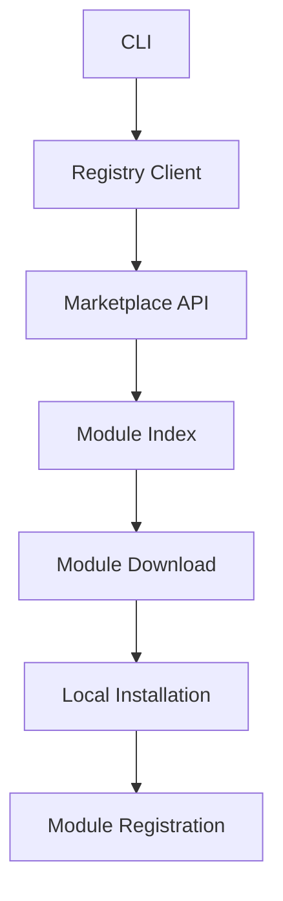

### Installation Flow

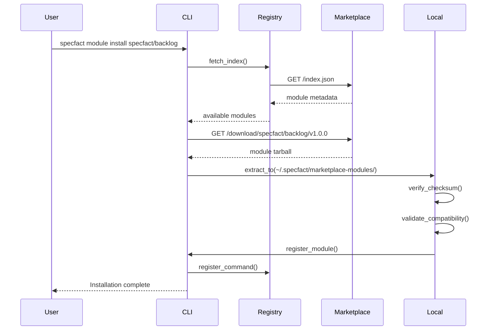

## Module Testing Strategy

### Test Pyramid

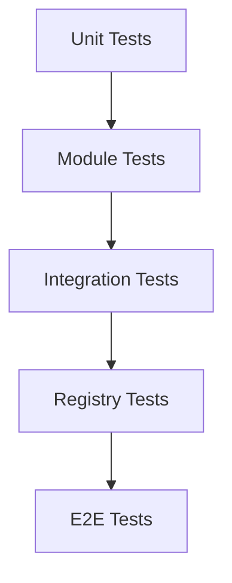

### Test Coverage Targets

| Test Type | Coverage Target | Focus |
|-----------|----------------|-------|
| Unit tests | 80%+ | Individual functions |
| Contract tests | 90%+ | Public interfaces |
| Integration tests | 70%+ | Module interactions |
| E2E tests | Key scenarios | User workflows |

## Module Documentation Requirements

### Required Documentation

1. **Module README**: Overview and usage
2. **Command help**: Typer help text
3. **Interface contracts**: @icontract decorators
4. **Examples**: Usage examples
5. **Error handling**: Documented error cases

### Documentation Structure

```bash
modules/<name>/
├── README.md              # Module overview
├── USAGE.md               # Usage examples
├── CONTRACTS.md           # Interface contracts
└── CHANGELOG.md           # Module changes
```

## Module Evolution and Deprecation

### Deprecation Policy

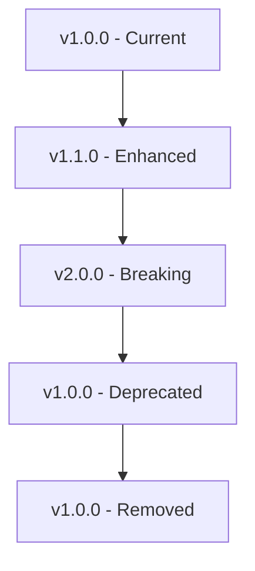

### Migration Path

1. **Announce deprecation** in release notes
2. **Add deprecation warnings** to console output
3. **Provide migration guide** in documentation
4. **Maintain backward compatibility** for 2 major versions
5. **Remove deprecated features** in next major version

## Future Enhancements

### Planned Features

1. **Dynamic module loading** from remote sources
2. **Module update notifications**
3. **Module dependency graph** visualization
4. **Module performance profiling**
5. **Enhanced security sandboxing**

### Roadmap

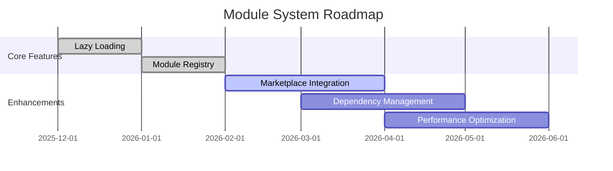
