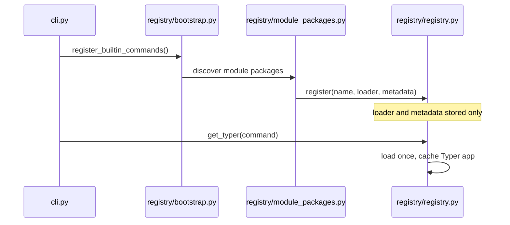

# SpecFact CLI Module System Architecture

## Status

The module system is production-ready and is the default command registration/runtime path.

## Registry flow



## Module package structure

```text
src/specfact_cli/modules/<module-name>/
  module-package.yaml
  src/
    __init__.py
    app.py
    commands.py
```

## Manifest fields

- Required: `name`, `version`, `commands`
- Optional: `command_help`, `pip_dependencies`, `module_dependencies`, `core_compatibility`, `tier`, `addon_id`
- Optional extension fields: `service_bridges`, `schema_extensions`, `publisher`, `integrity`

## Runtime behavior

- Commands are discovered at startup, imported on demand.
- Metadata remains available for help output without importing every module.
- Module enable/disable state is controlled by module state and lifecycle flows.

## Development guidance

- [Module Development Guide](../guides/module-development.md)
- [Module Security](../reference/module-security.md)
