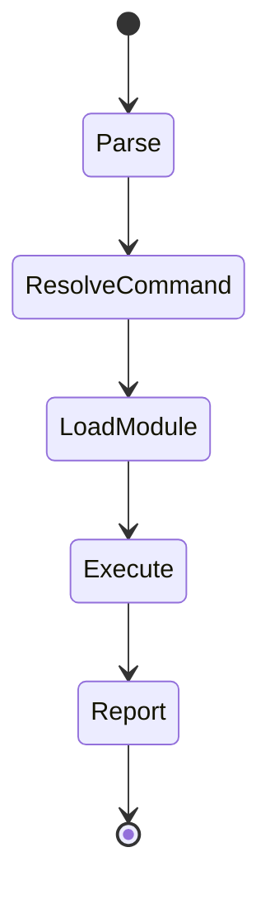
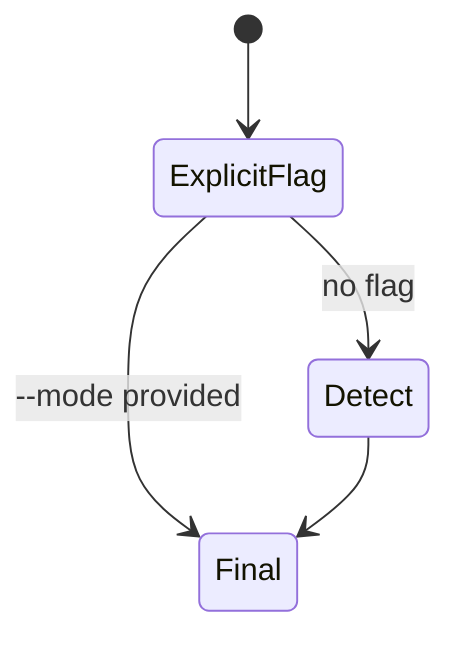

# SpecFact CLI State Machine Logic

## CLI command lifecycle

## Mode selection (implemented)

## Protocol FSM status

Protocol states and transitions are modeled in OpenSpec artifacts and data models.
Runtime FSM engine behavior is currently limited and tracked as planned work in `architecture-01-solution-layer`.
