# SpecFact CLI State Machine Logic

## CLI Workflow State Machines

### Main CLI Execution Flow

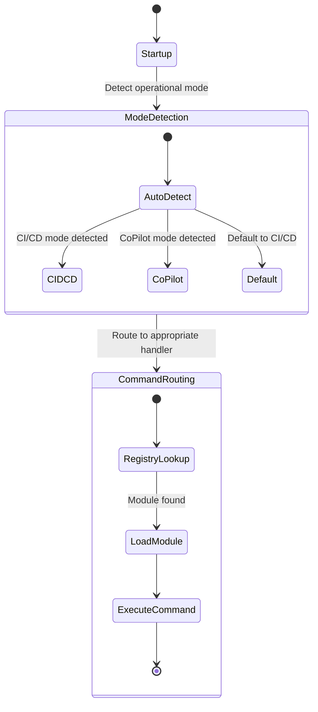

### Module Lifecycle State Machine

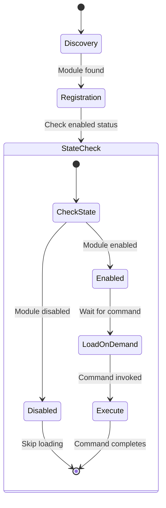

### Protocol FSM (Finite State Machine)

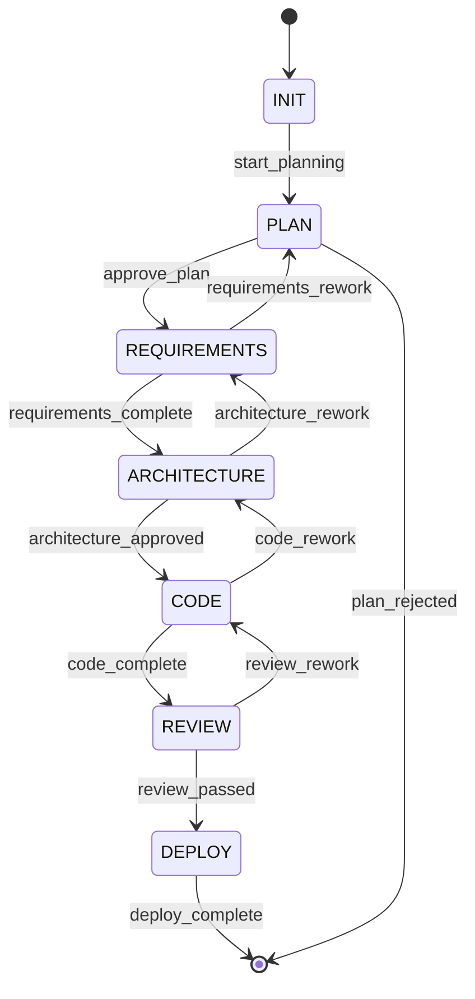

## Operational Mode State Transitions

### Mode Detection Logic

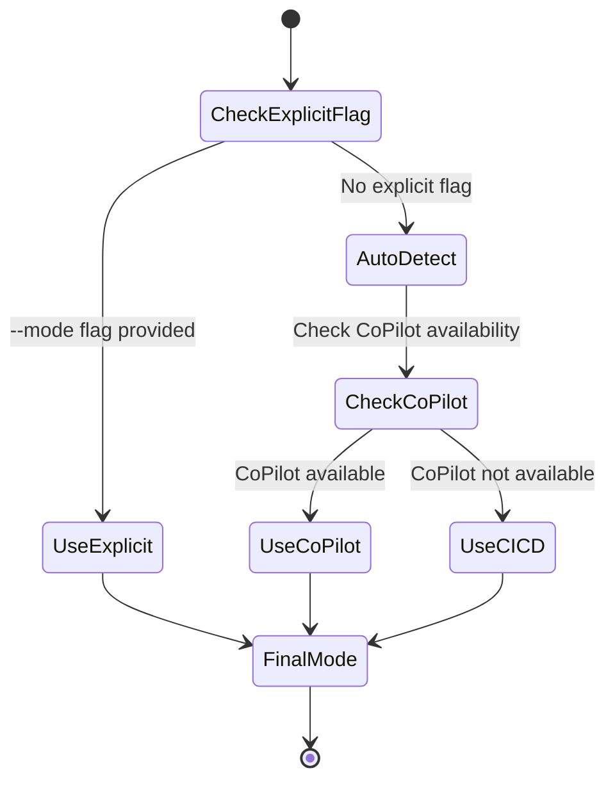

### CI/CD Mode State Machine

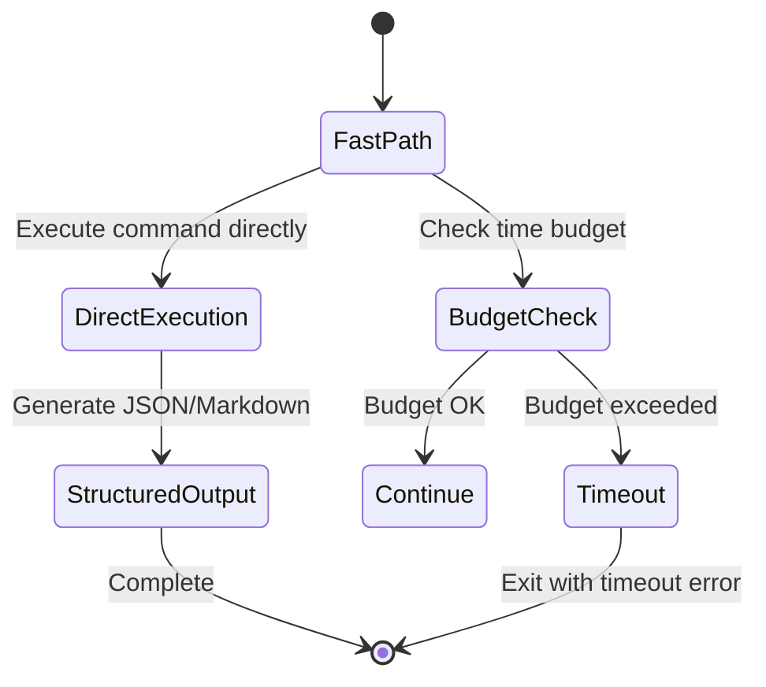

### CoPilot Mode State Machine

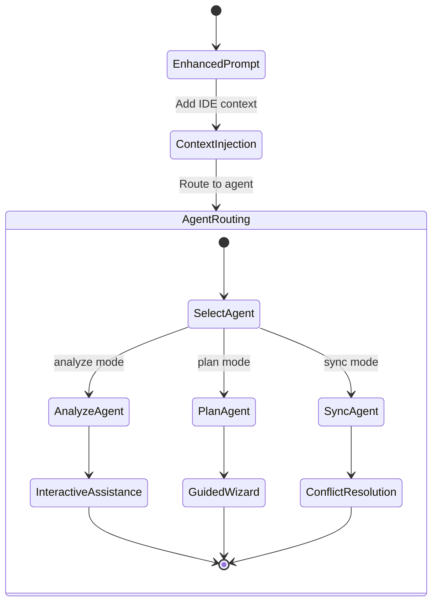

## Sync Operation State Machines

### Bridge Sync Flow

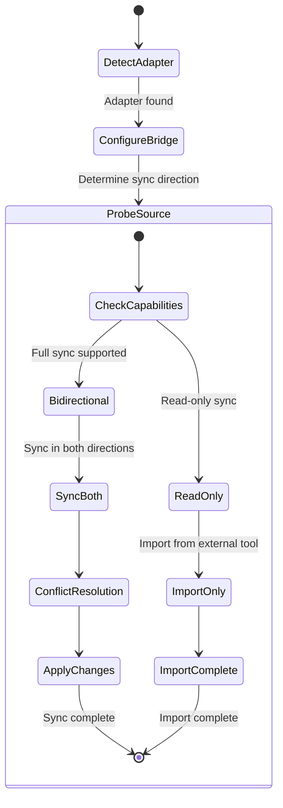

### Repository Sync State Machine

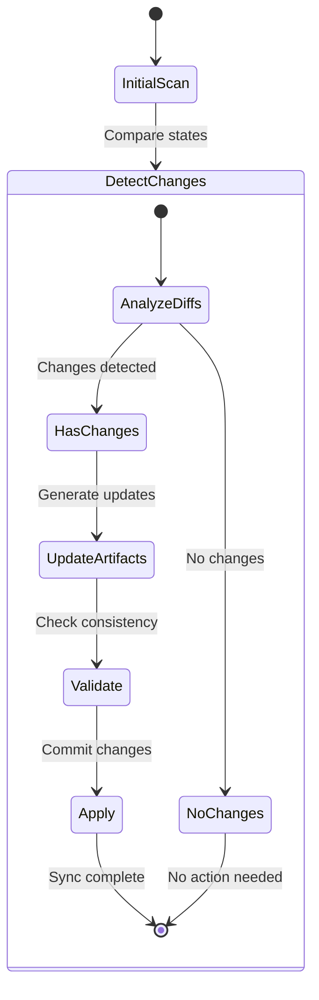

## Validation and Enforcement State Machines

### Contract Validation Flow

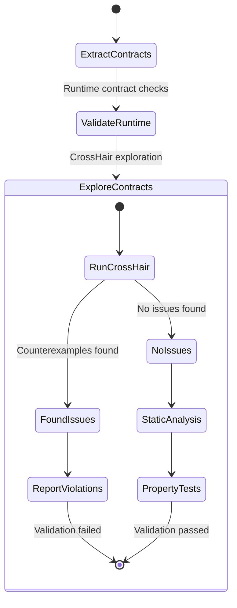

### Enforcement Gate State Machine

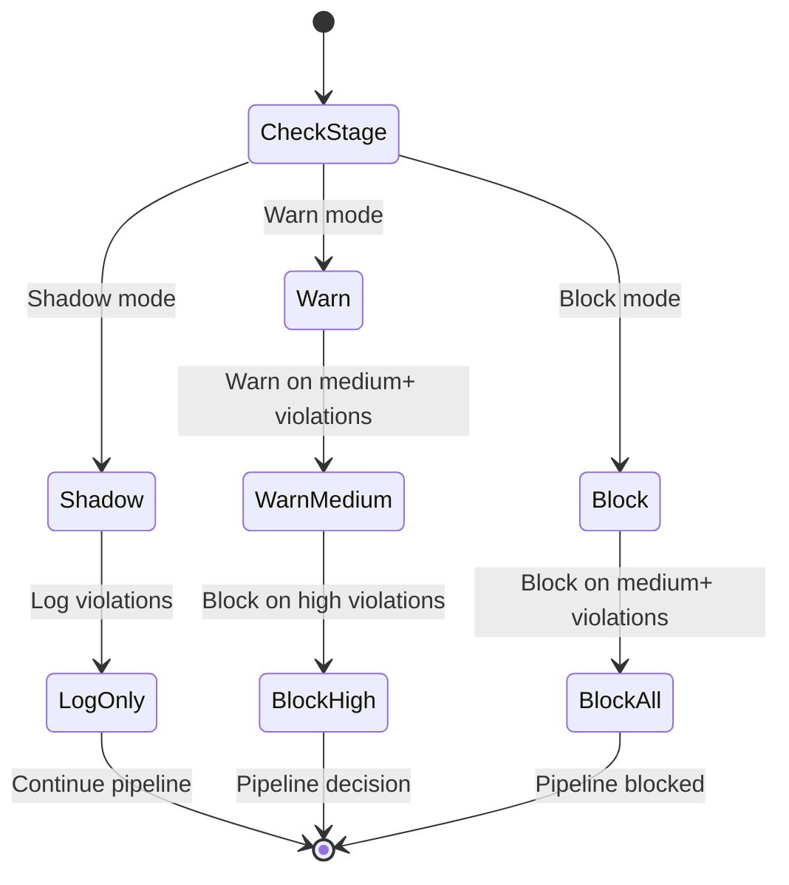

## Error Handling State Machines

### Command Execution Error Flow

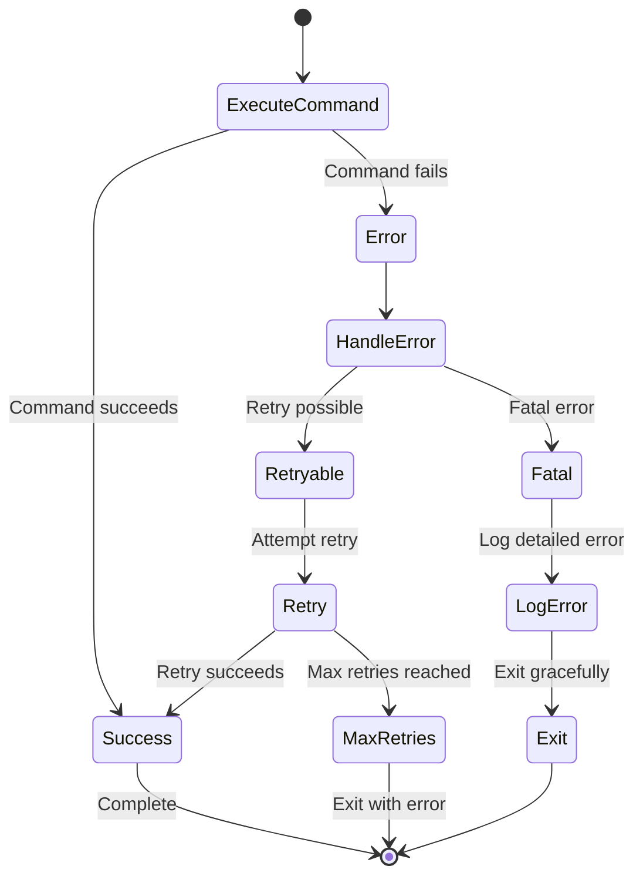

### Module Loading Error Flow

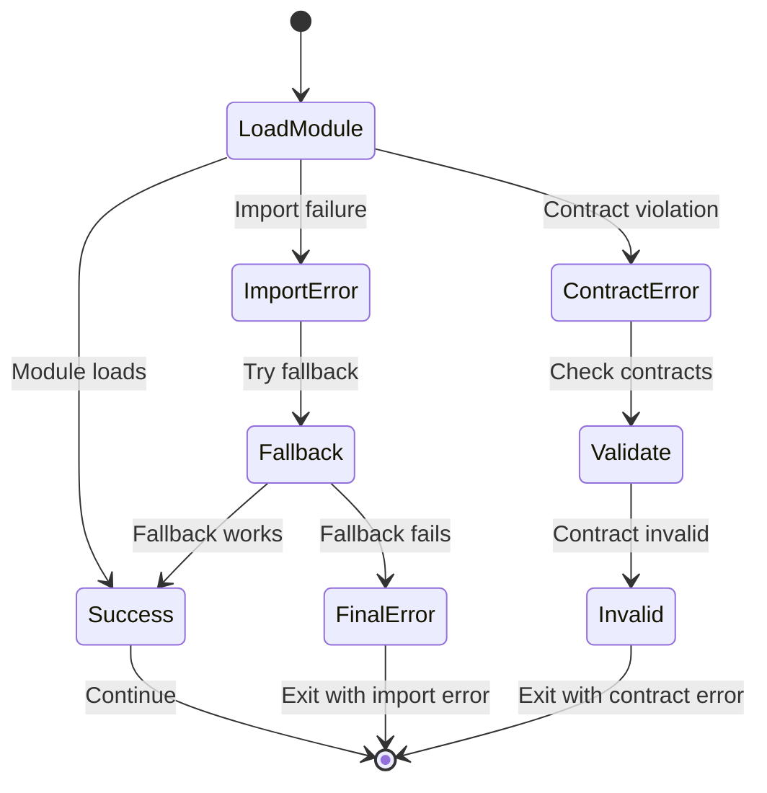

## Agent Mode State Machines

### Analyze Agent Flow

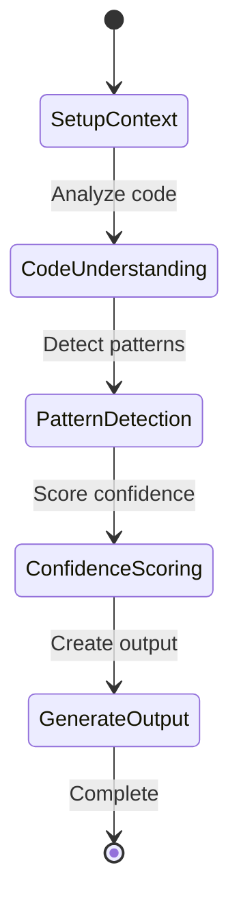

### Plan Agent Flow

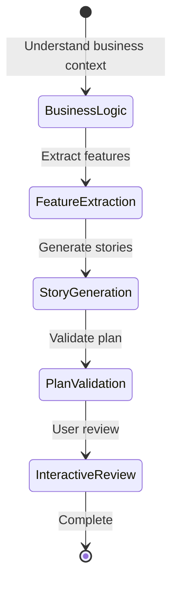

### Sync Agent Flow

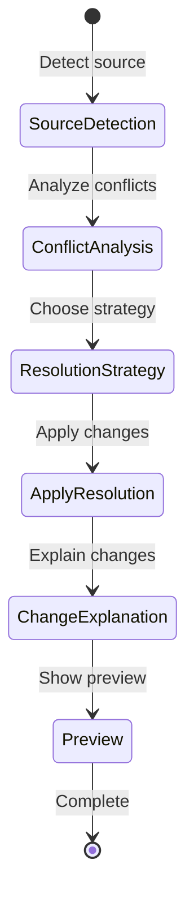

## Protocol State Machine Implementation

The protocol FSM is implemented using the following model:

```python
from pydantic import BaseModel
from typing import List, Optional

class Transition(BaseModel):
    """State machine transition."""
    from_state: str
    on_event: str
    to_state: str
    guard: Optional[str] = None

class ProtocolSpec(BaseModel):
    """FSM protocol specification."""
    states: List[str]
    start: str
    transitions: List[Transition]
```

### State Transition Example

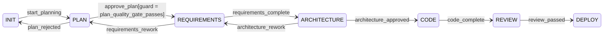

## State Machine Guard Conditions

### Common Guard Conditions

- `plan_quality_gate_passes`: All quality criteria met
- `requirements_complete`: All requirements documented
- `architecture_approved`: Architecture review passed
- `code_complete`: Implementation finished
- `review_passed`: Code review approved
- `budget_not_exceeded`: Time budget remaining

### Guard Implementation

```python
def plan_quality_gate_passes(plan: PlanBundle) -> bool:
    """Check if plan meets quality criteria."""
    return (
        len(plan.features) > 0 and
        all(len(feature.stories) > 0 for feature in plan.features) and
        plan.validation_status == "passed"
    )
```

## Event-Driven Architecture

### Event Types

- **Command Events**: `command_started`, `command_completed`, `command_failed`
- **Module Events**: `module_loaded`, `module_failed`
- **Sync Events**: `sync_started`, `conflict_detected`, `sync_completed`
- **Validation Events**: `validation_started`, `violation_found`, `validation_completed`

### Event Flow Example

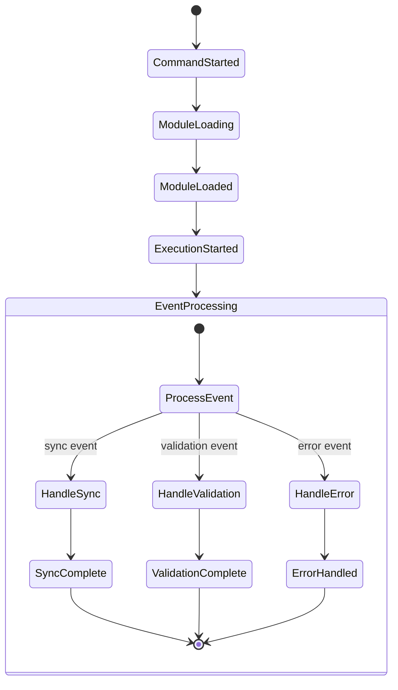

## State Persistence

### Module State Persistence

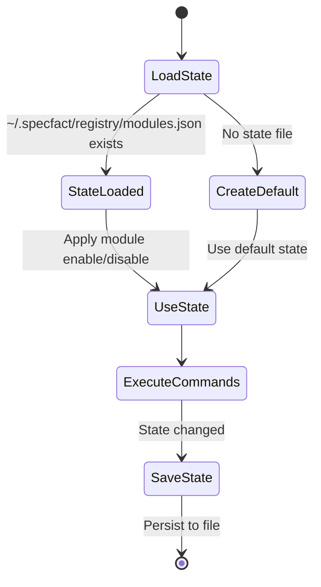

### Bridge Configuration Persistence

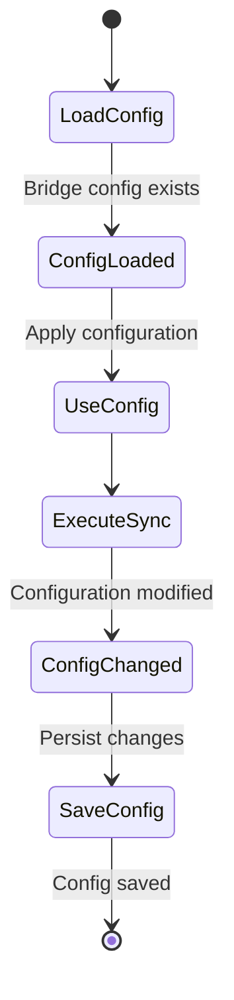
