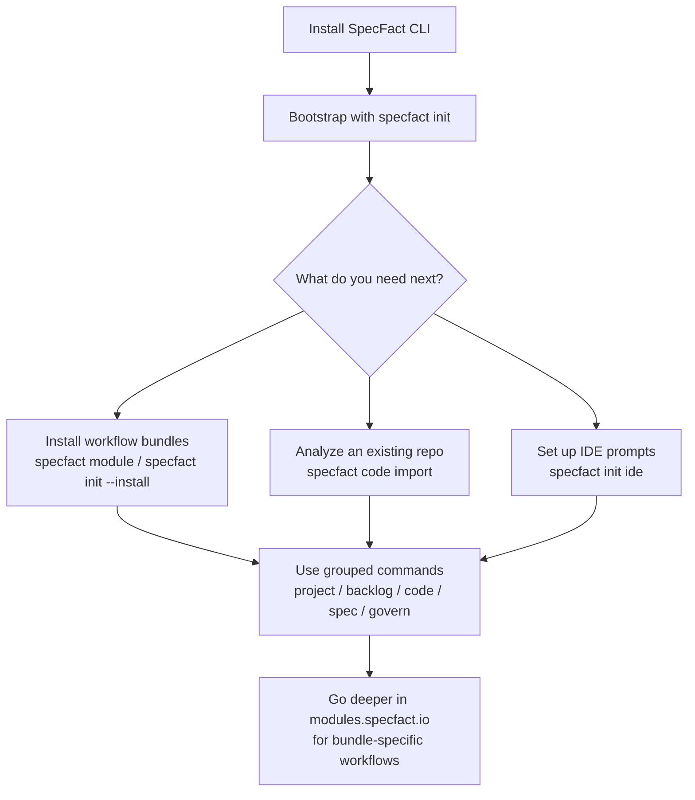

# Where to Start with SpecFact CLI

You installed the CLI. The next question is usually not "what command exists?" but "what should I actually use this for?"

This page is the short answer.

## What SpecFact is for

SpecFact helps teams turn real engineering work into a structured, traceable workflow:

- bootstrap a repository with a consistent CLI and IDE setup
- install only the workflow modules you actually need
- reverse-engineer an existing codebase into project structure and features
- connect planning, specs, validation, and governance through mounted command groups
- keep the core CLI lean while moving module-specific depth into the modules docs portal

SpecFact CLI does **not** include built-in AI. If you use Cursor, Copilot, Claude Code, or another supported IDE, SpecFact provides prompt templates and slash commands so your chosen copilot can invoke the deterministic CLI in a guided workflow.

If you are starting from an existing repository, SpecFact is primarily a **brownfield-first** tool. It helps you understand what you already have before you start inventing new process around it.

## Core CLI vs Modules

The easiest mental model is:

| If you want to... | Start here |
| --- | --- |
| Install, bootstrap, update, or manage the runtime | **Core CLI docs** |
| Decide which workflow bundles you need | **Core first**, then hand off to **modules docs** |
| Run backlog, project, code, spec, or govern workflows in depth | **Modules docs** |

The core CLI owns the platform entry points:

- `specfact init`
- `specfact module`
- `specfact upgrade`

Installed modules then mount the workflow groups:

- `specfact project ...`
- `specfact backlog ...`
- `specfact code ...`
- `specfact spec ...`
- `specfact govern ...`

## Quick decision guide

**"I just installed SpecFact and I need to..."**

| I need to... | Go here next |
| --- | --- |
| Understand the smallest useful first run | [5-Minute Quickstart](/getting-started/quickstart/) |
| Bootstrap this repo correctly | [specfact init](/core-cli/init/) |
| Decide which workflow bundles to install | [Installing Modules](/module-system/installing-modules/) and [modules docs overview](https://modules.specfact.io/) |
| Analyze an existing codebase | [5-Minute Quickstart](/getting-started/quickstart/) |
| Set up IDE prompts to use SpecFact with your AI copilot | [AI IDE Workflow](/guides/ai-ide-workflow/) |
| See the full command surface after install | [Command Reference](/reference/commands/) |

## Recommended first paths

### Path 1: "I have a repo and want SpecFact to tell me what is there"

This is the most common entry point.

1. Install the CLI
2. Run `specfact init --profile solo-developer`
3. Run `specfact code import <bundle-name> --repo .`
4. Check `specfact code repro --repo .`

Start here:

- [Installation](/getting-started/installation/)
- [5-Minute Quickstart](/getting-started/quickstart/)

### Path 2: "I want to understand which parts of SpecFact I actually need"

Start with the core runtime, then decide which mounted workflow groups belong in your setup.

1. Bootstrap the CLI with `specfact init`
2. Review module installation and grouped command families
3. Continue into the modules portal for bundle-specific guidance

Start here:

- [specfact init](/core-cli/init/)
- [Installing Modules](/module-system/installing-modules/)
- [Modules Docs Home](https://modules.specfact.io/)

### Path 3: "I want a shared team workflow, not just a local CLI"

Once the CLI is installed, the next step is usually IDE setup, grouped commands, and repeatable review or validation flows.

Start here:

- [AI IDE Workflow](/guides/ai-ide-workflow/)
- [Command Reference](/reference/commands/)
- [Migration Guide](/migration/migration-guide/)

## What happens after install



## Good first commands

```bash
# Install or update bootstrap state
specfact init --profile solo-developer

# See which modules are available
specfact module search

# See what is installed
specfact module list

# Analyze the current repository
specfact code import my-project --repo .

# Check resulting state
specfact code repro --repo .
```

## If you only remember one thing

Start with **core docs** when you are asking:

- how do I install this?
- how do I bootstrap the runtime?
- what command groups appear after module install?
- how do I move from installation to first useful result?

Switch to **modules docs** when you are asking:

- which workflow bundle solves my problem?
- how does backlog/project/spec/govern work in detail?
- what are the full runbooks, examples, and module-specific guides?

## Next pages

- [5-Minute Quickstart](/getting-started/quickstart/)
- [specfact init](/core-cli/init/)
- [Installing Modules](/module-system/installing-modules/)
- [Modules Docs Home](https://modules.specfact.io/)
