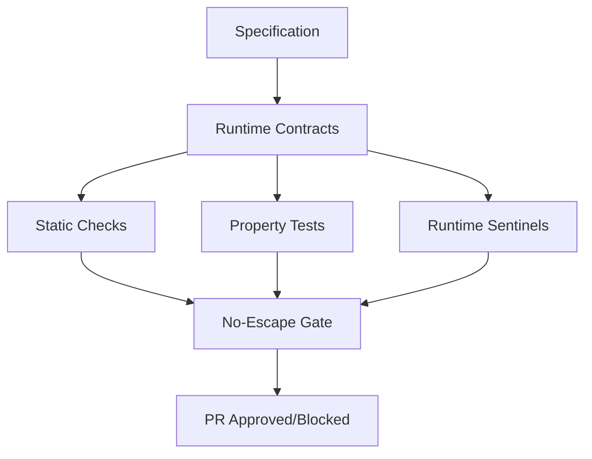

# Architecture

Technical architecture and design principles of SpecFact CLI.

## Quick Overview

**For Users**: SpecFact CLI is a **brownfield-first tool** that reverse engineers legacy Python code into documented specs, then enforces them as runtime contracts. It works in two modes: **CI/CD mode** (fast, automated) and **CoPilot mode** (interactive, AI-enhanced). **Primary use case**: Analyze existing codebases. **Secondary use case**: Add enforcement to Spec-Kit projects.

**For Contributors**: SpecFact CLI implements a contract-driven development framework through three layers: Specification (plans and protocols), Contract (runtime validation), and Enforcement (quality gates). The architecture supports dual-mode operation (CI/CD and CoPilot) with agent-based routing for complex operations.

---

## Overview

SpecFact CLI implements a **contract-driven development** framework through three core layers:

1. **Specification Layer** - Plan bundles and protocol definitions
2. **Contract Layer** - Runtime contracts, static checks, and property tests
3. **Enforcement Layer** - No-escape gates with budgets and staged enforcement

### Related Documentation

- [Getting Started](../getting-started/README.md) - Installation and first steps
- [Use Cases](../guides/use-cases.md) - Real-world scenarios
- [Workflows](../guides/workflows.md) - Common daily workflows
- [Commands](commands.md) - Complete command reference
- [Bridge Registry](bridge-registry.md) - Module-declared converter registration
- [Creating Custom Bridges](../guides/creating-custom-bridges.md) - Custom converter patterns

## Bridge Registry Integration

`arch-05-bridge-registry` introduces module-declared service converters into lifecycle registration.

- Modules declare `service_bridges` in `module-package.yaml`.
- Lifecycle loads converter classes by dotted path and registers them in `BridgeRegistry`.
- Invalid bridge declarations are non-fatal and skipped with warnings.
- Protocol compliance reporting uses effective runtime interface detection and logs one aggregate summary line.

## Operational Modes

SpecFact CLI supports two operational modes for different use cases:

### Mode 1: CI/CD Automation (Default)

**Best for:**

- Clean-code repositories
- Self-explaining codebases
- Lower complexity projects
- Automated CI/CD pipelines

**Characteristics:**

- Fast, deterministic execution (< 10s typical)
- No AI copilot dependency
- Direct command execution
- Structured JSON/Markdown output
- **Enhanced Analysis**: AST + Semgrep hybrid pattern detection (API endpoints, models, CRUD, code quality)
- **Optimized Bundle Size**: 81% reduction (18MB → 3.4MB, 5.3x smaller) via test pattern extraction to OpenAPI contracts
- **Interruptible**: All parallel operations support Ctrl+C for immediate cancellation

**Usage:**

```bash
# Auto-detected (default)
specfact import from-code my-project --repo .

# Explicit CI/CD mode
specfact --mode cicd import from-code my-project --repo .
```

### Mode 2: CoPilot-Enabled

**Best for:**

- Brownfield repositories
- High complexity codebases
- Mixed code quality
- Interactive development with AI assistants

**Characteristics:**

- Enhanced prompts for better analysis
- IDE integration via prompt templates (slash commands)
- Agent mode routing for complex operations
- Interactive assistance

**Usage:**

```bash
# Auto-detected (if CoPilot available)
specfact import from-code my-project --repo .

# Explicit CoPilot mode
specfact --mode copilot import from-code my-project --repo .

# IDE integration (slash commands)
# First, initialize: specfact init ide --ide cursor
# Then use in IDE chat:
/specfact.01-import legacy-api --repo . --confidence 0.7
/specfact.02-plan init legacy-api
/specfact.06-sync --adapter speckit --repo . --bidirectional
```

### Mode Detection

Mode is automatically detected based on:

1. **Explicit `--mode` flag** (highest priority)
2. **CoPilot API availability** (environment/IDE detection)
3. **IDE integration** (VS Code/Cursor with CoPilot enabled)
4. **Default to CI/CD mode** (fallback)

---

## Agent Modes

Agent modes provide enhanced prompts and routing for CoPilot-enabled operations:

### Available Agent Modes

- **`analyze` agent mode**: Brownfield analysis with code understanding
- **`plan` agent mode**: Plan management with business logic understanding
- **`sync` agent mode**: Bidirectional sync with conflict resolution

### Agent Mode Routing

Each command uses specialized agent mode routing:

```python
# Analyze agent mode
/specfact.01-import legacy-api --repo . --confidence 0.7
# → Enhanced prompts for code understanding
# → Context injection (current file, selection, workspace)
# → Interactive assistance for complex codebases

# Plan agent mode
/specfact.02-plan init legacy-api
# → Guided wizard mode
# → Natural language prompts
# → Context-aware feature extraction

# Sync agent mode
/specfact.06-sync --adapter speckit --repo . --bidirectional
# → Automatic source detection via bridge adapter
# → Conflict resolution assistance
# → Change explanation and preview
```

---

## Sync Operation

SpecFact CLI supports bidirectional synchronization for consistent change management:

### Bridge-Based Sync (Adapter-Agnostic)

Bidirectional synchronization between external tools (e.g., Spec-Kit, OpenSpec) and SpecFact via configurable bridge:

```bash
# Spec-Kit bidirectional sync
specfact sync bridge --adapter speckit --bundle <bundle-name> --repo . --bidirectional

# OpenSpec read-only sync (Phase 1)
specfact sync bridge --adapter openspec --mode read-only --bundle <bundle-name> --repo .

# OpenSpec cross-repository sync
specfact sync bridge --adapter openspec --mode read-only --bundle <bundle-name> --repo . --external-base-path ../specfact-cli-internal

# Continuous watch mode
specfact sync bridge --adapter speckit --bundle <bundle-name> --repo . --bidirectional --watch --interval 5
```

**What it syncs:**

- `specs/[###-feature-name]/spec.md`, `plan.md`, `tasks.md` ↔ `.specfact/projects/<bundle-name>/` aspect files
- `.specify/memory/constitution.md` ↔ SpecFact business context
- `specs/[###-feature-name]/research.md`, `data-model.md`, `quickstart.md` ↔ SpecFact supporting artifacts
- `specs/[###-feature-name]/contracts/*.yaml` ↔ SpecFact protocol definitions
- Automatic conflict resolution with priority rules

**Bridge Architecture**: The sync layer uses a configurable bridge (`.specfact/config/bridge.yaml`) that maps SpecFact logical concepts to physical tool artifacts, making it adapter-agnostic and extensible for future tool integrations (OpenSpec, Linear, Jira, Notion, etc.). The architecture uses a plugin-based adapter registry pattern - all adapters are registered in `AdapterRegistry` and accessed via `AdapterRegistry.get_adapter()`, eliminating hard-coded adapter checks in core components like `BridgeProbe` and `BridgeSync`.

### Repository Sync

Sync code changes to SpecFact artifacts:

```bash
# One-time sync
specfact sync repository --repo . --target .specfact

# Continuous watch mode
specfact sync repository --repo . --watch --interval 5
```

**What it tracks:**

- Code changes → Plan artifact updates
- Deviations from manual plans
- Feature/story extraction from code

## Contract Layers


```mermaid
graph TD
    A[Specification] --> B[Runtime Contracts]
    B --> C[Static Checks]
    B --> D[Property Tests]
    B --> E[Runtime Sentinels]
    C --> F[No-Escape Gate]
    D --> F
    E --> F
    F --> G[PR Approved/Blocked]
```

### 1. Specification Layer

**Project Bundle** (`.specfact/projects/<bundle-name>/` - modular structure with multiple aspect files):

```yaml
version: "1.0"
idea:
  title: "SpecFact CLI Tool"
  narrative: "Enable contract-driven development"
product:
  themes:
    - "Developer Experience"
  releases:
    - name: "v0.1"
      objectives: ["Import", "Analyze", "Enforce"]
features:
  - key: FEATURE-001
    title: "Spec-Kit Import"
    outcomes:
      - "Zero manual conversion"
    stories:
      - key: STORY-001
        title: "Parse Spec-Kit artifacts"
        acceptance:
          - "Schema validation passes"
```

**Protocol** (`.specfact/protocols/workflow.protocol.yaml`):

```yaml
states:
  - INIT
  - PLAN
  - REQUIREMENTS
  - ARCHITECTURE
  - CODE
  - REVIEW
  - DEPLOY
start: INIT
transitions:
  - from_state: INIT
    on_event: start_planning
    to_state: PLAN
  - from_state: PLAN
    on_event: approve_plan
    to_state: REQUIREMENTS
    guard: plan_quality_gate_passes
```

### 2. Contract Layer

## Contract-First Module Development

SpecFact module development follows a contract-first pattern:

- `ModuleIOContract` formalizes module IO on top of `ProjectBundle`.
- `ValidationReport` standardizes module validation output.
- Registration validates supported protocol operations and declared schema compatibility.

### Core-Module Isolation Principle

Core runtime paths (`cli.py`, `registry/`, `models/`, `utils/`, `contracts/`) must not import from
`specfact_cli.modules.*` directly.

- Core invokes module capabilities through `CommandRegistry`.
- Modules are discovered and loaded lazily.
- Static isolation tests enforce this boundary in CI.

See also:

- [Module Contracts](module-contracts.md)
- [ProjectBundle Schema](projectbundle-schema.md)

#### Runtime Contracts (icontract)

```python
from icontract import require, ensure
from beartype import beartype

@require(lambda plan: plan.version == "1.0")
@ensure(lambda result: len(result.features) > 0)
@beartype
def validate_plan(plan: PlanBundle) -> ValidationResult:
    """Validate plan bundle against contracts."""
    return ValidationResult(valid=True)
```

#### Static Checks (Semgrep)

```yaml
# .semgrep/async-anti-patterns.yaml
rules:
  - id: async-without-await
    pattern: |
      async def $FUNC(...):
        ...
    pattern-not: |
      async def $FUNC(...):
        ...
        await ...
    message: "Async function without await"
    severity: ERROR
```

#### Property Tests (Hypothesis)

```python
from hypothesis import given
from hypothesis.strategies import text

@given(text())
def test_plan_key_format(feature_key: str):
    """All feature keys must match FEATURE-\d+ format."""
    if feature_key.startswith("FEATURE-"):
        assert feature_key[8:].isdigit()
```

#### Runtime Sentinels

```python
import asyncio
from typing import Optional

class EventLoopMonitor:
    """Monitor event loop health."""
    
    def __init__(self, lag_threshold_ms: float = 100.0):
        self.lag_threshold_ms = lag_threshold_ms
    
    async def check_lag(self) -> Optional[float]:
        """Return lag in ms if above threshold."""
        start = asyncio.get_event_loop().time()
        await asyncio.sleep(0)
        lag_ms = (asyncio.get_event_loop().time() - start) * 1000
        return lag_ms if lag_ms > self.lag_threshold_ms else None
```

### 3. Enforcement Layer

#### No-Escape Gate

```yaml
# .github/workflows/specfact-gate.yml
name: No-Escape Gate
on: [pull_request]
jobs:
  validate:
    runs-on: ubuntu-latest
    steps:
      - uses: actions/checkout@v4
      - name: SpecFact Validation
        run: |
          specfact repro --budget 120 --verbose
          if [ $? -ne 0 ]; then
            echo "::error::Contract violations detected"
            exit 1
          fi
```

#### Staged Enforcement

| Stage | Description | Violations |
|-------|-------------|------------|
| **Shadow** | Log only, never block | All logged, none block |
| **Warn** | Warn on medium+, block high | HIGH blocks, MEDIUM warns |
| **Block** | Block all medium+ | MEDIUM+ blocks |

#### Budget-Based Execution

```python
from typing import Optional
import time

class BudgetedValidator:
    """Validator with time budget."""
    
    def __init__(self, budget_seconds: int = 120):
        self.budget_seconds = budget_seconds
        self.start_time: Optional[float] = None
    
    def start(self):
        """Start budget timer."""
        self.start_time = time.time()
    
    def check_budget(self) -> bool:
        """Return True if budget exceeded."""
        if self.start_time is None:
            return False
        elapsed = time.time() - self.start_time
        return elapsed > self.budget_seconds
```

## Data Models

### PlanBundle

```python
from pydantic import BaseModel, Field
from typing import List

class Idea(BaseModel):
    """High-level idea."""
    title: str
    narrative: str

class Story(BaseModel):
    """User story."""
    key: str = Field(pattern=r"^STORY-\d+$")
    title: str
    acceptance: List[str]

class Feature(BaseModel):
    """Feature with stories."""
    key: str = Field(pattern=r"^FEATURE-\d+$")
    title: str
    outcomes: List[str]
    stories: List[Story]

class PlanBundle(BaseModel):
    """Complete plan bundle."""
    version: str = "1.0"
    idea: Idea
    features: List[Feature]
```

### ProtocolSpec

```python
from pydantic import BaseModel
from typing import List, Optional

class Transition(BaseModel):
    """State machine transition."""
    from_state: str
    on_event: str
    to_state: str
    guard: Optional[str] = None

class ProtocolSpec(BaseModel):
    """FSM protocol specification."""
    states: List[str]
    start: str
    transitions: List[Transition]
```

### Deviation

```python
from enum import Enum
from pydantic import BaseModel

class DeviationSeverity(str, Enum):
    """Severity levels."""
    LOW = "LOW"
    MEDIUM = "MEDIUM"
    HIGH = "HIGH"
    CRITICAL = "CRITICAL"

class Deviation(BaseModel):
    """Detected deviation."""
    type: str
    severity: DeviationSeverity
    description: str
    location: str
    suggestion: Optional[str] = None
```

### Change Tracking Models (v1.1 Schema)

**Introduced in v0.21.1**: Tool-agnostic change tracking models for delta spec tracking and change proposals. These models support OpenSpec and other tools (Linear, Jira, etc.) that track changes to specifications.

```python
from enum import Enum
from pydantic import BaseModel
from typing import Optional, Dict, List, Any

class ChangeType(str, Enum):
    """Change type for delta specs (tool-agnostic)."""
    ADDED = "added"
    MODIFIED = "modified"
    REMOVED = "removed"

class FeatureDelta(BaseModel):
    """Delta tracking for a feature change (tool-agnostic)."""
    feature_key: str
    change_type: ChangeType
    original_feature: Optional[Feature] = None  # For MODIFIED/REMOVED
    proposed_feature: Optional[Feature] = None  # For ADDED/MODIFIED
    change_rationale: Optional[str] = None
    change_date: Optional[str] = None  # ISO timestamp
    validation_status: Optional[str] = None  # pending, passed, failed
    validation_results: Optional[Dict[str, Any]] = None
    source_tracking: Optional[SourceTracking] = None  # Tool-specific metadata

class ChangeProposal(BaseModel):
    """Change proposal (tool-agnostic, used by OpenSpec and other tools)."""
    name: str  # Change identifier (e.g., 'add-user-feedback')
    title: str
    description: str  # What: Description of the change
    rationale: str  # Why: Rationale and business value
    timeline: Optional[str] = None  # When: Timeline and dependencies
    owner: Optional[str] = None  # Who: Owner and stakeholders
    stakeholders: List[str] = []
    dependencies: List[str] = []
    status: str = "proposed"  # proposed, in-progress, applied, archived
    created_at: str  # ISO timestamp
    applied_at: Optional[str] = None
    archived_at: Optional[str] = None
    source_tracking: Optional[SourceTracking] = None  # Tool-specific metadata

class ChangeTracking(BaseModel):
    """Change tracking for a bundle (tool-agnostic capability)."""
    proposals: Dict[str, ChangeProposal] = {}  # change_name -> ChangeProposal
    feature_deltas: Dict[str, List[FeatureDelta]] = {}  # change_name -> [FeatureDelta]

class ChangeArchive(BaseModel):
    """Archive entry for completed changes (tool-agnostic)."""
    change_name: str
    applied_at: str  # ISO timestamp
    applied_by: Optional[str] = None
    pr_number: Optional[str] = None
    commit_hash: Optional[str] = None
    feature_deltas: List[FeatureDelta] = []
    validation_results: Optional[Dict[str, Any]] = None
    source_tracking: Optional[SourceTracking] = None  # Tool-specific metadata
```

**Key Design Principles**:

- **Tool-Agnostic**: All tool-specific metadata stored in `source_tracking`, not in core models
- **Cross-Repository Support**: Adapters can load change tracking from external repositories
- **Backward Compatible**: All fields optional - v1.0 bundles work without modification
- **Validation Integration**: Change proposals can include SpecFact validation results

**Schema Versioning**:

- **v1.0**: Original bundle format (no change tracking)
- **v1.1**: Extended with optional `change_tracking` and `change_archive` fields
- **Automatic Detection**: Bundle loader checks schema version and conditionally loads change tracking via adapters

## Modules Design

**Introduced in v0.27**: The CLI uses a **modular command registry** so that command groups are discovered from **module packages** and loaded lazily. This keeps startup fast and allows optional modules to be enabled or disabled per user.

### Command registry

- **CommandRegistry** (`src/specfact_cli/registry/registry.py`): Registers command groups by name with a **loader** (callable that returns a Typer app) and **metadata** (help text, tier, addon_id). The loader is invoked only when that command is requested (e.g. `specfact sync …`), so help and completion can run without loading every module.
- **Bootstrap** (`registry/bootstrap.py`): On startup, `register_builtin_commands()` calls `register_module_package_commands()`, which discovers module packages and registers only **enabled** modules’ commands.

### Module packages

- **Location**: `src/specfact_cli/modules/<name>/` (e.g. `sync`, `plan`, `init`).
- **Manifest**: Each package has a `module-package.yaml` with:
  - `name`, `version`, `commands` (list of command names the package provides)
  - optional `command_help` (name → short help for root `specfact --help`)
  - optional `pip_dependencies`, `module_dependencies`, `core_compatibility`, `tier` (e.g. community/enterprise), `addon_id`
- **Entry point**: Each package has `src/app.py` that exposes a Typer `app` by importing from module-local `src/commands.py`.

### Legacy shim policy and timeline

- Legacy files under `src/specfact_cli/commands/*.py` are compatibility shims.
- Supported legacy surface: `from specfact_cli.commands.<name> import app`.
- Preferred replacement imports:
  - `from specfact_cli.modules.<module>.src.commands import app`
  - `from specfact_cli.modules.<module>.src.commands import <symbol>`
- Deprecation timeline: non-`app` legacy shim usage is deprecated now; shim removal is planned no earlier than `v0.30` (or next major migration window).

### Module state (user-level)

- **File**: `~/.specfact/registry/modules.json` (created when you run `specfact init`).
- **Content**: List of `{ "id", "version", "enabled" }` per module. Only modules with `enabled: true` have their commands registered.
- **CLI**:
  - `specfact init --list-modules` shows effective state.
  - `specfact init --enable-module <id>` and `--disable-module <id>` update persisted state.
  - In interactive terminals, `specfact init --enable-module` and `specfact init --disable-module` (without ids) open an interactive selector.
  - In non-interactive mode, explicit module ids are required.
  - Safe dependency guards block invalid enable/disable actions unless `--force` is used.
  - With `--force`, enable cascades to required dependencies and disable cascades to enabled dependents.

### Lifecycle notes and roadmap

- `specfact init` is bootstrap/module-lifecycle focused.
- `specfact init ide` is responsible for IDE prompt/template setup.
- This lifecycle architecture is the baseline for future granular module updates and enhancements.
- Third-party/community module installation is planned as a next step, but not implemented yet.

### Registry package layout

- **registry/registry.py** – CommandRegistry (lazy loaders, metadata, list_commands, get_typer).
- **registry/module_packages.py** – Discovery of packages under `modules/`, parsing of `module-package.yaml`, building loaders, and registration with CommandRegistry; respects `modules.json` and `--enable-module` / `--disable-module`.
- **registry/module_state.py** – Read/write `~/.specfact/registry/modules.json`.
- **registry/metadata.py** – CommandMetadata (name, help, tier, addon_id).
- **registry/bootstrap.py** – Single entry point that registers all built-in commands via module discovery.
- **registry/help_cache.py** – Registry directory and optional `commands.json` cache for fast root help.

## Module Structure

```bash
src/specfact_cli/
├── cli.py                 # Main CLI entry point (uses CommandRegistry; no top-level command imports)
├── registry/               # Command registry and module discovery (v0.27+)
│   ├── registry.py        # CommandRegistry: lazy-loaded Typer apps by name
│   ├── bootstrap.py       # Registers commands from module packages
│   ├── module_packages.py  # Discover modules, parse module-package.yaml, register loaders
│   ├── module_state.py    # Read/write ~/.specfact/registry/modules.json
│   ├── metadata.py        # CommandMetadata for help/tier/addon
│   └── help_cache.py      # Registry dir and commands.json cache
├── modules/               # Module packages (each provides one or more CLI commands)
│   ├── init/              # e.g. init
│   │   ├── module-package.yaml
│   │   └── src/app.py
│   ├── sync/
│   │   ├── module-package.yaml
│   │   └── src/app.py
│   └── ...                # plan, analyze, enforce, repro, etc.
├── commands/              # Legacy app-only compatibility shims
│   ├── import_cmd.py      # -> modules/import_cmd/src/commands.py
│   ├── analyze.py         # -> modules/analyze/src/commands.py
│   ├── plan.py            # -> modules/plan/src/commands.py
│   ├── enforce.py         # -> modules/enforce/src/commands.py
│   └── ...                # auth, backlog, contract, drift, etc.
├── modes/                 # Operational mode management
│   ├── detector.py        # Mode detection logic
│   └── router.py          # Command routing
├── utils/                 # Utilities
│   └── ide_setup.py       # IDE integration (template copying)
├── agents/                # Agent mode implementations
│   ├── base.py            # Agent mode base class
│   ├── analyze_agent.py   # Analyze agent mode
│   ├── plan_agent.py      # Plan agent mode
│   └── sync_agent.py      # Sync agent mode
├── adapters/              # Bridge adapter implementations
│   ├── base.py            # BridgeAdapter base interface
│   ├── registry.py        # AdapterRegistry for plugin-based architecture
│   ├── openspec.py        # OpenSpec adapter (read-only sync)
│   └── speckit.py         # Spec-Kit adapter (bidirectional sync)
├── sync/                  # Sync operation modules
│   ├── bridge_sync.py     # Bridge-based bidirectional sync (adapter-agnostic)
│   ├── bridge_probe.py    # Bridge detection and auto-generation
│   ├── bridge_watch.py    # Bridge-based watch mode
│   ├── repository_sync.py # Repository sync
│   └── watcher.py         # Watch mode for continuous sync
├── models/                # Pydantic data models
│   ├── plan.py            # Plan bundle models (legacy compatibility)
│   ├── project.py         # Project bundle models (modular structure)
│   ├── change.py          # Change tracking models (v1.1 schema)
│   ├── bridge.py          # Bridge configuration models
│   ├── protocol.py        # Protocol FSM models
│   └── deviation.py       # Deviation models
├── validators/            # Schema validators
│   ├── schema.py          # Schema validation
│   ├── contract.py        # Contract validation
│   └── fsm.py             # FSM validation
├── generators/            # Code generators
│   ├── protocol.py        # Protocol generator
│   ├── plan.py            # Plan generator
│   └── report.py          # Report generator
├── utils/                 # CLI utilities
│   ├── console.py         # Rich console output
│   ├── git.py             # Git operations
│   └── yaml_utils.py      # YAML helpers
├── analyzers/              # Code analysis engines
│   ├── code_analyzer.py    # AST+Semgrep hybrid analysis
│   ├── graph_analyzer.py   # Dependency graph analysis
│   └── relationship_mapper.py # Relationship extraction
└── common/                 # Shared utilities
    ├── logger_setup.py    # Logging infrastructure
    ├── logging_utils.py   # Logging helpers
    ├── text_utils.py      # Text utilities
    └── utils.py           # File/JSON utilities
```

## Analysis Components

### AST+Semgrep Hybrid Analysis

The `CodeAnalyzer` uses a hybrid approach combining AST parsing with Semgrep pattern detection:

**AST Analysis** (Core):

- Structural code analysis (classes, methods, imports)
- Type hint extraction
- Parallelized processing (2-4x speedup)
- Interruptible with Ctrl+C (graceful cancellation)

**Recent Improvements** (2025-11-30):

- ✅ **Bundle Size Optimization**: 81% reduction (18MB → 3.4MB, 5.3x smaller) via test pattern extraction to OpenAPI contracts
- ✅ **Acceptance Criteria Limiting**: 1-3 high-level items per story (detailed examples in contract files)
- ✅ **KeyboardInterrupt Handling**: All parallel operations support immediate cancellation
- ✅ **Semgrep Detection Fix**: Increased timeout from 1s to 5s for reliable detection
- Async pattern detection
- Theme detection from imports

**Semgrep Pattern Detection** (Enhancement):

- **API Endpoint Detection**: FastAPI, Flask, Express, Gin routes
- **Database Model Detection**: SQLAlchemy, Django, Pydantic, TortoiseORM, Peewee
- **CRUD Operation Detection**: Function naming patterns (create_*, get_*, update_*, delete_*)
- **Authentication Patterns**: Auth decorators, permission checks
- **Code Quality Assessment**: Anti-patterns, code smells, security vulnerabilities
- **Framework Patterns**: Async/await, context managers, type hints, configuration

**Plugin Status**: The import command displays plugin status (AST Analysis, Semgrep Pattern Detection, Dependency Graph Analysis) showing which tools are enabled and used.

**Benefits**:

- Framework-aware feature detection
- Enhanced confidence scores (AST + Semgrep evidence)
- Code quality maturity assessment
- Multi-language ready (TypeScript, JavaScript, Go patterns available)

## Testing Strategy

### Contract-First Testing

SpecFact CLI uses **contracts as specifications**:

1. **Runtime Contracts** - `@icontract` decorators on public APIs
2. **Type Validation** - `@beartype` for runtime type checking
3. **Contract Exploration** - CrossHair to discover counterexamples
4. **Scenario Tests** - Focus on business workflows

### Test Pyramid

```ascii
         /\
        /  \  E2E Tests (Scenario)
       /____\
      /      \  Integration Tests (Contract)
     /________\
    /          \  Unit Tests (Property)
   /____________\
```

### Running Tests

```bash
# Contract validation
hatch run contract-test-contracts

# Contract exploration (CrossHair)
hatch run contract-test-exploration

# Scenario tests
hatch run contract-test-scenarios

# E2E tests
hatch run contract-test-e2e

# Full test suite
hatch run contract-test-full
```

## Bridge Adapter Interface

**Introduced in v0.21.1**: The `BridgeAdapter` interface has been extended with change tracking methods to support OpenSpec and other tools that track specification changes.

### Core Interface Methods

All adapters must implement these base methods:

```python
from abc import ABC, abstractmethod
from pathlib import Path
from specfact_cli.models.bridge import BridgeConfig
from specfact_cli.models.change import ChangeProposal, ChangeTracking

class BridgeAdapter(ABC):
    @abstractmethod
    def detect(self, repo_path: Path, bridge_config: BridgeConfig | None = None) -> bool:
        """Detect if adapter applies to repository."""

    @abstractmethod
    def import_artifact(self, artifact_key: str, artifact_path: Path | dict, project_bundle: Any, bridge_config: BridgeConfig | None = None) -> None:
        """Import artifact from tool format to SpecFact."""

    @abstractmethod
    def export_artifact(self, artifact_key: str, artifact_data: Any, bridge_config: BridgeConfig | None = None) -> Path | dict:
        """Export artifact from SpecFact to tool format."""

    @abstractmethod
    def generate_bridge_config(self, repo_path: Path) -> BridgeConfig:
        """Generate bridge configuration for adapter."""
    
    @abstractmethod
    def get_capabilities(self, repo_path: Path, bridge_config: BridgeConfig | None = None) -> ToolCapabilities:
        """Get adapter capabilities (sync modes, layout, etc.)."""
```

### Change Tracking Methods (v0.21.1+)

**Introduced in v0.21.1**: Adapters that support change tracking must implement these additional methods:

```python
@abstractmethod
def load_change_tracking(
    self, bundle_dir: Path, bridge_config: BridgeConfig | None = None
) -> ChangeTracking | None:
    """
    Load change tracking from adapter-specific storage location.
    
    Args:
        bundle_dir: Path to bundle directory (.specfact/projects/<bundle-name>/)
        bridge_config: Bridge configuration (may contain external_base_path for cross-repo)
    
    Returns:
        ChangeTracking instance or None if not available
    """

@abstractmethod
def save_change_tracking(
    self, bundle_dir: Path, change_tracking: ChangeTracking, bridge_config: BridgeConfig | None = None
) -> None:
    """
    Save change tracking to adapter-specific storage location.
    
    Args:
        bundle_dir: Path to bundle directory
        change_tracking: ChangeTracking instance to save
        bridge_config: Bridge configuration (may contain external_base_path for cross-repo)
    """

@abstractmethod
def load_change_proposal(
    self, bundle_dir: Path, change_name: str, bridge_config: BridgeConfig | None = None
) -> ChangeProposal | None:
    """
    Load change proposal from adapter-specific storage location.
    
    Args:
        bundle_dir: Path to bundle directory
        change_name: Change identifier (e.g., 'add-user-feedback')
        bridge_config: Bridge configuration (may contain external_base_path for cross-repo)
    
    Returns:
        ChangeProposal instance or None if not found
    """

@abstractmethod
def save_change_proposal(
    self, bundle_dir: Path, proposal: ChangeProposal, bridge_config: BridgeConfig | None = None
) -> None:
    """
    Save change proposal to adapter-specific storage location.
    
    Args:
        bundle_dir: Path to bundle directory
        proposal: ChangeProposal instance to save
        bridge_config: Bridge configuration (may contain external_base_path for cross-repo)
    """
```

### Cross-Repository Support

Adapters must support loading change tracking from external repositories:

- **`external_base_path`**: If `bridge_config.external_base_path` is set, adapters should load change tracking from that location instead of `bundle_dir`
- **Tool-Specific Storage**: Each adapter determines where change tracking is stored (e.g., OpenSpec uses `openspec/changes/`, Linear uses API)
- **Source Tracking**: Tool-specific metadata (issue IDs, file paths, etc.) stored in `source_tracking` field

### Implementation Examples

**OpenSpec Adapter** (v0.21.1+):

The OpenSpec adapter provides read-only sync (Phase 1) for importing OpenSpec specifications and change tracking:

```python
class OpenSpecAdapter(BridgeAdapter):
    def detect(self, repo_path: Path, bridge_config: BridgeConfig | None = None) -> bool:
        # Detects openspec/config.yaml (OPSX), openspec/project.md (legacy), or openspec/specs/
        base_path = bridge_config.external_base_path if bridge_config and bridge_config.external_base_path else repo_path
        openspec = base_path / "openspec"
        return (openspec / "config.yaml").exists() or (openspec / "project.md").exists() or (openspec / "specs").exists()
    
    def get_capabilities(self, repo_path: Path, bridge_config: BridgeConfig | None = None) -> ToolCapabilities:
        # Returns OpenSpec-specific capabilities
        return ToolCapabilities(tool="openspec", layout="openspec", specs_dir="openspec/specs")
    
    def load_change_tracking(self, bundle_dir: Path, bridge_config: BridgeConfig | None = None) -> ChangeTracking | None:
        # Load from openspec/changes/ directory
        base_path = bridge_config.external_base_path if bridge_config and bridge_config.external_base_path else bundle_dir.parent.parent.parent
        changes_dir = base_path / "openspec" / "changes"
        # Parse change proposals and feature deltas
        return ChangeTracking(...)
    
    def import_artifact(self, artifact_key: str, artifact_path: Path, project_bundle: Any, bridge_config: BridgeConfig | None = None) -> None:
        # Supports: specification, project_context, change_proposal, change_spec_delta
        # Parses OpenSpec markdown and updates project bundle
        pass
```

**Key Features:**
- **Read-only sync (Phase 1)**: Import only, export methods raise `NotImplementedError`
- **Cross-repository support**: Uses `external_base_path` for OpenSpec in different repositories
- **Change tracking**: Loads change proposals and feature deltas from `openspec/changes/`
- **Source tracking**: Stores OpenSpec paths in `source_tracking.source_metadata`

**SpecKit Adapter** (v0.22.0+):

The SpecKit adapter provides full bidirectional sync for Spec-Kit markdown artifacts:

```python
class SpecKitAdapter(BridgeAdapter):
    def detect(self, repo_path: Path, bridge_config: BridgeConfig | None = None) -> bool:
        # Detects .specify/ directory or specs/ directory (classic/modern layouts)
        base_path = bridge_config.external_base_path if bridge_config and bridge_config.external_base_path else repo_path
        return (base_path / ".specify").exists() or (base_path / "specs").exists() or (base_path / "docs" / "specs").exists()
    
    def get_capabilities(self, repo_path: Path, bridge_config: BridgeConfig | None = None) -> ToolCapabilities:
        # Returns Spec-Kit-specific capabilities (bidirectional sync supported)
        return ToolCapabilities(
            tool="speckit",
            layout="classic" or "modern",
            specs_dir="specs" or "docs/specs",
            supported_sync_modes=["bidirectional", "unidirectional"]
        )
    
    def import_artifact(self, artifact_key: str, artifact_path: Path, project_bundle: Any, bridge_config: BridgeConfig | None = None) -> None:
        # Supports: specification, plan, tasks, constitution
        # Parses Spec-Kit markdown and updates project bundle
        pass
    
    def export_artifact(self, artifact_key: str, artifact_data: Any, bridge_config: BridgeConfig | None = None) -> Path:
        # Supports: specification, plan, tasks, constitution
        # Exports SpecFact models to Spec-Kit markdown format
        pass
```

**Key Features:**
- **Bidirectional sync**: Full import and export support for Spec-Kit artifacts
- **Classic and modern layouts**: Supports both `specs/` (classic) and `docs/specs/` (modern) directory structures
- **Public helper methods**: `discover_features()`, `detect_changes()`, `detect_conflicts()`, `export_bundle()` for advanced operations
- **Contract-first**: All methods have `@beartype`, `@require`, and `@ensure` decorators for runtime validation
- **Adapter registry**: Registered in `AdapterRegistry` for plugin-based architecture

**GitHub Adapter** (export-only):

```python
class GitHubAdapter(BridgeAdapter):
    def load_change_tracking(self, bundle_dir: Path, bridge_config: BridgeConfig | None = None) -> ChangeTracking | None:
        # GitHub adapter is export-only (OpenSpec → GitHub Issues)
        return None
    
    def save_change_tracking(self, bundle_dir: Path, change_tracking: ChangeTracking, bridge_config: BridgeConfig | None = None) -> None:
        # Export change proposals to GitHub Issues
        pass
    
    def export_artifact(self, artifact_key: str, artifact_data: Any, bridge_config: BridgeConfig | None = None) -> dict:
        # Supports artifact keys: change_proposal, change_status, change_proposal_update, code_change_progress
        if artifact_key == "code_change_progress":
            # Add progress comment to existing GitHub issue based on code changes
            return self._add_progress_comment(artifact_data, ...)
```

### Schema Version Handling

- **v1.0 Bundles**: `load_change_tracking()` returns `None` (backward compatible)
- **v1.1 Bundles**: Bundle loader calls `load_change_tracking()` via adapter if schema version is 1.1+
- **Automatic Detection**: `ProjectBundle.load_from_directory()` checks schema version before loading change tracking

## Dependencies

### Core

- **typer** - CLI framework
- **pydantic** - Data validation
- **rich** - Terminal output
- **networkx** - Graph analysis
- **ruamel.yaml** - YAML processing

### Validation

- **icontract** - Runtime contracts
- **beartype** - Type checking
- **crosshair-tool** - Contract exploration
- **hypothesis** - Property-based testing

### Development

- **hatch** - Build and environment management
- **basedpyright** - Type checking
- **ruff** - Linting
- **pytest** - Test runner

See [pyproject.toml](../../pyproject.toml) for complete dependency list.

## Design Principles

1. **Contract-Driven** - Contracts are specifications
2. **Evidence-Based** - Claims require reproducible evidence
3. **Offline-First** - No SaaS required for core functionality
4. **Progressive Enhancement** - Shadow → Warn → Block
5. **Fast Feedback** - < 90s CI overhead
6. **Escape Hatches** - Override mechanisms for emergencies
7. **Quality-First** - TDD with quality gates from day 1
8. **Dual-Mode Operation** - CI/CD automation or CoPilot-enabled assistance
9. **Bidirectional Sync** - Consistent change management across tools

## Performance Characteristics

| Operation | Typical Time | Budget |
|-----------|--------------|--------|
| Plan validation | < 1s | 5s |
| Contract exploration | 10-30s | 60s |
| Full repro suite | 60-90s | 120s |
| Brownfield analysis | 2-5 min | 300s |

## Security Considerations

1. **No external dependencies** for core validation
2. **Secure defaults** - Shadow mode by default
3. **No data exfiltration** - Works offline
4. **Contract provenance** - SHA256 hashes in reports
5. **Reproducible builds** - Deterministic outputs

---

See [Commands](commands.md) for command reference and [Technical Deep Dives](../technical/README.md) for testing procedures.
