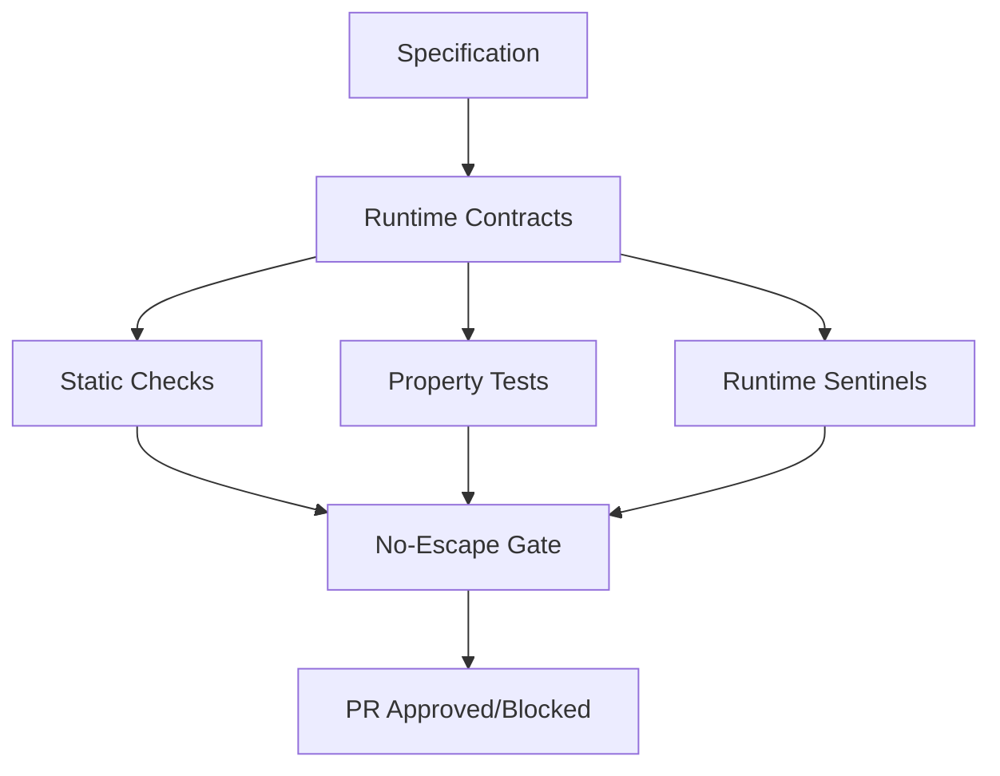

# Architecture

Technical architecture and design principles of SpecFact CLI.

## Quick Overview

**For Users**: SpecFact CLI is a **brownfield-first tool** that reverse engineers legacy Python code into documented specs, then enforces them as runtime contracts. It works in two modes: **CI/CD mode** (fast, automated) and **CoPilot mode** (interactive, AI-enhanced). **Primary use case**: Analyze existing codebases. **Secondary use case**: Add enforcement to Spec-Kit projects.

**For Contributors**: SpecFact CLI implements a contract-driven development framework through three layers: Specification (plans and protocols), Contract (runtime validation), and Enforcement (quality gates). The architecture supports dual-mode operation (CI/CD and CoPilot) with agent-based routing for complex operations.

---

## Overview

SpecFact CLI implements a **contract-driven development** framework through three core layers:

1. **Specification Layer** - Plan bundles and protocol definitions
2. **Contract Layer** - Runtime contracts, static checks, and property tests
3. **Enforcement Layer** - No-escape gates with budgets and staged enforcement

### Related Documentation

- [Getting Started](../getting-started/README.md) - Installation and first steps
- [Use Cases](../guides/use-cases.md) - Real-world scenarios
- [Workflows](../guides/workflows.md) - Common daily workflows
- [Commands](commands.md) - Complete command reference

## Operational Modes

SpecFact CLI supports two operational modes for different use cases:

### Mode 1: CI/CD Automation (Default)

**Best for:**

- Clean-code repositories
- Self-explaining codebases
- Lower complexity projects
- Automated CI/CD pipelines

**Characteristics:**

- Fast, deterministic execution (< 10s typical)
- No AI copilot dependency
- Direct command execution
- Structured JSON/Markdown output

**Usage:**

```bash
# Auto-detected (default)
specfact import from-code --repo .

# Explicit CI/CD mode
specfact --mode cicd import from-code --repo .
```

### Mode 2: CoPilot-Enabled

**Best for:**

- Brownfield repositories
- High complexity codebases
- Mixed code quality
- Interactive development with AI assistants

**Characteristics:**

- Enhanced prompts for better analysis
- IDE integration via prompt templates (slash commands)
- Agent mode routing for complex operations
- Interactive assistance

**Usage:**

```bash
# Auto-detected (if CoPilot available)
specfact import from-code --repo .

# Explicit CoPilot mode
specfact --mode copilot import from-code --repo .

# IDE integration (slash commands)
# First, initialize: specfact init --ide cursor
# Then use in IDE chat:
/specfact-import-from-code --repo . --confidence 0.7
/specfact-plan-init --idea idea.yaml
/specfact-sync --repo . --bidirectional
```

### Mode Detection

Mode is automatically detected based on:

1. **Explicit `--mode` flag** (highest priority)
2. **CoPilot API availability** (environment/IDE detection)
3. **IDE integration** (VS Code/Cursor with CoPilot enabled)
4. **Default to CI/CD mode** (fallback)

---

## Agent Modes

Agent modes provide enhanced prompts and routing for CoPilot-enabled operations:

### Available Agent Modes

- **`analyze` agent mode**: Brownfield analysis with code understanding
- **`plan` agent mode**: Plan management with business logic understanding
- **`sync` agent mode**: Bidirectional sync with conflict resolution

### Agent Mode Routing

Each command uses specialized agent mode routing:

```python
# Analyze agent mode
/specfact-import-from-code --repo . --confidence 0.7
# → Enhanced prompts for code understanding
# → Context injection (current file, selection, workspace)
# → Interactive assistance for complex codebases

# Plan agent mode
/specfact-plan-init --idea idea.yaml
# → Guided wizard mode
# → Natural language prompts
# → Context-aware feature extraction

# Sync agent mode
/specfact-sync --source spec-kit --target .specfact
# → Automatic source detection
# → Conflict resolution assistance
# → Change explanation and preview
```

---

## Sync Operation

SpecFact CLI supports bidirectional synchronization for consistent change management:

### Spec-Kit Sync

Bidirectional synchronization between Spec-Kit artifacts and SpecFact:

```bash
# One-time bidirectional sync
specfact sync spec-kit --repo . --bidirectional

# Continuous watch mode
specfact sync spec-kit --repo . --bidirectional --watch --interval 5
```

**What it syncs:**

- `specs/[###-feature-name]/spec.md`, `plan.md`, `tasks.md` ↔ `.specfact/plans/*.yaml`
- `.specify/memory/constitution.md` ↔ SpecFact business context
- `specs/[###-feature-name]/research.md`, `data-model.md`, `quickstart.md` ↔ SpecFact supporting artifacts
- `specs/[###-feature-name]/contracts/*.yaml` ↔ SpecFact protocol definitions
- Automatic conflict resolution with priority rules

### Repository Sync

Sync code changes to SpecFact artifacts:

```bash
# One-time sync
specfact sync repository --repo . --target .specfact

# Continuous watch mode
specfact sync repository --repo . --watch --interval 5
```

**What it tracks:**

- Code changes → Plan artifact updates
- Deviations from manual plans
- Feature/story extraction from code

## Contract Layers



### 1. Specification Layer

**Plan Bundle** (`.specfact/plans/main.bundle.yaml`):

```yaml
version: "1.0"
idea:
  title: "SpecFact CLI Tool"
  narrative: "Enable contract-driven development"
product:
  themes:
    - "Developer Experience"
  releases:
    - name: "v0.1"
      objectives: ["Import", "Analyze", "Enforce"]
features:
  - key: FEATURE-001
    title: "Spec-Kit Import"
    outcomes:
      - "Zero manual conversion"
    stories:
      - key: STORY-001
        title: "Parse Spec-Kit artifacts"
        acceptance:
          - "Schema validation passes"
```

**Protocol** (`.specfact/protocols/workflow.protocol.yaml`):

```yaml
states:
  - INIT
  - PLAN
  - REQUIREMENTS
  - ARCHITECTURE
  - CODE
  - REVIEW
  - DEPLOY
start: INIT
transitions:
  - from_state: INIT
    on_event: start_planning
    to_state: PLAN
  - from_state: PLAN
    on_event: approve_plan
    to_state: REQUIREMENTS
    guard: plan_quality_gate_passes
```

### 2. Contract Layer

#### Runtime Contracts (icontract)

```python
from icontract import require, ensure
from beartype import beartype

@require(lambda plan: plan.version == "1.0")
@ensure(lambda result: len(result.features) > 0)
@beartype
def validate_plan(plan: PlanBundle) -> ValidationResult:
    """Validate plan bundle against contracts."""
    return ValidationResult(valid=True)
```

#### Static Checks (Semgrep)

```yaml
# .semgrep/async-anti-patterns.yaml
rules:
  - id: async-without-await
    pattern: |
      async def $FUNC(...):
        ...
    pattern-not: |
      async def $FUNC(...):
        ...
        await ...
    message: "Async function without await"
    severity: ERROR
```

#### Property Tests (Hypothesis)

```python
from hypothesis import given
from hypothesis.strategies import text

@given(text())
def test_plan_key_format(feature_key: str):
    """All feature keys must match FEATURE-\d+ format."""
    if feature_key.startswith("FEATURE-"):
        assert feature_key[8:].isdigit()
```

#### Runtime Sentinels

```python
import asyncio
from typing import Optional

class EventLoopMonitor:
    """Monitor event loop health."""
    
    def __init__(self, lag_threshold_ms: float = 100.0):
        self.lag_threshold_ms = lag_threshold_ms
    
    async def check_lag(self) -> Optional[float]:
        """Return lag in ms if above threshold."""
        start = asyncio.get_event_loop().time()
        await asyncio.sleep(0)
        lag_ms = (asyncio.get_event_loop().time() - start) * 1000
        return lag_ms if lag_ms > self.lag_threshold_ms else None
```

### 3. Enforcement Layer

#### No-Escape Gate

```yaml
# .github/workflows/specfact-gate.yml
name: No-Escape Gate
on: [pull_request]
jobs:
  validate:
    runs-on: ubuntu-latest
    steps:
      - uses: actions/checkout@v4
      - name: SpecFact Validation
        run: |
          specfact repro --budget 120 --verbose
          if [ $? -ne 0 ]; then
            echo "::error::Contract violations detected"
            exit 1
          fi
```

#### Staged Enforcement

| Stage | Description | Violations |
|-------|-------------|------------|
| **Shadow** | Log only, never block | All logged, none block |
| **Warn** | Warn on medium+, block high | HIGH blocks, MEDIUM warns |
| **Block** | Block all medium+ | MEDIUM+ blocks |

#### Budget-Based Execution

```python
from typing import Optional
import time

class BudgetedValidator:
    """Validator with time budget."""
    
    def __init__(self, budget_seconds: int = 120):
        self.budget_seconds = budget_seconds
        self.start_time: Optional[float] = None
    
    def start(self):
        """Start budget timer."""
        self.start_time = time.time()
    
    def check_budget(self) -> bool:
        """Return True if budget exceeded."""
        if self.start_time is None:
            return False
        elapsed = time.time() - self.start_time
        return elapsed > self.budget_seconds
```

## Data Models

### PlanBundle

```python
from pydantic import BaseModel, Field
from typing import List

class Idea(BaseModel):
    """High-level idea."""
    title: str
    narrative: str

class Story(BaseModel):
    """User story."""
    key: str = Field(pattern=r"^STORY-\d+$")
    title: str
    acceptance: List[str]

class Feature(BaseModel):
    """Feature with stories."""
    key: str = Field(pattern=r"^FEATURE-\d+$")
    title: str
    outcomes: List[str]
    stories: List[Story]

class PlanBundle(BaseModel):
    """Complete plan bundle."""
    version: str = "1.0"
    idea: Idea
    features: List[Feature]
```

### ProtocolSpec

```python
from pydantic import BaseModel
from typing import List, Optional

class Transition(BaseModel):
    """State machine transition."""
    from_state: str
    on_event: str
    to_state: str
    guard: Optional[str] = None

class ProtocolSpec(BaseModel):
    """FSM protocol specification."""
    states: List[str]
    start: str
    transitions: List[Transition]
```

### Deviation

```python
from enum import Enum
from pydantic import BaseModel

class DeviationSeverity(str, Enum):
    """Severity levels."""
    LOW = "LOW"
    MEDIUM = "MEDIUM"
    HIGH = "HIGH"
    CRITICAL = "CRITICAL"

class Deviation(BaseModel):
    """Detected deviation."""
    type: str
    severity: DeviationSeverity
    description: str
    location: str
    suggestion: Optional[str] = None
```

## Module Structure

```bash
src/specfact_cli/
├── cli.py                 # Main CLI entry point
├── commands/              # CLI command implementations
│   ├── import_cmd.py     # Import from external formats
│   ├── analyze.py        # Code analysis
│   ├── plan.py           # Plan management
│   ├── enforce.py        # Enforcement configuration
│   ├── repro.py          # Reproducibility validation
│   └── sync.py           # Sync operations (Spec-Kit, repository)
├── modes/                 # Operational mode management
│   ├── detector.py       # Mode detection logic
│   └── router.py         # Command routing
├── utils/                 # Utilities
│   └── ide_setup.py      # IDE integration (template copying)
├── agents/                # Agent mode implementations
│   ├── base.py           # Agent mode base class
│   ├── analyze_agent.py # Analyze agent mode
│   ├── plan_agent.py    # Plan agent mode
│   └── sync_agent.py    # Sync agent mode
├── sync/                  # Sync operation modules
│   ├── speckit_sync.py  # Spec-Kit bidirectional sync
│   ├── repository_sync.py # Repository sync
│   └── watcher.py        # Watch mode for continuous sync
├── models/               # Pydantic data models
│   ├── plan.py          # Plan bundle models
│   ├── protocol.py      # Protocol FSM models
│   └── deviation.py     # Deviation models
├── validators/          # Schema validators
│   ├── schema.py        # Schema validation
│   ├── contract.py      # Contract validation
│   └── fsm.py           # FSM validation
├── generators/          # Code generators
│   ├── protocol.py      # Protocol generator
│   ├── plan.py          # Plan generator
│   └── report.py        # Report generator
├── utils/               # CLI utilities
│   ├── console.py       # Rich console output
│   ├── git.py           # Git operations
│   └── yaml_utils.py    # YAML helpers
└── common/              # Shared utilities
    ├── logger_setup.py  # Logging infrastructure
    ├── logging_utils.py # Logging helpers
    ├── text_utils.py    # Text utilities
    └── utils.py         # File/JSON utilities
```

## Testing Strategy

### Contract-First Testing

SpecFact CLI uses **contracts as specifications**:

1. **Runtime Contracts** - `@icontract` decorators on public APIs
2. **Type Validation** - `@beartype` for runtime type checking
3. **Contract Exploration** - CrossHair to discover counterexamples
4. **Scenario Tests** - Focus on business workflows

### Test Pyramid

```ascii
         /\
        /  \  E2E Tests (Scenario)
       /____\
      /      \  Integration Tests (Contract)
     /________\
    /          \  Unit Tests (Property)
   /____________\
```

### Running Tests

```bash
# Contract validation
hatch run contract-test-contracts

# Contract exploration (CrossHair)
hatch run contract-test-exploration

# Scenario tests
hatch run contract-test-scenarios

# E2E tests
hatch run contract-test-e2e

# Full test suite
hatch run contract-test-full
```

## Dependencies

### Core

- **typer** - CLI framework
- **pydantic** - Data validation
- **rich** - Terminal output
- **networkx** - Graph analysis
- **ruamel.yaml** - YAML processing

### Validation

- **icontract** - Runtime contracts
- **beartype** - Type checking
- **crosshair-tool** - Contract exploration
- **hypothesis** - Property-based testing

### Development

- **hatch** - Build and environment management
- **basedpyright** - Type checking
- **ruff** - Linting
- **pytest** - Test runner

See [pyproject.toml](../../pyproject.toml) for complete dependency list.

## Design Principles

1. **Contract-Driven** - Contracts are specifications
2. **Evidence-Based** - Claims require reproducible evidence
3. **Offline-First** - No SaaS required for core functionality
4. **Progressive Enhancement** - Shadow → Warn → Block
5. **Fast Feedback** - < 90s CI overhead
6. **Escape Hatches** - Override mechanisms for emergencies
7. **Quality-First** - TDD with quality gates from day 1
8. **Dual-Mode Operation** - CI/CD automation or CoPilot-enabled assistance
9. **Bidirectional Sync** - Consistent change management across tools

## Performance Characteristics

| Operation | Typical Time | Budget |
|-----------|--------------|--------|
| Plan validation | < 1s | 5s |
| Contract exploration | 10-30s | 60s |
| Full repro suite | 60-90s | 120s |
| Brownfield analysis | 2-5 min | 300s |

## Security Considerations

1. **No external dependencies** for core validation
2. **Secure defaults** - Shadow mode by default
3. **No data exfiltration** - Works offline
4. **Contract provenance** - SHA256 hashes in reports
5. **Reproducible builds** - Deterministic outputs

---

See [Commands](commands.md) for command reference and [Technical Deep Dives](../technical/README.md) for testing procedures.
