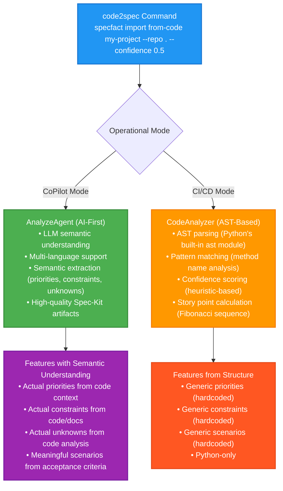

# Code2Spec Analysis Logic: How It Works

> **TL;DR**: SpecFact CLI uses **AI-first approach** via AI IDE integration (Cursor, CoPilot, etc.) for semantic understanding, with **AST-based fallback** for CI/CD mode. The AI IDE's native LLM understands the codebase semantically, then calls the SpecFact CLI for structured analysis. This avoids separate LLM API setup, langchain, or additional API keys while providing high-quality, semantic-aware analysis that works with all languages and generates Spec-Kit compatible artifacts.

---

## Overview

The `code2spec` command analyzes existing codebases and reverse-engineers them into plan bundles (features, stories, tasks). It uses **two approaches** depending on operational mode:

### **Mode 1: AI-First (CoPilot Mode)** - Recommended

Uses **AI IDE's native LLM** for semantic understanding via pragmatic integration:

**Workflow**:

1. **AI IDE's LLM** understands codebase semantically (via slash command prompt)
2. **AI calls SpecFact CLI** (`specfact import from-code <bundle-name>`) for structured analysis
3. **AI enhances results** with semantic understanding (priorities, constraints, unknowns)
4. **CLI handles structured work** (file I/O, YAML generation, validation)

**Benefits**:

- ✅ **No separate LLM setup** - Uses AI IDE's existing LLM (Cursor, CoPilot, etc.)
- ✅ **No additional API costs** - Leverages existing IDE infrastructure
- ✅ **Simpler architecture** - No langchain, API keys, or complex integration
- ✅ **Multi-language support** - Works with Python, TypeScript, JavaScript, PowerShell, Go, Rust, etc.

- ✅ **Semantic understanding** - AI understands business logic, not just structure
- ✅ **High-quality output** - Generates meaningful priorities, constraints, unknowns
- ✅ **Spec-Kit compatible** - Produces artifacts that pass `/speckit.analyze` validation
- ✅ **Bidirectional sync** - Preserves semantics during Spec-Kit ↔ SpecFact sync

**Why this approach?**

- ✅ **Pragmatic** - Uses existing IDE infrastructure, no extra setup
- ✅ **Cost-effective** - No additional API costs
- ✅ **Streamlined** - Native IDE integration, better developer experience
- ✅ **Maintainable** - Simpler architecture, less code to maintain

### **Mode 2: AST-Based (CI/CD Mode)** - Fallback

Uses **Python's AST** for structural analysis when LLM is unavailable:

1. **AST Parsing** - Python's built-in Abstract Syntax Tree
2. **Pattern Matching** - Heuristic-based method grouping
3. **Confidence Scoring** - Evidence-based quality metrics
4. **Deterministic Algorithms** - No randomness, 100% reproducible

**Why AST fallback?**

- ✅ **Fast** - Analyzes thousands of lines in seconds
- ✅ **Deterministic** - Same code always produces same results
- ✅ **Offline** - No cloud services or API calls
- ✅ **Python-only** - Limited to Python codebases
- ⚠️ **Generic Content** - Produces generic priorities, constraints (hardcoded fallbacks)

---

## Architecture



---

## Step-by-Step Process

### Step 1: File Discovery and Filtering

```python
# Find all Python files
python_files = repo_path.rglob("*.py")

# Skip certain directories
skip_patterns = [
    "__pycache__", ".git", "venv", ".venv", 
    "env", ".pytest_cache", "htmlcov",
    "dist", "build", ".eggs", "tests"
]
```

**Rationale**: Only analyze production code, not test files or dependencies.

---

### Step 2: AST Parsing

For each Python file, we use Python's built-in `ast` module:

```python
content = file_path.read_text(encoding="utf-8")
tree = ast.parse(content)  # Built-in Python AST parser
```

**What AST gives us:**

- ✅ Class definitions (`ast.ClassDef`)
- ✅ Function/method definitions (`ast.FunctionDef`)
- ✅ Import statements (`ast.Import`, `ast.ImportFrom`)
- ✅ Docstrings (via `ast.get_docstring()`)
- ✅ Method signatures and bodies

**Why AST?**

- Built into Python (no dependencies)
- Preserves exact structure (not text parsing)
- Handles all Python syntax correctly
- Extracts metadata (docstrings, names, structure)

---

### Step 3: Feature Extraction from Classes

**Rule**: Each public class (not starting with `_`) becomes a potential feature.

```python
def _extract_feature_from_class(node: ast.ClassDef, file_path: Path) -> Feature | None:
    # Skip private classes
    if node.name.startswith("_") or node.name.startswith("Test"):
        return None
    
    # Generate feature key: FEATURE-CLASSNAME
    feature_key = f"FEATURE-{node.name.upper()}"
    
    # Extract docstring as outcome
    docstring = ast.get_docstring(node)
    if docstring:
        outcomes = [docstring.split("\n\n")[0].strip()]
    else:
        outcomes = [f"Provides {humanize_name(node.name)} functionality"]
```

**Example**:

- `EnforcementConfig` class → `FEATURE-ENFORCEMENTCONFIG` feature
- Docstring "Configuration for contract enforcement" → Outcome
- Methods grouped into stories (see Step 4)

---

### Step 4: Story Extraction from Methods

**Key Insight**: Methods are grouped by **functionality patterns**, not individually.

#### 4.1 Method Grouping (Pattern Matching)

Methods are grouped using **keyword matching** on method names:

```python
def _group_methods_by_functionality(methods: list[ast.FunctionDef]) -> dict[str, list]:
    groups = defaultdict(list)
    
    for method in public_methods:
        name_lower = method.name.lower()
        
        # CRUD Operations
        if any(crud in name_lower for crud in ["create", "add", "insert", "new"]):
            groups["Create Operations"].append(method)
        elif any(read in name_lower for read in ["get", "read", "fetch", "find", "list"]):
            groups["Read Operations"].append(method)
        elif any(update in name_lower for update in ["update", "modify", "edit"]):
            groups["Update Operations"].append(method)
        elif any(delete in name_lower for delete in ["delete", "remove", "destroy"]):
            groups["Delete Operations"].append(method)
        
        # Validation
        elif any(val in name_lower for val in ["validate", "check", "verify"]):
            groups["Validation"].append(method)
        
        # Processing
        elif any(proc in name_lower for proc in ["process", "compute", "transform"]):
            groups["Processing"].append(method)
        
        # Analysis
        elif any(an in name_lower for an in ["analyze", "parse", "extract"]):
            groups["Analysis"].append(method)
        
        # ... more patterns
```

**Pattern Groups**:

| Group | Keywords | Example Methods |
|-------|----------|----------------|
| **Create Operations** | `create`, `add`, `insert`, `new` | `create_user()`, `add_item()` |
| **Read Operations** | `get`, `read`, `fetch`, `find`, `list` | `get_user()`, `list_items()` |
| **Update Operations** | `update`, `modify`, `edit`, `change` | `update_profile()`, `modify_settings()` |
| **Delete Operations** | `delete`, `remove`, `destroy` | `delete_user()`, `remove_item()` |
| **Validation** | `validate`, `check`, `verify` | `validate_input()`, `check_permissions()` |
| **Processing** | `process`, `compute`, `transform` | `process_data()`, `transform_json()` |
| **Analysis** | `analyze`, `parse`, `extract` | `analyze_code()`, `parse_config()` |
| **Generation** | `generate`, `build`, `make` | `generate_report()`, `build_config()` |
| **Comparison** | `compare`, `diff`, `match` | `compare_plans()`, `diff_files()` |
| **Configuration** | `setup`, `configure`, `initialize` | `setup_logger()`, `configure_db()` |

**Why Pattern Matching?**

- ✅ Fast - Simple string matching, no ML overhead
- ✅ Deterministic - Same patterns always grouped together
- ✅ Interpretable - You can see why methods are grouped
- ✅ Customizable - Easy to add new patterns

---

#### 4.2 Story Creation from Method Groups

Each method group becomes a **user story**:

```python
def _create_story_from_method_group(group_name, methods, class_name, story_number):
    # Generate story key: STORY-CLASSNAME-001
    story_key = f"STORY-{class_name.upper()}-{story_number:03d}"
    
    # Create user-centric title
    title = f"As a user, I can {group_name.lower()} {class_name}"
    
    # Extract tasks (method names)
    tasks = [f"{method.name}()" for method in methods]
    
    # Extract acceptance from docstrings
    acceptance = []
    for method in methods:
        docstring = ast.get_docstring(method)
        if docstring:
            acceptance.append(docstring.split("\n")[0].strip())
    
    # Calculate story points and value points
    story_points = _calculate_story_points(methods)
    value_points = _calculate_value_points(methods, group_name)
```

**Example**:

```python
# EnforcementConfig class has methods:
# - validate_input()
# - check_permissions()
# - verify_config()

# → Grouped into "Validation" story:
{
    "key": "STORY-ENFORCEMENTCONFIG-001",
    "title": "As a developer, I can validate EnforcementConfig data",
    "tasks": ["validate_input()", "check_permissions()", "verify_config()"],
    "story_points": 5,
    "value_points": 3
}
```

---

### Step 5: Confidence Scoring

**Goal**: Determine how confident we are that this is a real feature (not noise).

```python
def _calculate_feature_confidence(node: ast.ClassDef, stories: list[Story]) -> float:
    score = 0.3  # Base score (30%)
    
    # Has docstring (+20%)
    if ast.get_docstring(node):
        score += 0.2
    
    # Has stories (+20%)
    if stories:
        score += 0.2
    
    # Has multiple stories (+20%)
    if len(stories) > 2:
        score += 0.2
    
    # Stories are well-documented (+10%)
    documented_stories = sum(1 for s in stories if s.acceptance and len(s.acceptance) > 1)
    if stories and documented_stories > len(stories) / 2:
        score += 0.1
    
    return min(score, 1.0)  # Cap at 100%
```

**Confidence Factors**:

| Factor | Weight | Rationale |
|--------|--------|-----------|
| **Base Score** | 30% | Every class starts with baseline |
| **Has Docstring** | +20% | Documented classes are more likely real features |
| **Has Stories** | +20% | Methods grouped into stories indicate functionality |
| **Multiple Stories** | +20% | More stories = more complete feature |
| **Well-Documented Stories** | +10% | Docstrings in methods indicate intentional design |

**Example**:

- `EnforcementConfig` with docstring + 3 well-documented stories → **0.9 confidence** (90%)
- `InternalHelper` with no docstring + 1 story → **0.5 confidence** (50%)

**Filtering**: Features below `--confidence` threshold (default 0.5) are excluded.

---

### Step 6: Story Points Calculation

**Goal**: Estimate complexity using **Fibonacci sequence** (1, 2, 3, 5, 8, 13, 21...)

```python
def _calculate_story_points(methods: list[ast.FunctionDef]) -> int:
    method_count = len(methods)
    
    # Count total lines
    total_lines = sum(len(ast.unparse(m).split("\n")) for m in methods)
    avg_lines = total_lines / method_count if method_count > 0 else 0
    
    # Heuristic: complexity based on count and size
    if method_count <= 2 and avg_lines < 20:
        base_points = 2  # Small
    elif method_count <= 5 and avg_lines < 40:
        base_points = 5  # Medium
    elif method_count <= 8:
        base_points = 8  # Large
    else:
        base_points = 13  # Extra Large
    
    # Return nearest Fibonacci number
    return min(FIBONACCI, key=lambda x: abs(x - base_points))
```

**Heuristic Table**:

| Methods | Avg Lines | Base Points | Fibonacci Result |
|---------|-----------|-------------|------------------|
| 1-2 | < 20 | 2 | **2** |
| 3-5 | < 40 | 5 | **5** |
| 6-8 | Any | 8 | **8** |
| 9+ | Any | 13 | **13** |

**Why Fibonacci?**

- ✅ Industry standard (Scrum/Agile)
- ✅ Non-linear (reflects uncertainty)
- ✅ Widely understood by teams

---

### Step 7: Value Points Calculation

**Goal**: Estimate **business value** (not complexity, but importance).

```python
def _calculate_value_points(methods: list[ast.FunctionDef], group_name: str) -> int:
    # CRUD operations are high value
    crud_groups = ["Create Operations", "Read Operations", "Update Operations", "Delete Operations"]
    if group_name in crud_groups:
        base_value = 8  # High business value
    
    # User-facing operations
    elif group_name in ["Processing", "Analysis", "Generation", "Comparison"]:
        base_value = 5  # Medium-high value
    
    # Developer/internal operations
    elif group_name in ["Validation", "Configuration"]:
        base_value = 3  # Medium value
    
    else:
        base_value = 3  # Default
    
    # Adjust for public API exposure
    public_count = sum(1 for m in methods if not m.name.startswith("_"))
    if public_count >= 3:
        base_value = min(base_value + 2, 13)
    
    return min(FIBONACCI, key=lambda x: abs(x - base_value))
```

**Value Hierarchy**:

| Group Type | Base Value | Rationale |
|------------|------------|-----------|
| **CRUD Operations** | 8 | Direct user value (create, read, update, delete) |
| **User-Facing** | 5 | Processing, analysis, generation - users see results |
| **Developer/Internal** | 3 | Validation, configuration - infrastructure |
| **Public API Bonus** | +2 | More public methods = higher exposure = more value |

---

### Step 8: Theme Detection from Imports

**Goal**: Identify what kind of application this is (API, CLI, Database, etc.).

```python
def _extract_themes_from_imports(tree: ast.AST) -> None:
    theme_keywords = {
        "fastapi": "API",
        "flask": "API",
        "django": "Web",
        "typer": "CLI",
        "click": "CLI",
        "pydantic": "Validation",
        "redis": "Caching",
        "postgres": "Database",
        "mysql": "Database",
        "asyncio": "Async",
        "pytest": "Testing",
        # ... more keywords
    }
    
    # Scan all imports
    for node in ast.walk(tree):
        if isinstance(node, (ast.Import, ast.ImportFrom)):
            # Match keywords in import names
            for keyword, theme in theme_keywords.items():
                if keyword in import_name.lower():
                    self.themes.add(theme)
```

**Example**:

- `import typer` → Theme: **CLI**
- `import pydantic` → Theme: **Validation**
- `from fastapi import FastAPI` → Theme: **API**

---

## Why AI-First?

### ✅ Advantages of AI-First Approach

| Aspect | AI-First (CoPilot Mode) | AST-Based (CI/CD Mode) |
|-------|------------------------|------------------------|
| **Language Support** | ✅ All languages | ❌ Python only |
| **Semantic Understanding** | ✅ Understands business logic | ❌ Structure only |
| **Priorities** | ✅ Actual from code context | ⚠️ Generic (hardcoded) |
| **Constraints** | ✅ Actual from code/docs | ⚠️ Generic (hardcoded) |
| **Unknowns** | ✅ Actual from code analysis | ⚠️ Generic (hardcoded) |
| **Scenarios** | ✅ Actual from acceptance criteria | ⚠️ Generic (hardcoded) |
| **Spec-Kit Compatibility** | ✅ High-quality artifacts | ⚠️ Low-quality artifacts |
| **Bidirectional Sync** | ✅ Semantic preservation | ⚠️ Structure-only |

### When AST Fallback Is Used

AST-based analysis is used in **CI/CD mode** when:

- LLM is unavailable (no API access)
- Fast, deterministic analysis is required
- Offline analysis is needed
- Python-only codebase analysis is sufficient

**Trade-offs**:

- ✅ Fast and deterministic
- ✅ Works offline
- ❌ Python-only
- ❌ Generic content (hardcoded fallbacks)

---

## Accuracy and Limitations

### ✅ AI-First Approach (CoPilot Mode)

**What It Does Well**:

1. **Semantic Understanding**: Understands business logic and domain concepts
2. **Multi-language Support**: Works with Python, TypeScript, JavaScript, PowerShell, Go, Rust, etc.

3. **Semantic Extraction**: Extracts actual priorities, constraints, unknowns from code context
4. **High-quality Artifacts**: Generates Spec-Kit compatible artifacts with semantic content
5. **Bidirectional Sync**: Preserves semantics during Spec-Kit ↔ SpecFact sync

**Limitations**:

1. **Requires LLM Access**: Needs CoPilot API or IDE integration
2. **Variable Response Time**: Depends on LLM API response time
3. **Token Costs**: May incur API costs for large codebases
4. **Non-deterministic**: May produce slightly different results on repeated runs

### ⚠️ AST-Based Fallback (CI/CD Mode)

**What It Does Well**:

1. **Structural Analysis**: Classes, methods, imports are 100% accurate (AST parsing)
2. **Pattern Recognition**: CRUD, validation, processing patterns are well-defined
3. **Confidence Scoring**: Evidence-based (docstrings, stories, documentation)
4. **Deterministic**: Same code always produces same results
5. **Fast**: Analyzes thousands of lines in seconds
6. **Offline**: Works without API access

**Limitations**:

1. **Python-only**: Cannot analyze TypeScript, JavaScript, PowerShell, etc.

2. **Generic Content**: Produces generic priorities, constraints, unknowns (hardcoded fallbacks)
3. **No Semantic Understanding**: Cannot understand business logic or domain concepts
4. **Method Name Dependency**: If methods don't follow naming conventions, grouping may be less accurate
5. **Docstring Dependency**: Features/stories without docstrings have lower confidence
6. **False Positives**: Internal helper classes might be detected as features

---

## Real Example: EnforcementConfig

Let's trace how `EnforcementConfig` class becomes a feature:

```python
class EnforcementConfig:
    """Configuration for contract enforcement and quality gates."""
    
    def __init__(self, preset: EnforcementPreset):
        ...
    
    def should_block_deviation(self, severity: str) -> bool:
        ...
    
    def get_action(self, severity: str) -> EnforcementAction:
        ...
```

**Step-by-Step Analysis**:

1. **AST Parse** → Finds `EnforcementConfig` class with 3 methods
2. **Feature Extraction**:
   - Key: `FEATURE-ENFORCEMENTCONFIG`
   - Title: `Enforcement Config` (humanized)
   - Outcome: `"Configuration for contract enforcement and quality gates."`
3. **Method Grouping**:
   - `__init__()` → **Configuration** group
   - `should_block_deviation()` → **Validation** group (has "check" pattern)
   - `get_action()` → **Read Operations** group (has "get" pattern)
4. **Story Creation**:
   - Story 1: "As a developer, I can configure EnforcementConfig" (Configuration group)
   - Story 2: "As a developer, I can validate EnforcementConfig data" (Validation group)
   - Story 3: "As a user, I can view EnforcementConfig data" (Read Operations group)
5. **Confidence**: 0.9 (has docstring + 3 stories + well-documented)
6. **Story Points**: 5 (3 methods, medium complexity)
7. **Value Points**: 3 (Configuration group = medium value)

**Result**:

```yaml
feature:
  key: FEATURE-ENFORCEMENTCONFIG
  title: Enforcement Config
  confidence: 0.9
  stories:
    - key: STORY-ENFORCEMENTCONFIG-001
      title: As a developer, I can configure EnforcementConfig
      story_points: 2
      value_points: 3
      tasks: ["__init__()"]
    - key: STORY-ENFORCEMENTCONFIG-002
      title: As a developer, I can validate EnforcementConfig data
      story_points: 2
      value_points: 3
      tasks: ["should_block_deviation()"]
    - key: STORY-ENFORCEMENTCONFIG-003
      title: As a user, I can view EnforcementConfig data
      story_points: 2
      value_points: 5
      tasks: ["get_action()"]
```

---

## Validation and Quality Assurance

### Built-in Validations

1. **Plan Bundle Schema**: Generated plans are validated against JSON schema
2. **Confidence Threshold**: Low-confidence features are filtered
3. **AST Error Handling**: Invalid Python files are skipped gracefully
4. **File Filtering**: Test files and dependencies are excluded

### How to Improve Accuracy

1. **Add Docstrings**: Increases confidence scores
2. **Use Descriptive Names**: Follow naming conventions (CRUD patterns)
3. **Group Related Methods**: Co-locate related functionality in same class
4. **Adjust Confidence Threshold**: Use `--confidence 0.7` for stricter filtering

---

## Performance

### Benchmarks

| Repository Size | Files | Time | Throughput |
|----------------|-------|------|------------|
| **Small** (10 files) | 10 | < 1s | 10+ files/sec |
| **Medium** (50 files) | 50 | ~2s | 25 files/sec |
| **Large** (100+ files) | 100+ | ~5s | 20+ files/sec |

**SpecFact CLI on itself**: 19 files in 3 seconds = **6.3 files/second**

### Optimization Opportunities

1. **Parallel Processing**: Analyze files concurrently (future enhancement)
2. **Caching**: Cache AST parsing results (future enhancement)
3. **Incremental Analysis**: Only analyze changed files (future enhancement)

---

## Conclusion

The `code2spec` analysis is **deterministic, fast, and transparent** because it uses:

1. ✅ **Python AST** - Built-in, reliable parsing
2. ✅ **Pattern Matching** - Simple, interpretable heuristics
3. ✅ **Confidence Scoring** - Evidence-based quality metrics
4. ✅ **Fibonacci Estimation** - Industry-standard story/value points

**No AI required** - just solid engineering principles and proven algorithms.

---

## Further Reading

- [Python AST Documentation](https://docs.python.org/3/library/ast.html)
- [Scrum Story Points](https://www.scrum.org/resources/blog/what-are-story-points)
- [Dogfooding Example](../examples/dogfooding-specfact-cli.md) - See it in action

---

**Questions or improvements?** Open an issue or PR on GitHub!
